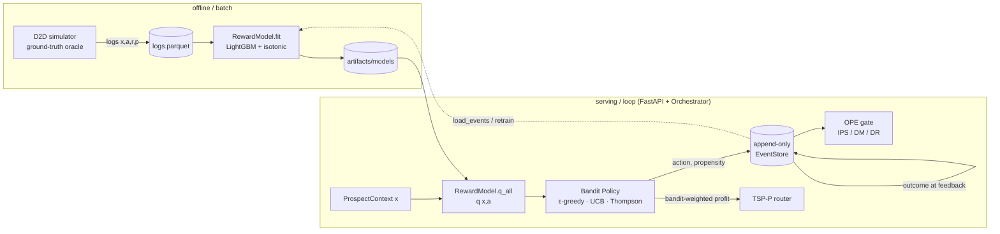

# Architecture — D2D Next Best Action (NBA)

This document describes how the system is structured and *why*. For the phased roadmap see
[PLAN.md](PLAN.md); for concepts and data sources see [docs/](docs).

## 1. The through-line

The system is a single decision loop. A door (context `x`) is scored, an action is proposed with
calibrated exploration, the choice is logged with its propensity, and the realized reward feeds
back into the model:

```
context x → reward model q(x,a) → bandit policy (explore) → per-door profit → TSP-P walkable route
```



> **The bandit proposes, the router disposes.** The reward model says *what an action is worth*;
> the bandit decides *what to do under uncertainty*; the router turns per-door value into a
> walkable plan. Every recommendation logs a propensity so the loop can be evaluated offline
> before any policy is promoted.

## 2. Design principles

These constraints are enforced in code and explain most of the structure.

- **Offline-first & deterministic.** Everything runs without network or real field data. A
  built-in simulator generates logs with *known* ground truth, and every stochastic step is
  seeded (`Settings.seed`, explicit `np.random.Generator`s) so runs are reproducible and tests
  are stable.
- **Oracle isolation.** The simulator's ground-truth functions (`latent_scores`, `true_reward`,
  `true_best_action`) are the *only* source of truth and must **never** be imported by the learning
  modules (`nba.reward`, `nba.bandits`, `nba.ope`, `nba.routing`, `nba.api`, `nba.pipeline`). Those
  modules only ever see logged `(context, action, reward, propensity)` tuples — exactly as in
  production. The oracle is used only by the simulator and by scripts/notebooks/tests for
  evaluation. This is enforced by an AST scan (`tests/test_ethics.py::test_no_oracle_leak`).
- **Propensity logging & overlap.** Every logged decision carries `p = P(action | context)`,
  strictly positive. Off-policy estimators reweight by `1/p`; a zero anywhere breaks overlap, so
  all serving policies emit **full-support** action distributions.
- **Ethics by construction.** Two layers. *Structural:* models are built *only* from an allow-list
  of features (`ALLOWED_FEATURES`); geo/identity fields (`lat`, `lon`, `address_id`) and any
  protected attribute are excluded by construction, not by omission — the feature vector is
  assembled from the allow-list, never by reflecting over the context. *Behavioral:* in a
  **sensitive** context (`nba.ethics`) an `EthicalPolicy` caps how much the policy may explore,
  while preserving full support so logs stay OPE-valid.
- **Frozen feature schema.** `FEATURE_NAMES` is the single source of truth for column order.
  Models persist it and **refuse to load** if it drifts, preventing silent train/serve skew.
- **Pluggable interfaces.** Components depend on narrow `Protocol`s, not concrete classes
  (`QModel`, `QEnsemble`, `Policy`, `DistanceEngine`). Swapping a policy or distance backend is a
  one-line change.

## 3. Module map

```
src/nba/
  schema.py            # ✅ Action, Outcome, REWARD map, ProspectContext, BanditEvent
  config.py            # ✅ pydantic Settings (env-overridable), seeds & knobs
  data/
    ames.py            # ✅ Ames housing loader (+ offline synthetic fallback)
    features.py        # ✅ featurize() with ethics allow-list; frozen FEATURE_NAMES
    simulator.py       # ✅ ground-truth oracle + logging policy → logged events
    relational_simulator.py  # ✅ relational/temporal world mirroring simulator.py (dataset_mode)
    graph.py           # ✅ heterogeneous-graph builder + graph allow-list (numpy, no torch)
  reward/
    model.py           # ✅ RewardModel (LightGBM + isotonic), ExploitationBaseline
  ethics.py            # ✅ is_sensitive, cap_exploration, EthicalPolicy wrapper
  bandits/
    base.py            # ✅ Policy/QModel/QEnsemble protocols, validate_dist, softmax
    epsilon_greedy.py  # ✅ EpsilonGreedy
    ucb.py             # ✅ UCB (bucketed counts + softmax)
    thompson.py        # ✅ BootstrapEnsemble + ThompsonSampling
  ope/
    estimators.py      # ✅ IPS/SNIPS/DM/DR estimators, LoggedBatch, clipping + ESS
    gate.py            # ✅ PromotionGate (DR lower bound vs baseline + min_lift)
  routing/
    distance.py        # ✅ DistanceEngine protocol, HaversineEngine, OSRMEngine stub
    territories.py     # ✅ KMeans walkable territories (Territory, cluster_territories)
    tsp_profits.py     # ✅ OR-Tools TSP-with-Profits solver (Route, solve_tsp_profits)
  pipeline/
    orchestrator.py    # ✅ Orchestrator (recommend/feedback/plan_route), RecommendResult
  api/
    store.py           # ✅ append-only EventStore (SQLite, decisions + outcomes)
    models.py          # ✅ pydantic request/response DTOs
    app.py             # ✅ FastAPI build_app factory + production app (lifespan)
  eval/
    oracle.py          # ✅ dataset-aware grading oracle facade (FlatOracle/RelationalOracle)
    metrics.py         # ✅ ExperimentMetrics + evaluate() (reuses run_demo across seeds/shifts)
    leaderboard.py     # ✅ append-only ExperimentRecord store + lift/regression verdict

scripts/
  generate_logs.py             # ✅ flat simulator → data/logs.parquet
  generate_relational_logs.py  # ✅ relational simulator → data/relational/{logs,households,edges,graph}
  train_reward.py              # ✅ logs → artifacts/models (+ metrics.json)
  evaluate_policy.py           # ✅ OPE + promotion gate CLI
  run_demo.py                  # ✅ end-to-end shift → artifacts/demo_report.json (dataset-aware)
  run_experiment.py            # ✅ grade a flag config → artifacts/leaderboard.jsonl (+ .md)
```

✅ implemented. Phases 0–9 and 17 are complete (see [PLAN.md](PLAN.md)).

## 4. Core contracts

The whole system is held together by a few small types in `schema.py` and three protocols in
`bandits/base.py`.

### Domain vocabulary (`schema.py`)

- `Action` — the 5-arm action space (`KNOCK_NOW`, `LEAVE_FLYER`, `SKIP_DOOR`, `PITCH_SOLAR`,
  `PITCH_SECURITY`); `ACTIONS` is the frozen canonical order used for one-hot encoding and column
  alignment.
- `Outcome` + `REWARD` — observed events mapped onto a monotone reward ladder
  (`SLAMMED -0.2 < NOT_HOME 0 < INFO 0.1 < APPOINTMENT 0.3 < CLOSED 1.0`). `SLAMMED` is negative
  so `SKIP_DOOR` is a real opportunity-cost decision.
- `ProspectContext` — a frozen, validated decision context (prospect + environment + spatial
  blocks). Contains no protected attributes.
- `BanditEvent` — one logged decision: `context, action, propensity (>0), reward?, outcome?,
  timestamp, decision_id`. The unit of the log and the input to every learner.

### Policy protocols (`bandits/base.py`)

```python
QModel:    q_all(ctx, actions) -> np.ndarray            # scores actions (the reward model)
QEnsemble: q_all_members(ctx, actions) -> np.ndarray    # (B, |A|) posterior sample source
Policy:    recommend(ctx) -> (Action, propensity)       # the (action, p) we log
           action_dist(ctx) -> {Action: prob}           # full-support dist OPE consumes
```

Shared helpers: `validate_dist` (sums to 1, full support), `sample_from_dist` (categorical draw
returning the chosen probability), `softmax` (numerically stable).

## 5. Components

### Data layer (`data/`)

- **`ames.py`** draws realistic `sale_price` / `year_built` from the public Ames dataset, with a
  statistically similar `synthetic_ames` fallback so the pipeline is fully offline-testable.
- **`features.py`** turns `(context, action)` into a fixed-width `float64` vector: allow-listed
  numeric/bool fields, a weather one-hot, then an action one-hot. `FEATURE_NAMES` freezes the
  order; this is the contract models persist and verify.
- **`simulator.py`** is the ground-truth world. `latent_scores` encodes documented interaction
  effects (e.g. evening `KNOCK_NOW` lifts appointments; bad weather lifts slams); a stochastic
  `behavior_policy` chooses actions and **records propensity**; `generate_logs` emits a parquet of
  fully-labeled `BanditEvent`s. The oracle handles (`true_reward`, `true_best_action`) are kept
  strictly out of the learning modules.
- **`relational_simulator.py`** mirrors `simulator.py`'s public surface but adds genuine relational/
  temporal structure (households, neighbor + competitor edges, per-door interaction histories): the
  latent score layers in social proof, household momentum, history fatigue, and competitor overlap on
  top of the flat signal, and a degenerate world (no edges/history) reproduces flat `true_reward`
  within tolerance (proven by test). Crucially, **the `BanditEvent` data contract is unchanged** — its
  logged event stream is schema-identical, so every learner consumes it as-is. The relational
  structure rides in **additive sidecar artifacts** under `data/relational/`
  (`households.parquet`, `edges.parquet`, `graph.npz`) plus one optional non-model `household_id`
  DataFrame column; `frame_to_events` ignores the extra column, so round-trips stay identical. Its
  oracle (which takes the bound `world`) is guarded out of the learning modules just like the flat one
  (`tests/test_ethics.py`).
- **`graph.py`** builds a typed `HeteroGraph` from a `RelationalWorld` for the future RDL value model,
  with node features drawn from a graph allow-list that mirrors `features.ALLOWED_FEATURES` (geo/
  identity/protected fields excluded by construction). Pure numpy with `save_graph`/`load_graph`.

### Reward model (`reward/model.py`)

`RewardModel` learns `q(x, a) = E[r | x, a]` — a LightGBM regressor plus an **isotonic
calibrator** fit on a held-out split (the raw regressor is biased near the sparse reward
extremes; isotonic monotonically maps predictions toward observed mean reward). It exposes
`q`, `q_all`, `best_action`, and `save`/`load` (which enforces the frozen feature schema).

`ExploitationBaseline` is the deliberate cautionary baseline: always `argmax q`, propensity
`1.0`. It is a valid DM target but has **no overlap** — the "goes blind" policy that motivates
exploration.

### Bandits (`bandits/`)

All three consume the reward model through the `QModel`/`QEnsemble` protocols and emit a
full-support distribution.

- **ε-greedy** — exploit `argmax q` w.p. `1-ε`, explore uniformly w.p. `ε`; argmax ties split the
  exploit mass uniformly. One knob from greedy (`ε→0`) to uniform (`ε→1`).
- **UCB** — adds an optimism bonus `c·√(ln(t+1)/(n+1))` using per-**context-bucket** visit counts
  (continuous contexts never repeat, so counts are kept on a coarse discretization; the bucketizer
  is injectable, a pragmatic stand-in for LinUCB), then **softmaxes** the optimistic scores for a
  smooth, full-support distribution. `temp` controls sharpness.
- **Thompson** — `BootstrapEnsemble` of `B` reward models (each on a bootstrap resample, seed
  offset per member) approximates the posterior over `q`. `recommend` plays a random member's
  argmax; `action_dist` is the Monte-Carlo `P(arm is best)`, floored to full support.

> **Scale caveat (current finding):** calibrated `q`-gaps are O(0.1), so the config defaults
> `ucb_c=1.0` / `softmax_temp=0.25` make UCB's bonus dwarf the signal and flatten it toward
> uniform. Reward-scaled knobs (e.g. `c=0.3`, `temp=0.1`) are needed; final tuning is validated by
> the Phase 5 off-policy evaluation work.

### OPE (`ope/`)

- **`estimators.py`** — IPS, SNIPS, DM, and DR estimators over a `LoggedBatch`, with optional
  importance-weight clipping and an effective-sample-size guard that warns on poor overlap. DR is
  unbiased if *either* `q̂` or the propensities are correct; SNIPS trades a little bias for much
  lower variance; DM is lowest-variance but leans entirely on `q̂` calibration.
- **`gate.py`** — `PromotionGate` promotes a candidate only if its DR lower confidence bound clears
  the logging baseline plus `min_lift`, and flags IPS/DM disagreement as a calibration smell.

### Routing (`routing/`)

- **`distance.py`** — a `DistanceEngine` protocol returning a travel-**time** matrix (seconds).
  `HaversineEngine` is a vectorized great-circle approximation; `OSRMEngine` is a conforming stub
  documenting the seam for a future road network, so callers never change.
- **`territories.py`** — KMeans (in equal-area-rescaled lat/lon) carves doors into walkable
  territories so each TSP instance stays small and a route stays in one neighborhood.
- **`tsp_profits.py`** — an OR-Tools TSP-with-Profits solver: every non-depot door is *optional*
  with a drop penalty equal to its scaled profit, so the solver trades travel time against profit
  and drops far-flung low-value doors. Capacity and per-node time windows are optional constraints;
  fixed inputs + fixed time limit + single thread make routes deterministic.

### Orchestrator (`pipeline/orchestrator.py`)

The `Orchestrator` is the single seam where proposing meets disposing, and the only place a
decision is logged. It is pure Python and dependency-injected (`policy`, `reward_model`,
`distance_engine`, `store`, `settings`), so the same loop runs in tests with fakes and in
production with disk-backed artifacts.

- **`recommend(ctx)`** asks the policy for `(action, propensity)`, appends a decision to the
  store, and returns a `RecommendResult` (`decision_id`, `action`, `propensity`, `q_values`).
- **`feedback(decision_id, outcome)`** appends an outcome (404-able if the id is unknown).
- **`plan_route(contexts)`** prices each door by its **bandit-weighted** value
  `profit_d = Σ_a π(a|x_d)·q(x_d,a)` — so exploration value, not a raw argmax, flows into routing —
  then solves TSP-with-Profits under the configured capacity and residential time window. The
  `argmax_profit=True` toggle recovers greedy best-action pricing. `replan(remaining)` re-solves
  over not-yet-visited doors.

### Ethics (`ethics.py`)

The behavioral guardrail (the structural one lives in `features.py`). `is_sensitive(ctx, settings)`
flags a door on a **non-protected** behavioral signal — too many prior contacts — where repeated
unsolicited visits warrant caution. `cap_exploration(dist, ceiling)` shrinks a distribution toward
its mode so the non-modal ("explore") mass is `≤ ceiling` while keeping every arm `> 0` (so IPS/DR
stay valid). `EthicalPolicy` wraps any `Policy`: a transparent pass-through in ordinary contexts,
and an exploration-capped version in sensitive ones when `cap_exploration_in_sensitive` is set.

### Pipeline & verification (`pipeline/`, `scripts/run_demo.py`)

`scripts/run_demo.py` runs the *entire* loop offline for one simulated shift: bootstrap logs → fit
the reward model → OPE-gate the three policies → plan and **walk** a route (`recommend → simulate
outcome → feedback`, replanning periodically, wrapped in `EthicalPolicy`) → compare against
uniform-random and exploit-only baselines, measure regret against the oracle, and quantify routing
time saved. It prints a report and writes `artifacts/demo_report.json`. `tests/test_e2e.py` asserts
the system-level claims (bandit beats uniform, value beats the logging baseline, regret far below
random, far doors dropped, propensity on every decision, API roundtrip); `tests/test_ethics.py`
asserts the guardrails (allow-list, sensitive cap, no oracle leak).

`run_demo.py` reaches the oracle only through `eval/oracle.py` (`oracle_for(settings, world=...)`),
which returns a `FlatOracle` (a pure pass-through to `simulator`, so flat output is byte-identical) or
a `RelationalOracle` bound to the sampled `RelationalWorld`, selected by `Settings.dataset_mode`. This
keeps grading dataset-aware without touching any learner, and a determinism regression confirms the
flat `seed=7` report is unchanged after the indirection.

### API (`api/`)

- **`store.py`** — an **append-only** SQLite `EventStore`: a `decisions` table (one row per
  recommendation, `propensity NOT NULL`) and a 1:N `outcomes` table. No `UPDATE`/`DELETE` — a
  correction is a new row and readers take the latest by autoincrement id, preserving the audit
  trail. The full `ProspectContext` is stored as JSON so `load_events` reconstructs exact
  `BanditEvent`s for training and OPE.
- **`models.py`** — thin pydantic request/response DTOs reusing the domain types
  (`ProspectContext`, `Action`, `Outcome`) so validation lives in one place.
- **`app.py`** — `build_app(orchestrator)` is a factory so a `TestClient` can inject a seeded/fake
  orchestrator without touching disk. The production `app` uses a lifespan that loads settings, the
  reward model, an ε-greedy logging policy, a Haversine engine, and the store. Endpoints
  (`/recommend`, `/feedback`→204, `/route`, `/health`) are thin HTTP↔orchestrator adapters; unknown
  ids → 404, malformed bodies → 422.

## 6. Control & data flow (the closed loop)

1. **Generate** logs from the simulator (`scripts/generate_logs.py`) → `data/logs.parquet`.
2. **Train** the reward model (`scripts/train_reward.py`) → `artifacts/models/` (+ `metrics.json`).
3. **Score**: `RewardModel.q_all(ctx)` gives per-action expected reward.
4. **Propose**: `Orchestrator.recommend` calls a `Policy` for `(action, propensity)` and returns a
   `decision_id`.
5. **Log**: the `EventStore` persists the decision (`propensity NOT NULL`); `feedback` later
   appends the outcome. `load_events` reconstructs `BanditEvent`s.
6. **Route**: `plan_route` turns bandit-weighted door profits into a walkable TSP-P plan.
7. **Evaluate**: OPE estimates a candidate policy's value from the logs; the gate decides promotion.
8. **Retrain**: accumulated logs refit the reward model (and ensemble), sharpening future
   proposals — closing the loop.

Exploration is the hinge: it keeps logged `p` strictly positive (bounded `1/p`), which is the
precondition for steps 6–7 to be valid. Pure exploitation short-circuits the loop.

## 7. Cross-cutting concerns

- **Configuration** — `config.py` exposes a pydantic `Settings` with every field overridable via
  an `NBA_*` env var: paths, `seed`, bandit knobs (`epsilon`, `ucb_c`, `softmax_temp`,
  `n_bootstrap`), routing knobs, OPE gate thresholds, and the ethics knobs
  (`cap_exploration_in_sensitive`, `sensitive_prior_interactions`,
  `sensitive_exploration_ceiling`). `get_settings()` returns a cached singleton.
- **Persistence** — `RewardModel.save/load` (joblib + a `feature_names.json` guard);
  `BootstrapEnsemble.save/load` (per-member directories + manifest). Batch logs are parquet; the
  serving `EventStore` is append-only SQLite (WAL), and both reconstruct the same `BanditEvent`s.
- **Determinism & seeding** — a single `seed` flows from `Settings` into every generator; the
  reward model's train/val split, the bootstrap resamples (seed offset per member), and policy
  sampling are all reproducible.
- **Testing & tooling** — `pytest` per module (oracle-backed assertions, protocol/contract tests,
  determinism, "beats uniform" smoke tests); `ruff` (lint+format), `pyright` (standard mode).
  `make check` runs all three.

```bash
make setup     # uv sync (.venv + deps)
make check     # ruff + pyright + pytest
uv run python scripts/generate_logs.py --n 20000 --out data/logs.parquet
uv run python scripts/train_reward.py  --logs data/logs.parquet --out artifacts/models
```

## 8. Improvement roadmap (feature-flagged)

The relational dataset (Phase 9) and the experiment leaderboard (Phase 17) are **built**; the value/
optimizer upgrades (Phases 10–16) remain planned. Phases 9–16 implement the upgrade roadmap from
[docs/11-improving-nba-spatio-relational-optimization.md](docs/11-improving-nba-spatio-relational-optimization.md)
(optimizer side) and
[docs/12-relational-deep-learning-mixin.md](docs/12-relational-deep-learning-mixin.md) (value side).
They are **additive and reversible**: each lives behind an `NBA_*` flag whose default reproduces
today's behavior, and each preserves every rail in §2 (oracle isolation, ethics allow-list,
calibration, propensity/overlap, the DR promotion gate).

### Feature flags (a new cross-cutting concern)

Every upgrade is gated by `Settings` flags that default to the current behavior, so the verified 0–8
loop is byte-identical until a flag is set. Examples: `dataset_mode="flat"`,
`use_time_budget=False`/`num_vehicles=1`/`distance_engine="haversine"`, `risk_kappa=0.0`,
`use_decision_focused=False`, `use_stochastic_prizes=False`, `reward_model_kind="lightgbm"`,
`router_kind="ortools"`. Heavy deps (PyTorch/PyG for RDL, the neural router) are **optional extras**,
never imported on the default path.

### Planned modules (additive to the §3 map)

```
src/nba/data/
  relational_simulator.py  # ✅ relational/temporal ground-truth world (mirrors simulator.py)
  graph.py                 # ✅ heterogeneous-graph builder + graph allow-list
eval/
  oracle.py                # ✅ dataset-aware grading oracle facade
  metrics.py               # ✅ common per-experiment metric set (doc 11 §10 yardsticks)
  leaderboard.py           # ✅ append-only ExperimentRecord store + lift/regression verdict
reward/
  graph_model.py           # ⏳ GraphRewardModel(QModel): R-GCN/GraphSAGE + isotonic calibration
  decision_focused.py      # ⏳ decision-aware reweighting + SPO+ fine-tune
routing/
  base.py                  # ⏳ Router protocol (OR-Tools + neural share it)
  neural_router.py         # ⏳ (deferred) attention encoder-decoder router
pipeline/
  dynamic.py               # ⏳ scenario sampling + lookahead/rollout replanning
```

### Experiment leaderboard (how every upgrade is judged)

Phase 17 adds a cross-cutting **evaluation harness** so each flag config is measured, not assumed. It
is built **right after the relational dataset (Phase 9)** — so experiments can be graded on both the
flat and relational datasets — and **before the upgrades (Phases 10-16)**, each of which must prove
its value here. `scripts/run_experiment.py` runs a named flag config over many simulated shifts,
scores it with `eval.metrics.evaluate`, and appends one row to `artifacts/leaderboard.jsonl` via
`eval.leaderboard.record_experiment`. Each row carries the flags, the metrics, the per-metric delta
vs the `baseline` (all flags off), the **DR-gate result** (reusing `ope/gate.py`), and a
**lift / regression / neutral** verdict. The store is **append-only** like `api/store.py` — results
are facts, never overwritten — and the oracle is used for grading only, never for serving. A *lift*
requires both a higher primary metric (realized shift value) and clearing the gate, so the board can't
be gamed by noise; a **regression blocks the upgrade's adoption**. The build order is therefore
**9 → 17 → 10-16**, and each upgrade phase names its leaderboard experiment(s) in its plan file.

The relational dataset feeds a GNN value model that still speaks the **`QModel` protocol**, so the
bandit, OPE, router, API, and ethics layers are unchanged — RDL replaces exactly one box (the reward
model) and is benchmarked head-to-head against LightGBM through the same DR gate. The orienteering,
risk-aware, decision-focused, and dynamic upgrades touch only the router and the reward-model training,
again behind their protocols. See [PLAN.md](PLAN.md), [plans/](plans), and [docs/](docs) (13–20).

## 9. Status

| Phase | Area | State |
|------:|------|-------|
| 0 | Scaffold, config, tooling | ✅ done |
| 1 | Schema + reward map + featurize | ✅ done |
| 2 | D2D simulator + feature substrate | ✅ done |
| 3 | Reward model (LightGBM + isotonic) | ✅ done |
| 4 | Bandit policies (ε-greedy, UCB, Thompson) | ✅ done |
| 5 | OPE estimators + promotion gate | ✅ done |
| 6 | Routing / TSP-P | ✅ done |
| 7 | Orchestrator + FastAPI service | ✅ done |
| 8 | Demo + end-to-end + ethics verification | ✅ done |
| 9 | Relational dataset (mirrors flat) | ✅ done |
| 10 | Upgrade 1 — orienteering (budget/team/road) | ⏳ planned |
| 11 | Upgrade 3 — risk-aware routing | ⏳ planned |
| 12 | Upgrade 2 — decision-focused learning | ⏳ planned |
| 13 | Upgrade 5 — dynamic/stochastic routing | ⏳ planned |
| 14 | Relational Deep Learning value model | ⏳ planned |
| 15 | Upgrade 4 — neural combinatorial optimization | ⏳ deferred |
| 16 | Decision-focused RDL | ⏳ deferred |
| 17 | Experiment leaderboard (lift/regression eval) | ✅ done |

See [PLAN.md](PLAN.md) and [plans/](plans) for detailed specs; notebooks in [notebooks/](notebooks)
explore the EDA, reward-model explainability, display calibration, bandit behavior, off-policy
evaluation, TSP-with-profits routing, the orchestrator/API loop, and the end-to-end demo. For a
from-first-principles walkthrough of the whole build, see
[docs/09-build-nba-from-scratch.md](docs/09-build-nba-from-scratch.md).
