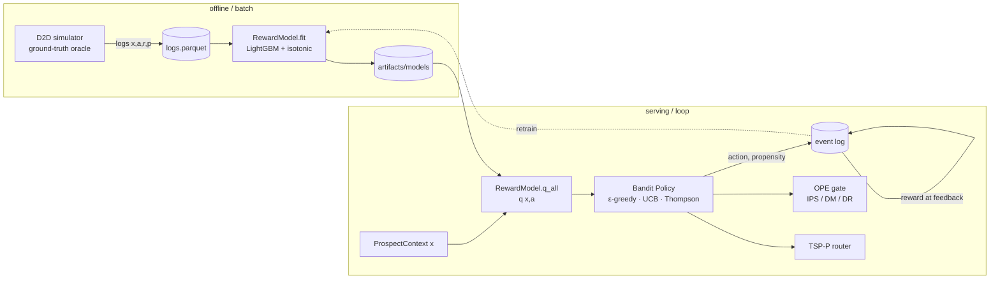

# Architecture — D2D Next Best Action (NBA)

This document describes how the system is structured and *why*. For the phased roadmap see
[PLAN.md](PLAN.md); for concepts and data sources see [docs/](docs).

## 1. The through-line

The system is a single decision loop. A door (context `x`) is scored, an action is proposed with
calibrated exploration, the choice is logged with its propensity, and the realized reward feeds
back into the model:

```
context x → reward model q(x,a) → bandit policy (explore) → per-door profit → TSP-P walkable route
```



> **The bandit proposes, the router disposes.** The reward model says *what an action is worth*;
> the bandit decides *what to do under uncertainty*; the router turns per-door value into a
> walkable plan. Every recommendation logs a propensity so the loop can be evaluated offline
> before any policy is promoted.

## 2. Design principles

These constraints are enforced in code and explain most of the structure.

- **Offline-first & deterministic.** Everything runs without network or real field data. A
  built-in simulator generates logs with *known* ground truth, and every stochastic step is
  seeded (`Settings.seed`, explicit `np.random.Generator`s) so runs are reproducible and tests
  are stable.
- **Oracle isolation.** The simulator's ground-truth functions (`latent_scores`, `true_reward`,
  `true_best_action`) are the *only* source of truth and must **never** be imported by
  `nba.reward`, `nba.bandits`, or `nba.ope`. Those modules only ever see logged
  `(context, action, reward, propensity)` tuples — exactly as in production. The oracle is used
  only by the simulator and by notebooks/tests for evaluation.
- **Propensity logging & overlap.** Every logged decision carries `p = P(action | context)`,
  strictly positive. Off-policy estimators reweight by `1/p`; a zero anywhere breaks overlap, so
  all serving policies emit **full-support** action distributions.
- **Ethics by construction.** Models are built *only* from an allow-list of features
  (`ALLOWED_FEATURES`). Geo/identity fields (`lat`, `lon`, `address_id`) and any protected
  attribute are excluded by construction, not by omission — the feature vector is assembled from
  the allow-list, never by reflecting over the context.
- **Frozen feature schema.** `FEATURE_NAMES` is the single source of truth for column order.
  Models persist it and **refuse to load** if it drifts, preventing silent train/serve skew.
- **Pluggable interfaces.** Components depend on narrow `Protocol`s, not concrete classes
  (`QModel`, `QEnsemble`, `Policy`, and later `DistanceEngine`). Swapping a policy or distance
  backend is a one-line change.

## 3. Module map

```
src/nba/
  schema.py            # ✅ Action, Outcome, REWARD map, ProspectContext, BanditEvent
  config.py            # ✅ pydantic Settings (env-overridable), seeds & knobs
  data/
    ames.py            # ✅ Ames housing loader (+ offline synthetic fallback)
    features.py        # ✅ featurize() with ethics allow-list; frozen FEATURE_NAMES
    simulator.py       # ✅ ground-truth oracle + logging policy → logged events
  reward/
    model.py           # ✅ RewardModel (LightGBM + isotonic), ExploitationBaseline
  bandits/
    base.py            # ✅ Policy/QModel/QEnsemble protocols, validate_dist, softmax
    epsilon_greedy.py  # ✅ EpsilonGreedy
    ucb.py             # ✅ UCB (bucketed counts + softmax)
    thompson.py        # ✅ BootstrapEnsemble + ThompsonSampling
  ope/
    estimators.py      # ✅ IPS/SNIPS/DM/DR estimators, LoggedBatch, clipping + ESS
    gate.py            # ✅ PromotionGate (DR lower bound vs baseline + min_lift)
  routing/
    distance.py        # ✅ DistanceEngine protocol, HaversineEngine, OSRMEngine stub
    territories.py     # ✅ KMeans walkable territories (Territory, cluster_territories)
    tsp_profits.py     # ✅ OR-Tools TSP-with-Profits solver (Route, solve_tsp_profits)
  pipeline/            # ⏳ planned: orchestrator.py
  api/                 # ⏳ planned: app.py (FastAPI), store.py (append-only event log)

scripts/
  generate_logs.py     # ✅ simulator → data/logs.parquet
  train_reward.py      # ✅ logs → artifacts/models (+ metrics.json)
  evaluate_policy.py   # ✅ OPE + promotion gate CLI
  run_demo.py          # ⏳ planned (end-to-end shift)
```

✅ implemented · ⏳ planned (see [PLAN.md](PLAN.md) phases 7–8).

## 4. Core contracts

The whole system is held together by a few small types in `schema.py` and three protocols in
`bandits/base.py`.

### Domain vocabulary (`schema.py`)

- `Action` — the 5-arm action space (`KNOCK_NOW`, `LEAVE_FLYER`, `SKIP_DOOR`, `PITCH_SOLAR`,
  `PITCH_SECURITY`); `ACTIONS` is the frozen canonical order used for one-hot encoding and column
  alignment.
- `Outcome` + `REWARD` — observed events mapped onto a monotone reward ladder
  (`SLAMMED -0.2 < NOT_HOME 0 < INFO 0.1 < APPOINTMENT 0.3 < CLOSED 1.0`). `SLAMMED` is negative
  so `SKIP_DOOR` is a real opportunity-cost decision.
- `ProspectContext` — a frozen, validated decision context (prospect + environment + spatial
  blocks). Contains no protected attributes.
- `BanditEvent` — one logged decision: `context, action, propensity (>0), reward?, outcome?,
  timestamp, decision_id`. The unit of the log and the input to every learner.

### Policy protocols (`bandits/base.py`)

```python
QModel:    q_all(ctx, actions) -> np.ndarray            # scores actions (the reward model)
QEnsemble: q_all_members(ctx, actions) -> np.ndarray    # (B, |A|) posterior sample source
Policy:    recommend(ctx) -> (Action, propensity)       # the (action, p) we log
           action_dist(ctx) -> {Action: prob}           # full-support dist OPE consumes
```

Shared helpers: `validate_dist` (sums to 1, full support), `sample_from_dist` (categorical draw
returning the chosen probability), `softmax` (numerically stable).

## 5. Components

### Data layer (`data/`)

- **`ames.py`** draws realistic `sale_price` / `year_built` from the public Ames dataset, with a
  statistically similar `synthetic_ames` fallback so the pipeline is fully offline-testable.
- **`features.py`** turns `(context, action)` into a fixed-width `float64` vector: allow-listed
  numeric/bool fields, a weather one-hot, then an action one-hot. `FEATURE_NAMES` freezes the
  order; this is the contract models persist and verify.
- **`simulator.py`** is the ground-truth world. `latent_scores` encodes documented interaction
  effects (e.g. evening `KNOCK_NOW` lifts appointments; bad weather lifts slams); a stochastic
  `behavior_policy` chooses actions and **records propensity**; `generate_logs` emits a parquet of
  fully-labeled `BanditEvent`s. The oracle handles (`true_reward`, `true_best_action`) are kept
  strictly out of the learning modules.

### Reward model (`reward/model.py`)

`RewardModel` learns `q(x, a) = E[r | x, a]` — a LightGBM regressor plus an **isotonic
calibrator** fit on a held-out split (the raw regressor is biased near the sparse reward
extremes; isotonic monotonically maps predictions toward observed mean reward). It exposes
`q`, `q_all`, `best_action`, and `save`/`load` (which enforces the frozen feature schema).

`ExploitationBaseline` is the deliberate cautionary baseline: always `argmax q`, propensity
`1.0`. It is a valid DM target but has **no overlap** — the "goes blind" policy that motivates
exploration.

### Bandits (`bandits/`)

All three consume the reward model through the `QModel`/`QEnsemble` protocols and emit a
full-support distribution.

- **ε-greedy** — exploit `argmax q` w.p. `1-ε`, explore uniformly w.p. `ε`; argmax ties split the
  exploit mass uniformly. One knob from greedy (`ε→0`) to uniform (`ε→1`).
- **UCB** — adds an optimism bonus `c·√(ln(t+1)/(n+1))` using per-**context-bucket** visit counts
  (continuous contexts never repeat, so counts are kept on a coarse discretization; the bucketizer
  is injectable, a pragmatic stand-in for LinUCB), then **softmaxes** the optimistic scores for a
  smooth, full-support distribution. `temp` controls sharpness.
- **Thompson** — `BootstrapEnsemble` of `B` reward models (each on a bootstrap resample, seed
  offset per member) approximates the posterior over `q`. `recommend` plays a random member's
  argmax; `action_dist` is the Monte-Carlo `P(arm is best)`, floored to full support.

> **Scale caveat (current finding):** calibrated `q`-gaps are O(0.1), so the config defaults
> `ucb_c=1.0` / `softmax_temp=0.25` make UCB's bonus dwarf the signal and flatten it toward
> uniform. Reward-scaled knobs (e.g. `c=0.3`, `temp=0.1`) are needed; final tuning is validated by
> the Phase 5 off-policy evaluation work.

### OPE (`ope/`)

- **`estimators.py`** — IPS, SNIPS, DM, and DR estimators over a `LoggedBatch`, with optional
  importance-weight clipping and an effective-sample-size guard that warns on poor overlap. DR is
  unbiased if *either* `q̂` or the propensities are correct; SNIPS trades a little bias for much
  lower variance; DM is lowest-variance but leans entirely on `q̂` calibration.
- **`gate.py`** — `PromotionGate` promotes a candidate only if its DR lower confidence bound clears
  the logging baseline plus `min_lift`, and flags IPS/DM disagreement as a calibration smell.

### Routing (`routing/`)

- **`distance.py`** — a `DistanceEngine` protocol returning a travel-**time** matrix (seconds).
  `HaversineEngine` is a vectorized great-circle approximation; `OSRMEngine` is a conforming stub
  documenting the seam for a future road network, so callers never change.
- **`territories.py`** — KMeans (in equal-area-rescaled lat/lon) carves doors into walkable
  territories so each TSP instance stays small and a route stays in one neighborhood.
- **`tsp_profits.py`** — an OR-Tools TSP-with-Profits solver: every non-depot door is *optional*
  with a drop penalty equal to its scaled profit, so the solver trades travel time against profit
  and drops far-flung low-value doors. Capacity and per-node time windows are optional constraints;
  fixed inputs + fixed time limit + single thread make routes deterministic.

### Planned: orchestrator, API

- **`pipeline/` + `api/`** — an orchestrator wiring bandit per-door profits into the router, and a
  thin FastAPI service (`/recommend` logs `p`, `/feedback` appends reward, `/route` re-solves)
  over an append-only event store.

## 6. Control & data flow (the closed loop)

1. **Generate** logs from the simulator (`scripts/generate_logs.py`) → `data/logs.parquet`.
2. **Train** the reward model (`scripts/train_reward.py`) → `artifacts/models/` (+ `metrics.json`).
3. **Score**: `RewardModel.q_all(ctx)` gives per-action expected reward.
4. **Propose**: a `Policy` returns `(action, propensity)`; `action_dist` records the full
   distribution.
5. **Log**: persist `BanditEvent(context, action, reward, propensity, …)`.
6. **Evaluate** (planned): OPE estimates a candidate policy's value from the logs; the gate
   decides promotion.
7. **Retrain**: accumulated logs refit the reward model (and ensemble), sharpening future
   proposals — closing the loop.

Exploration is the hinge: it keeps logged `p` strictly positive (bounded `1/p`), which is the
precondition for steps 6–7 to be valid. Pure exploitation short-circuits the loop.

## 7. Cross-cutting concerns

- **Configuration** — `config.py` exposes a pydantic `Settings` with every field overridable via
  an `NBA_*` env var: paths, `seed`, bandit knobs (`epsilon`, `ucb_c`, `softmax_temp`,
  `n_bootstrap`), routing knobs, OPE gate thresholds, and the ethics switch
  (`cap_exploration_in_sensitive`). `get_settings()` returns a cached singleton.
- **Persistence** — `RewardModel.save/load` (joblib + a `feature_names.json` guard);
  `BootstrapEnsemble.save/load` (per-member directories + manifest). Logs are parquet; the
  planned event store is append-only.
- **Determinism & seeding** — a single `seed` flows from `Settings` into every generator; the
  reward model's train/val split, the bootstrap resamples (seed offset per member), and policy
  sampling are all reproducible.
- **Testing & tooling** — `pytest` per module (oracle-backed assertions, protocol/contract tests,
  determinism, "beats uniform" smoke tests); `ruff` (lint+format), `pyright` (standard mode).
  `make check` runs all three.

```bash
make setup     # uv sync (.venv + deps)
make check     # ruff + pyright + pytest
uv run python scripts/generate_logs.py --n 20000 --out data/logs.parquet
uv run python scripts/train_reward.py  --logs data/logs.parquet --out artifacts/models
```

## 8. Status

| Phase | Area | State |
|------:|------|-------|
| 0 | Scaffold, config, tooling | ✅ done |
| 1 | Schema + reward map + featurize | ✅ done |
| 2 | D2D simulator + feature substrate | ✅ done |
| 3 | Reward model (LightGBM + isotonic) | ✅ done |
| 4 | Bandit policies (ε-greedy, UCB, Thompson) | ✅ done |
| 5 | OPE estimators + promotion gate | ✅ done |
| 6 | Routing / TSP-P | ✅ done |
| 7 | Orchestrator + FastAPI service | ⏳ planned |
| 8 | Demo + end-to-end verification | ⏳ planned |

See [PLAN.md](PLAN.md) and [plans/](plans) for detailed specs; notebooks in [notebooks/](notebooks)
explore the EDA, reward-model explainability, display calibration, bandit behavior, off-policy
evaluation, and TSP-with-profits routing.
