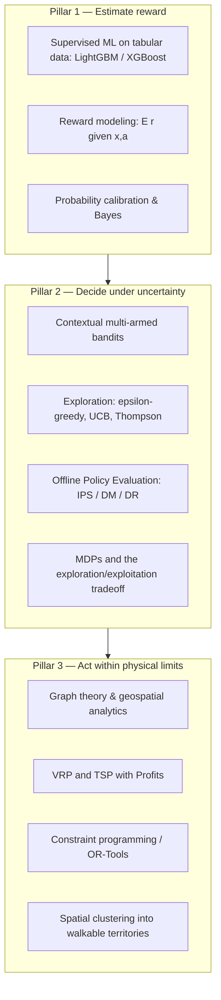

# 2. Concepts to Learn

Architecting an NBA + routing system from scratch requires synthesizing **predictive
analytics**, **reinforcement learning / decision theory**, and **operations research**. The
core engine is a **contextual multi-armed bandit**, wrapped by a reward model underneath and a
geographic constraint solver on top. This document groups the prerequisite concepts into three
pillars and explains *why each one matters* for the field-sales use case.

> **Mental model.** Supervised learning answers *"how good is this door?"*. A bandit answers
> *"which door should I knock **and** how much should I explore unknowns?"*. Operations
> research answers *"given those choices, what is the shortest walkable path?"*. NBA needs all
> three.

---

## 2.1 Pillar 1 — Reward modeling & probability

The NBA engine needs a model that, for a given **context** $x$ (the prospect + environment)
and a candidate **action** $a$, predicts the **expected reward**:

$$\hat{q}(x, a) = \mathbb{E}[\,r \mid x, a\,]$$

where the reward $r$ is a business-defined number (e.g., `0.0` slammed door, `0.2` appointment
set, `1.0` closed deal — see [03-data.md](03-data.md)). This reward model is the "value
estimator" the bandit consults.

### Supervised machine learning on tabular data

Use models that produce a **continuous, calibrated score**:

- **LightGBM** — the default workhorse. Gradient-boosted trees dominate tabular problems and
  are fast enough to retrain nightly and serve in milliseconds. Handles categorical features,
  missing values, and non-linear interactions natively.
- **XGBoost** — equivalent alternative; pick one and standardize.
- **Regularized Logistic Regression** — interpretable baseline and a good behavior policy for
  early OPE.
- **Random Forests** — robust, low-tuning sanity check.

> **Why tree-based, not deep nets?** D2D data is tabular, medium-sized, and heterogeneous
> (mixed categorical/numeric). Gradient-boosted trees win on accuracy, training speed, and
> operational simplicity in exactly this regime.

### Probability calibration & Bayes' Theorem

A bandit's exploration math assumes scores mean what they say, so **calibration matters**
(Platt scaling / isotonic regression). The underlying conditional-probability machinery rests
on **Bayes' Theorem** and **maximum likelihood estimation**:

$$P(A \mid B) = \frac{P(B \mid A)\,P(A)}{P(B)}$$

### Bayesian updating

As new behavioral signals arrive (flyer left yesterday, neighbor just converted), the **prior**
is updated into a **posterior**, instantly changing the prospect's reward estimate and its
place in the routing queue. Bayesian updating is also the engine behind **Thompson Sampling**
(Pillar 2).

**Why it matters:** this is the "value" half of the NBA. Without a calibrated reward estimate
per (context, action), the bandit cannot compare arms or compute exploration bonuses.

---

## 2.2 Pillar 2 — Decision-making under uncertainty (the bandit)

Supervised learning predicts a *static* value. But the system must **act**, and every action it
takes also determines **what data it gets back**. This is the realm of **reinforcement
learning**, and for NBA the right tool is the **contextual multi-armed bandit (CMAB)**.

### 2.2.1 Contextual multi-armed bandits — the foundation of NBA

- A **plain bandit** has $K$ arms and tries to find the single best arm overall.
- A **contextual bandit** observes a **context** $x$ first, then chooses an arm $a$, and learns
  the best arm **as a function of context**. *"Knock now"* may be optimal at 5 PM for a
  long-tenure household, and *"leave flyer"* optimal at 11 AM for a rental — same model,
  different context.

Formally, at each round the policy $\pi$ observes context $x$, picks action $a \sim \pi(\cdot\mid x)$,
and receives only the reward $r$ for the **chosen** action (the **bandit feedback** problem —
you never see what the other doors would have done).

### 2.2.2 Why bandits beat pure supervised learning here

A naive supervised system always routes reps to the highest-predicted door. That creates a
**pernicious feedback loop**: you only ever collect data on "good" doors, and the model goes
**blind** to the rest of the territory. Two business problems make this fatal:

| Problem | What goes wrong with pure supervised | How the bandit solves it |
|---------|--------------------------------------|--------------------------|
| **Non-stationarity** | A neighborhood that converted in spring dries up in summer; a competitor enters. The frozen model keeps sending reps to now-dead streets. | Continuous **exploration** re-samples "stale" areas, so the policy detects shifting trends automatically — no manual retrain needed. |
| **Cold start** | A brand-new city / team has *zero* history; the model has nothing to predict from. | The bandit starts near-**uniform random** (pure exploration) and smoothly shifts to exploitation as it learns which profiles pay off. |

See [08-bandits-and-offline-evaluation.md](08-bandits-and-offline-evaluation.md) for the full
treatment.

### 2.2.3 Exploration strategies (know the trade-offs)

The exploration/exploitation balance is the heart of the bandit. Master three strategies:

| Strategy | Idea | Pros | Cons |
|----------|------|------|------|
| **ε-greedy** | Pick the best estimated action with prob. $1-\varepsilon$, a random valid action with prob. $\varepsilon$. | Trivial to implement; great first wrapper around LightGBM. | Explores blindly (wastes pulls on obviously bad arms); fixed $\varepsilon$ ignores confidence. |
| **Upper Confidence Bound (UCB)** | Pick $\arg\max_a \big[\hat{q}(x,a) + c\sqrt{\tfrac{\ln t}{n_a}}\big]$ — optimism under uncertainty. | Explores *informatively* (favors uncertain arms); strong regret bounds. | Needs a usable uncertainty estimate; tuning $c$. |
| **Thompson Sampling** | Keep a posterior over each arm's reward; **sample** from it and act greedily on the sample. | Excellent empirical performance; naturally Bayesian; handles delayed feedback well. | Requires maintaining/sampling posteriors. |

$$a_t^{\text{UCB}} = \arg\max_a \left( \hat{q}(x_t,a) + c\sqrt{\frac{\ln t}{n_a}} \right)$$

A pragmatic build path: start with **ε-greedy** wrapped around LightGBM (Phase 3), then upgrade
to **Thompson Sampling** once posteriors/uncertainty are available.

### 2.2.4 Offline Policy Evaluation (OPE) — the safety gate

You **cannot** safely A/B test an unproven routing policy on live reps and real revenue. You
must first estimate how a *new* policy would have performed using *old, biased* historical logs.
This is **OPE**, and it is the single most important discipline that separates a toy bandit from
a deployable one.

The key tool is **Inverse Propensity Scoring (IPS)**, which reweights logged rewards by the
ratio of new-policy to logging-policy action probabilities:

$$\hat{V}_{\text{IPS}}(\pi) = \frac{1}{n}\sum_{i=1}^{n} \frac{\pi(a_i \mid x_i)}{p_i}\, r_i$$

where $p_i$ is the **propensity** — the probability the *logging* system chose action $a_i$.
**This is why propensity logging is mandatory from day one** ([03-data.md](03-data.md)). Related
estimators trade bias for variance:

- **Direct Method (DM)** — fit a reward model and average its predictions under the new policy
  (low variance, biased if the model is wrong).
- **IPS** — unbiased if propensities are correct, but high variance when ratios are large.
- **Doubly Robust (DR)** — combines DM + IPS; unbiased if *either* the reward model *or* the
  propensities are correct. Usually the best default.

Tooling: the **Open Bandit Pipeline (OBP)** implements IPS/DM/DR over real logged bandit data
and is the recommended sandbox ([03-data.md](03-data.md)).

### 2.2.5 MDPs and the broader RL framing

When actions have *long-horizon* consequences (a flyer today raises tomorrow's knock value), the
problem generalizes from a bandit (one-step) to a **Markov Decision Process** (multi-step):

| Element | Field-sales meaning |
|---------|---------------------|
| **State** | Full status of a lead: demographics, interaction history, geo-coordinates. |
| **Action** | Knock Now, Leave Flyer, Skip Door, Pitch Solar, Pitch Security, … |
| **Transition** | Likelihood an action moves the prospect to a better state (Cold → Appointment). |
| **Reward** | Business reward of the outcome **minus** the operational cost (a knock costs minutes + walking; a flyer is cheap). |

Start with the **contextual bandit** (simpler, well-understood, strong OPE support) and only
graduate to full MDP/RL if long-horizon credit assignment proves necessary.

**Why it matters:** this is the "decision" half of the NBA — it converts reward estimates into
cost-aware actions *while actively managing what the system learns next*.

---

## 2.3 Pillar 3 — Geospatial analytics & the Vehicle Routing Problem

Field sales adds severe geographic constraints that digital channels never face.

### The Vehicle Routing Problem (VRP) and TSP with Profits

The bandit may output *"these are the 8 highest-reward doors"* — but several could be miles
apart. **Constrained optimization** reconciles the bandit's wish-list with physical reality.

- The **VRP** is **NP-hard**: *"What is the optimal set of routes for a fleet of vehicles (or
  reps) to service a set of customers?"*
- The most relevant variant for NBA is the **Traveling Salesperson Problem with Profits
  (TSP-P)**: you are **not required to visit every node**. Each node carries a *profit* (the
  bandit's expected reward) and visiting costs travel time. The solver chooses **which subset**
  of high-reward doors to visit **and in what order** to maximize `Σ profit − λ·travel`.

This is exactly the field-sales decision: *"Don't send the rep 5 miles for one slightly-better
door; pick the dense cluster of good-enough doors on the next two blocks."*

Because brute force is intractable, practitioners use:

- **Heuristic approximations** (e.g., **Christofides'** algorithm for near-optimal TSP paths;
  nearest-neighbor / 2-opt / Or-opt local search for fast routing).
- **Constraint programming** via **Google OR-Tools** — the industry standard for VRP/TSP-P with
  real constraints: **time windows** (residential visits 16:00–19:00), **capacity**
  (~15–20 quality visits/shift), real **drive-time matrices** (not Euclidean), shift schedules,
  and **skill matching** (senior reps for enterprise leads).

### Graph theory

Model prospect locations as **nodes** and physical **drive/walk times as edges**; routing
operates on this weighted graph.

### Geospatial fundamentals

- Coordinate systems, map projections, the **WGS84** datum.
- **Haversine formula** for great-circle surface distance.
- Spatial indexing (**R-trees**) for millisecond queries over millions of lead pins.
- Spatial clustering (**DBSCAN**, **K-Means**) to segment a national dataset into feasible,
  walkable territories *before* routing.

**Why it matters:** this is the "move" half — it makes the abstract "visit" recommendation
physically executable within a real shift.

---

## 2.4 Skills checklist

- [ ] Train and **calibrate** a tabular reward model (LightGBM) for $\mathbb{E}[r\mid x,a]$.
- [ ] Apply Bayes' theorem / Bayesian updating to a streaming context.
- [ ] Implement a **contextual bandit** with ε-greedy, then UCB, then Thompson Sampling.
- [ ] Explain non-stationarity and cold-start, and why exploration fixes both.
- [ ] Run **OPE** (IPS / DM / DR) on logged bandit data with the Open Bandit Pipeline.
- [ ] Define and log **propensity scores** for every action.
- [ ] Formalize a long-horizon variant as an MDP (state / action / transition / reward).
- [ ] Model locations as a graph; compute Haversine and real drive-time matrices.
- [ ] Solve a constrained **TSP-P / VRP** with Google OR-Tools (time windows + capacity).
- [ ] Cluster coordinates into walkable territories with K-Means / DBSCAN.
