# 4. Learning Curriculum (6 Months, 5 Phases)

A sequential plan to take a data / operations / revenue-engineering team from zero to a
deployed NBA + routing system. Each phase lists a **strategic objective**, **curriculum
directives** (what to study), and a **practical application** (what to build).

```mermaid
gantt
    dateFormat  X
    axisFormat  W%s
    title NBA Build — Learning Phases (weeks)
    section Foundations
    Geospatial data engineering      :a1, 0, 4
    Reward modeling / lead scoring   :a2, 4, 4
    section Decisioning
    Contextual bandits + OPE         :a3, 8, 6
    Geo-constraining / TSP-P         :a4, 14, 4
    section Production
    Cloud architecture & deployment  :a5, 18, 6
```

---

## Phase 1 — Geospatial data engineering & spatial SQL (Weeks 1–4)

**Objective:** master handling, storage, and rapid querying of geographic coordinate data.

**Study:**
- Geographic coordinate systems, map projections, the **WGS84** datum.
- **PostgreSQL + PostGIS**; the **Haversine** formula; bounding-box queries.
- Geospatial indexing (**R-trees**) so million-row pin queries run in milliseconds without
  locking the DB.

**Build:** Ingest the **10M-row** synthetic geographic demand dataset. Run **K-Means**
clustering to group B2C prospects into localized, high-density, foot-canvassable territories.

---

## Phase 2 — Reward modeling & lead scoring (Weeks 5–8)

**Objective:** predict the expected reward of a (context, action) pair *before* acting.

**Study:**
- Supervised classification & regression theory; **probability calibration** (Platt/isotonic).
- Core Python stack: **LightGBM** (primary), **scikit-learn**, **pandas**.
- Feature engineering for real estate / demographics (e.g., derive roof age from `YearBuilt`,
  turn categorical zoning into continuous risk).

**Build:** Using **Ames Housing + ACS** (not Boston), train a LightGBM model for property
value / roof age as a reward-model substrate. Then reshape historical knock logs into the
`(context, action, reward, propensity)` schema and fit $\hat{q}(x,a)=\mathbb{E}[r\mid x,a]$.

---

## Phase 3 — Contextual bandits & offline evaluation (Weeks 9–14)

**Objective:** move from *predicting* rewards to *choosing actions* — and prove a new policy is
safe **before** field testing.

**Study:**
- **Contextual multi-armed bandits**; exploration strategies (**ε-greedy → UCB → Thompson**).
- **Offline Policy Evaluation**: **IPS**, **Direct Method**, **Doubly Robust**.
- Hands-on with the **Open Bandit Pipeline (OBP)** and the **Open Bandit Dataset**; optionally
  the **Yahoo R6** uniform-random logs for clean replay.

**Build:** Wrap the Phase-2 LightGBM reward model in an **ε-greedy** policy. Evaluate it on
logged data with IPS/DM/DR (OBP). Only promote a policy whose OPE estimate beats the logging
baseline with acceptable variance.

---

## Phase 4 — Geographic constraining: TSP-P & OR-Tools (Weeks 15–18)

**Objective:** reconcile the bandit's high-reward doors with physical walkability.

**Study:**
- Operations research & combinatorial optimization, focused on **TSP with Profits** and the
  **VRP**.
- **Google OR-Tools** in Python for constrained routing.
- External **distance-matrix** sources (OSRM/Valhalla over OSM) for realistic travel times
  (discard naive Euclidean distance).

**Build:** Take the top high-reward doors from Phase 3. Run a **TSP-P** in OR-Tools that selects
a *walkable subset* maximizing `Σ reward − λ·travel`, under **time-window** constraints
(e.g., residential 16:00–19:00), producing an optimized daily manifest.

---

## Phase 5 — Cloud architecture & real-time deployment (Weeks 19–24)

**Objective:** deploy the local models into a scalable, fault-tolerant, real-time cloud
environment.

**Study:**
- AWS serverless patterns: **AWS Lambda**, **Amazon API Gateway**.
- IoT telematics & **MQTT** pub/sub for high-volume GPS pings.
- **Docker** containerization — needed because OR-Tools compute often exceeds Lambda timeout
  limits.

**Build:** An end-to-end pipeline where a simulated mobile app emits a **"Visit Completed"**
MQTT ping. The ping must update the lead's state, recompute the NBA model, and push a newly
optimized route back to the client in **under two seconds**.

---

## Milestone definition of done

| Phase | "Done" looks like |
|-------|-------------------|
| 1 | Territories generated from 10M rows; sub-second spatial queries. |
| 2 | Calibrated reward model $\hat{q}(x,a)$; logs reshaped to `(x,a,r,p)`. |
| 3 | ε-greedy bandit whose **OPE** (IPS/DM/DR) beats the logging baseline. |
| 4 | Walkable TSP-P route maximizing `Σ reward − λ·travel` under time windows. |
| 5 | Closed-loop ping → re-route round trip in < 2 seconds. |
