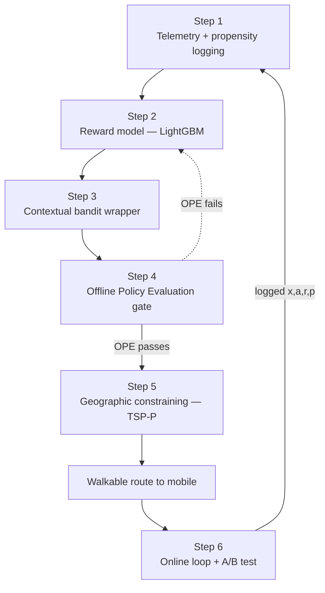
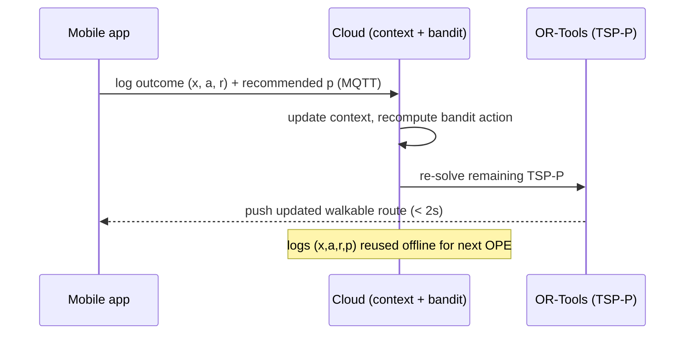

# 5. Implementation Steps (From Scratch)

This is the end-to-end build, linking a **reward model**, a **contextual bandit**, an **OPE
safety gate**, and a **geographic constraint solver**. It maps directly to the phased rollout
in [07-deployment-roadmap.md](07-deployment-roadmap.md). For a longer treatment of **why** each
step exists and **what alternatives** were considered, see
[10-implementation-rationale-and-alternatives.md](10-implementation-rationale-and-alternatives.md).
Six steps:



---

## Step 1 — Telemetry & propensity logging

**Before any modeling**, upgrade the app to log the exact state of the world at the moment a
door is actioned, as a `(context, action, reward, propensity)` tuple.

- **Context $x$** — prospect features (property/roof age, est. income, tenure, prior
  interactions) **+** environment (time, day, weather, block density, recent neighbor
  conversion) **+** spatial (distance from rep's GPS, nearby high-reward density).
- **Action $a$** — `Knock Now`, `Leave Flyer`, `Skip Door`, `Pitch Solar`, `Pitch Security`, …
- **Reward $r$** — business-defined (`0.0` slammed · `0.2` appointment · `1.0` closed).
- **Propensity $p$** — *the probability the current system/rep chose this action.* **This is the
  critical, easily-forgotten field.** Even if the current "policy" is a rep's habit, model it
  (e.g., uniform over offered options) and record `p` at decision time — it is irreplaceable
  later for OPE.

```python
@dataclass
class BanditEvent:
    context: dict      # x: prospect + environment + spatial features
    action: str        # a
    reward: float      # r (filled when outcome is observed)
    propensity: float  # p: P(action chosen by the logging policy)
    address_id: str
    timestamp: datetime
```

---

## Step 2 — Train the reward model (LightGBM baseline)

Extract historical logs and train a **LightGBM** model to predict expected reward
$\hat{q}(x,a)=\mathbb{E}[r\mid x,a]$. **Deploy it first as a pure-exploitation engine** (always
pick the highest predicted reward) to establish a measurable baseline — this is the supervised
predecessor the bandit will wrap.

```python
import lightgbm as lgb

# features include the action (one-hot or native categorical) so the model is q(x, a)
model = lgb.LGBMRegressor(
    n_estimators=600, learning_rate=0.05, num_leaves=63,
)
model.fit(X_train, r_train)            # X = context+action, r = reward

def q_hat(context, action):
    return model.predict(featurize(context, action))[0]
```

> Calibrate scores (isotonic/Platt) so the bandit's exploration math is meaningful.

---

## Step 3 — Wrap the reward model in a contextual bandit

A pure-exploitation model goes **blind** to the rest of the territory (see
[08-bandits-and-offline-evaluation.md](08-bandits-and-offline-evaluation.md)). Wrap it in an
**exploration policy**. Start simple with **ε-greedy**: recommend the model's best action with
probability $1-\varepsilon$, and a random *valid* action with probability $\varepsilon$.

Crucially, **record the propensity of whatever you recommend** so the next OPE is possible.

```python
import random

def epsilon_greedy(context, actions, epsilon=0.1):
    best = max(actions, key=lambda a: q_hat(context, a))
    if random.random() < epsilon:
        choice = random.choice(actions)                 # explore
    else:
        choice = best                                   # exploit
    # propensity of the chosen action under THIS policy
    n = len(actions)
    p = (1 - epsilon) * (choice == best) + epsilon / n
    return choice, p
```

Upgrade path: **UCB** (optimism via uncertainty) → **Thompson Sampling** (posterior sampling)
once you can estimate per-arm uncertainty.

---

## Step 4 — Offline Policy Evaluation (the safety gate)

**Never** ship a new bandit policy straight to the field. First estimate its value on the
*logged* data using **IPS / DM / DR** (the Open Bandit Pipeline implements all three). Only
promote a policy whose OPE estimate beats the current logging baseline with acceptable
variance.

$$\hat{V}_{\text{IPS}}(\pi) = \frac{1}{n}\sum_{i} \frac{\pi(a_i \mid x_i)}{p_i}\, r_i$$

```python
from obp.ope import OffPolicyEvaluation, InverseProbabilityWeighting as IPS, \
    DirectMethod as DM, DoublyRobust as DR

ope = OffPolicyEvaluation(
    bandit_feedback=logged_feedback,        # {context, action, reward, pscore, ...}
    ope_estimators=[IPS(), DM(), DR()],
)
estimated_value = ope.estimate_policy_values(
    action_dist=new_policy_action_dist,     # π(a|x) for the candidate policy
    estimated_rewards_by_reg_model=q_model_preds,
)
# promote only if estimated_value beats the logging baseline within variance bounds
```

This gate is what makes the system **safe to iterate** without burning real rep-hours.

---

## Step 5 — Geographic constraining via TSP with Profits

The bandit outputs a set of high-reward doors — but they may be scattered. A rep cannot walk 5
miles for one slightly-better door. Solve a **TSP-P** that picks a **walkable subset** and
order, maximizing `Σ reward − λ·travel`.

1. **Initialize OR-Tools** in a dedicated (containerized) compute env.
2. **Build a real travel matrix** — OSRM/Valhalla over OSM (or a maps API), **not** Euclidean.
3. **Apply constraints:** capacity (~15–20 visits/shift), **time windows** (residential
   16:00–19:00), **skill matching** (enterprise leads → senior reps).
4. **Optimize:** maximize collected profit (bandit reward) minus weighted travel; push the
   turn-by-turn route to the rep's device.

```python
from ortools.constraint_solver import pywrapcp, routing_enums_pb2

manager = pywrapcp.RoutingIndexManager(len(travel_matrix), num_vehicles=1, depot=0)
routing = pywrapcp.RoutingModel(manager)

transit = routing.RegisterTransitCallback(
    lambda i, j: travel_matrix[manager.IndexToNode(i)][manager.IndexToNode(j)]
)
routing.SetArcCostEvaluatorOfAllVehicles(transit)

# TSP-P: make nodes OPTIONAL with a drop penalty = the door's bandit reward (profit)
for node in range(1, len(travel_matrix)):
    routing.AddDisjunction([manager.NodeToIndex(node)], int(reward_profit[node] * SCALE))
# add time-window + capacity dimensions here ...

params = pywrapcp.DefaultRoutingSearchParameters()
params.first_solution_strategy = routing_enums_pb2.FirstSolutionStrategy.PATH_CHEAPEST_ARC
solution = routing.SolveWithParameters(params)
```

> The drop-penalty trick turns a routing solver into a **profit-selecting** one: skipping a
> high-reward door costs more than skipping a low-reward one, so the solver keeps the dense,
> valuable cluster and drops the far-flung outliers.

---

## Step 6 — Online loop & A/B test

Route a **small fraction of reps** with the bandit, the rest with the legacy system, and
compare on real outcomes. As reps log results (`Not Home`, `Gatekeeper Blocked`, `Requested
Callback`, `Pitch Delivered`), the cloud ingests the telemetry instantly:

- A callback request in 2 days updates the context; the door's immediate reward drops to ~0.
- The remaining route is **re-solved** for the rest of the shift — no manager intervention.
- Every logged `(x, a, r, p)` flows back to Step 1, feeding the next OPE round.



Monitor **cumulative reward** (closed deals) and **walk-time efficiency** over a multi-week
window before widening the rollout (see [07-deployment-roadmap.md](07-deployment-roadmap.md)).

---

## Build checklist

- [ ] Log `(context, action, reward, propensity)` for every door — **propensity included**.
- [ ] Train + calibrate a LightGBM reward model; deploy as exploitation baseline.
- [ ] Wrap it in an ε-greedy bandit; record recommendation propensities.
- [ ] Gate every new policy through OPE (IPS/DM/DR) before field exposure.
- [ ] Build a real travel matrix (OSRM/Valhalla), not Euclidean.
- [ ] Solve constrained **TSP-P** (drop penalty = reward; time windows; capacity).
- [ ] Run a 10/90 online A/B; monitor cumulative reward + walk efficiency; re-route in < 2s.
