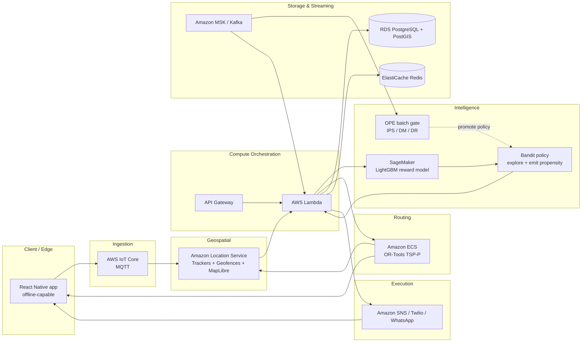

# 6. AWS Cloud Architecture

Deploying a mobile-first, real-time optimization system to hundreds of field reps needs a
**resilient, scalable** architecture. AWS provides an integrated ecosystem to fuse ML,
geospatial calculations, and mobile event streams. The design leans on **serverless compute**
and **managed ML** to absorb the spiky load of field activity (morning dispatch surges,
afternoon canvassing bursts).

---

## 6.1 Architectural component flow

### 1. Mobile edge & high-volume event ingestion
- App built on a cross-platform framework (**React Native**).
- **Offline-first**: field work happens in poor-reception areas (rural pockets, basements,
  concrete urban cores). The app **caches state changes locally** and syncs on reconnect.
- Online, the device streams **GPS pings** and **user events** (e.g., "Visit Logged") via
  **AWS IoT Core** over **MQTT** (lightweight, high-volume friendly — avoids overwhelming HTTP
  endpoints).

### 2. Geospatial processing — Amazon Location Service
GPS coordinates interface directly with **Amazon Location Service**:
- **MapLibre** rendering for fast custom maps on the device.
- **Trackers + Geofence Collections** represent assigned territories. Entering/exiting a
  geofence **auto-triggers a Lambda** (update DB; optionally SMS-alert management on route
  deviation).
- **`CalculateRouteMatrix` API** returns accurate travel times/distances between prospect
  nodes, honoring avoidance parameters (tolls, ferries, traffic density) for the OR-Tools
  engine.

### 3. Data storage & streaming
- **Amazon RDS (PostgreSQL + PostGIS)** — primary store with spatial querying
  (e.g., *"find all uncontacted leads within a 3-mile radius of the rep's current location"*).
- **Amazon ElastiCache (Redis)** — fast state caching + queue management.
- **Amazon MSK (Kafka)** — high-velocity visit/event streams with low latency.

### 4. Machine learning engine — reward model, bandit & OPE
- **Amazon SageMaker** hosts the **LightGBM reward model** ($\hat{q}(x,a)$) as a real-time
  inference endpoint (containerized, hot-swappable, zero-downtime retraining).
- A lightweight **bandit policy service** (Lambda or a small ECS service) wraps the reward
  model with the exploration strategy (ε-greedy → Thompson) and, critically, **emits the
  propensity $p$** of every recommendation into the event log.
- **Offline Policy Evaluation** runs as a **batch job** (SageMaker Processing / Batch) over the
  logged `(x, a, r, p)` data using the **Open Bandit Pipeline** (IPS/DM/DR). A new policy is
  only promoted to the endpoint after it **passes the OPE gate**.
- **Amazon Personalize** (Native NBA recipe) is an optional managed alternative to a
  self-built bandit for teams that prefer not to operate their own policy service.

> **Propensity logging is an architectural requirement, not an afterthought.** The bandit
> service must write `p` alongside `x`, `a`, and (later) `r` for every decision — there is no
> way to reconstruct it downstream.

### 5. Automated execution & notification
- If ML determines the best action is a **digital** communication (not a costly visit), the
  routing engine is bypassed and **Amazon SNS** / **Twilio SMS** / **WhatsApp Business API**
  dispatches the message — no human intervention.

---

## 6.2 Service responsibility map

| Layer | AWS service / tech | Primary function | Data direction |
|-------|--------------------|------------------|----------------|
| Client / Edge | React Native app | Offline UX; collect GPS + outcomes | → Ingestion |
| Ingestion | AWS IoT Core (MQTT) | High-frequency pings & event streams | → Routing & Compute |
| Geospatial | Amazon Location Service | Geofences, Tracker logs, MapLibre rendering | → Compute |
| Compute orchestration | AWS Lambda & API Gateway | Serverless triggers; read/write RDS | Bi-directional |
| Intelligence / ML | Amazon SageMaker | LightGBM **reward model** $\hat{q}(x,a)$ endpoint | → Compute |
| Bandit policy | Lambda / small ECS service | Wrap reward model with exploration; **emit propensity $p$** | → Compute & Log |
| Offline evaluation | SageMaker Processing / Batch + OBP | Batch **OPE** (IPS/DM/DR) gate before promotion | Reads logs |
| Recommendation (optional) | Amazon Personalize | Managed Native NBA recipe alternative | → Compute |
| Routing / optimization | Amazon ECS (OR-Tools) | Containerized **TSP-P / VRP** solver | Pull from Location, push to Edge |
| Database | RDS (PostgreSQL + PostGIS) | CRM data + spatial queries | Accessed by Compute |
| Cache & streaming | ElastiCache (Redis) + Kafka | Real-time streams; cache context vectors | Accessed by Compute |
| Execution | Amazon SNS / Twilio API | Dispatch automated SMS/email | → Customer |

---

## 6.3 Why this shape

- **Decoupled & scalable** — the reward model retrains offline on vast history and
  **hot-swaps** into the SageMaker endpoint with no downtime.
- **OPE before promotion** — a new bandit policy is validated by a **batch OPE job** on logged
  `(x,a,r,p)` data and only then promoted, so experiments never risk live revenue blindly.
- **Container for OR-Tools** — TSP-P/VRP compute regularly exceeds Lambda timeout limits, so it
  runs in **Docker on ECS** rather than serverless functions.
- **Real-time responsiveness** — OR-Tools reacts to live traffic + field inputs from Location
  Service, keeping the rep on the most efficient walkable path available.

---

## 6.4 Security & operational notes

- Encrypt data in transit (TLS/MQTTS) and at rest (KMS); GPS + customer data are sensitive.
- Scope IAM roles tightly per service (least privilege) for Lambda → RDS / SageMaker / ECS.
- Validate and authenticate all device events at IoT Core; never trust raw client payloads.
- Rate-limit and throttle outbound SNS/Twilio to protect deliverability and contain costs.
- Treat geofence-deviation alerts as monitoring signals, mindful of worker-privacy policy.
- **Protect log integrity** — the `(x,a,r,p)` event stream is the asset that enables OPE;
  make it append-only/immutable and guard against dropped or backfilled propensities.
