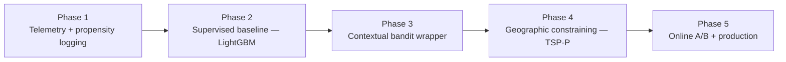

# 7. Enterprise Deployment Roadmap

Moving an NBA model from a local Python script to a resilient enterprise field tool requires a
**phased rollout**. Rigorous process management maximizes ROI while limiting operational shock
to the existing sales force.

---

## Phase 1 — Telemetry & logging infrastructure

- **Milestone:** upgrade the app's tracking to log the **exact state of the world** at the
  moment a door is knocked, as `(context, action, reward, propensity)` tuples.
- **Critical action:** begin logging **propensity scores** — the probability the current
  system/rep chose the action taken. *This is mandatory for all future offline evaluation and
  cannot be reconstructed later.*
- **Success metric:** ≥ 99% of door events carry a complete `(x, a, r, p)` tuple with a valid,
  non-null propensity.

## Phase 2 — Supervised baseline (LightGBM)

- **Milestone:** extract historical logs and train a gradient-boosting model (**LightGBM**) to
  predict expected reward $\mathbb{E}[r\mid x,a]$. Deploy it **purely as an exploitation
  engine** (always pick the highest-predicted action) to establish a performance baseline.
- **Deliverables:** reward model + baseline metrics.
- **Success metric:** model demonstrably beats the legacy heuristic on held-out reward; stable
  calibration.

## Phase 3 — Contextual bandit wrapper

- **Milestone:** wrap the LightGBM predictions in an **exploration policy** — an **ε-greedy**
  wrapper that recommends the optimal action $1-\varepsilon$ of the time and a random valid
  action $\varepsilon$ of the time — while recording the recommendation's propensity.
- **Critical gate:** validate the wrapped policy with **OPE (IPS/DM/DR)** on logged data before
  any field exposure.
- **Success metric:** OPE estimate of the bandit policy beats the exploitation baseline within
  acceptable variance bounds.

## Phase 4 — Geographic constraining

- **Milestone:** integrate a geospatial layer. When the bandit outputs its top-scoring doors,
  run a **TSP-P / routing** step (OR-Tools) so recommendations collapse onto the same walkable
  block, minimizing walk/drive time.
- **Deliverables:** route service that returns a walkable, time-windowed manifest.
- **Success metric:** simulated routes show a meaningful **reduction in walk/drive time**
  versus unconstrained bandit output, with no loss of collected reward.

## Phase 5 — Online A/B test & production

- **Milestone:** route **10% of reps** with the contextual bandit and **90% with the legacy
  system**. Monitor over a **~4-week** window before full rollout.
- **Deliverables:** live experiment, dashboards, rollout decision.
- **Success metric:** the bandit arm shows higher **cumulative reward** (closed deals) and
  better **walk-time efficiency**; no critical failures in offline/dead-zone conditions.

---

## Summary table

| Phase | Focus | Key success metric |
|-------|-------|--------------------|
| 1 — Telemetry | Log `(x,a,r,p)` incl. **propensity** | ≥ 99% events with valid propensity |
| 2 — Baseline | LightGBM exploitation engine | Beats legacy heuristic on held-out reward |
| 3 — Bandit | ε-greedy wrapper + OPE gate | OPE value > baseline within variance |
| 4 — Geo-constraining | TSP-P / OR-Tools routing | Less walk-time, equal reward |
| 5 — Online A/B | 10% bandit / 90% legacy, ~4 wks | Higher cumulative reward + efficiency |

---

## Rollout principles

- **Instrument before you model** — without propensity logs (Phase 1), nothing downstream can
  be evaluated safely.
- **Earn trust before exploring** — the exploitation baseline (Phase 2) proves the model is
  sane before you let it take random actions.
- **Gate every policy through OPE** — never expose an unproven policy to live reps and revenue.
- **The bandit proposes, the router disposes** — geographic constraining (Phase 4) keeps
  recommendations physically sane.
- **Ramp on evidence** — the 10/90 A/B (Phase 5) ties the rollout decision to measured
  cumulative reward and walk efficiency.
