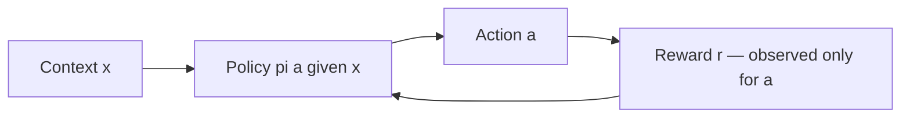
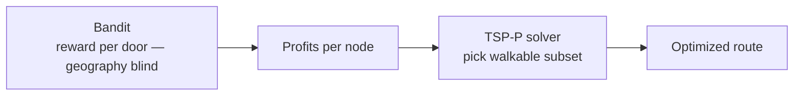

# 8. Bandits & Offline Evaluation — Deep Dive

This document goes deeper on the **algorithmic heart** of the NBA system: contextual
multi-armed bandits, why they beat pure supervised learning for D2D, and how to evaluate a new
policy safely **offline** before risking it in the field.

---

## 8.1 The bandit feedback problem

At each decision the system observes a **context** $x$ (prospect + environment + spatial),
picks an **action** $a$ from a discrete set, and receives a **reward** $r$ — but **only for the
action it took**. It never sees what the other doors would have returned. This *partial
feedback* is what makes the problem a **bandit** rather than ordinary supervised learning.



Formally, a policy $\pi(a\mid x)$ aims to maximize expected reward
$V(\pi) = \mathbb{E}_{x}\,\mathbb{E}_{a\sim\pi(\cdot\mid x)}\big[\,r(x,a)\,\big]$.

---

## 8.2 Why bandits, not pure supervised learning

A naive supervised system trains $P(\text{conversion}\mid x)$ and **always** routes reps to the
highest-probability doors. Two failure modes make this unacceptable in the field:

### Non-stationarity (the world changes)

Sales environments shift fast: a neighborhood that converted in spring dries up in summer; a
competitor enters the territory. A frozen "always-exploit" model keeps sending reps to
now-dead streets because it never re-samples them.

A bandit continuously balances:

- **Exploitation** — send reps to known high-converting areas to hit quota.
- **Exploration** — send a small fraction to *untested* areas to gather fresh signal.

This lets the policy **detect shifting trends automatically**, without waiting for a manual
retrain.

### Cold start (no history)

When a new D2D team launches in a new city, there is **zero** historical data. A pure
supervised model has nothing to predict from. A bandit handles this elegantly: it begins with
**high exploration** (near-uniform random routing) and **smoothly transitions to exploitation**
as it learns which demographic/context profiles yield the highest reward.

> The feedback loop that dooms pure supervised learning — *you only collect data on the doors
> you already like* — is precisely what exploration is designed to break.

---

## 8.3 Exploration strategies in depth

| Strategy | Rule | When to use |
|----------|------|-------------|
| **ε-greedy** | best action w.p. $1-\varepsilon$, random valid action w.p. $\varepsilon$ | First wrapper around LightGBM; dead simple. |
| **UCB** | $\arg\max_a \big[\hat{q}(x,a) + c\sqrt{\ln t / n_a}\big]$ | When you have an uncertainty estimate and want *informed* exploration. |
| **Thompson Sampling** | sample $\tilde{q}(x,a)$ from each arm's posterior, act greedily on the sample | Strong empirical performance; handles delayed feedback. |

**Decaying ε.** A common practical trick is to start with large $\varepsilon$ (cold start) and
decay it over time / as confidence grows — mimicking the bandit's natural exploration →
exploitation arc.

```python
def epsilon_at(t, eps0=0.4, eps_min=0.05, half_life=5000):
    # smooth decay from eps0 toward eps_min
    return eps_min + (eps0 - eps_min) * 0.5 ** (t / half_life)
```

---

## 8.4 Offline Policy Evaluation (OPE)

You **cannot** safely A/B test a totally unproven routing policy on live reps — that risks real
revenue and rep trust. OPE estimates how a **new** (evaluation) policy $\pi_e$ would have
performed using **old** logs collected under a **different** (logging/behavior) policy $\pi_b$.

The bias problem: the logs are skewed toward whatever $\pi_b$ liked. OPE estimators correct for
this skew.

### Inverse Propensity Scoring (IPS)

Reweight each logged reward by how much *more or less* the new policy would have chosen that
action:

$$\hat{V}_{\text{IPS}}(\pi_e) = \frac{1}{n}\sum_{i=1}^{n}
\frac{\pi_e(a_i\mid x_i)}{\underbrace{p_i}_{=\,\pi_b(a_i\mid x_i)}}\; r_i$$

- **Unbiased** if the propensities $p_i$ are correct and have full support.
- **High variance** when the importance ratio $\pi_e/p$ is large (rare logged actions).
- **Requires logged propensities** — the reason Phase 1 logging is non-negotiable.

### Direct Method (DM)

Fit a reward model $\hat{q}(x,a)$ and average its predictions under the new policy:

$$\hat{V}_{\text{DM}}(\pi_e) = \frac{1}{n}\sum_i \sum_a \pi_e(a\mid x_i)\,\hat{q}(x_i,a)$$

- **Low variance**, but **biased** if the reward model is wrong.

### Doubly Robust (DR)

Combine DM and IPS so the estimate is correct if **either** the reward model **or** the
propensities are right:

$$\hat{V}_{\text{DR}}(\pi_e) = \frac{1}{n}\sum_i\left[\sum_a \pi_e(a\mid x_i)\,\hat{q}(x_i,a)
+ \frac{\pi_e(a_i\mid x_i)}{p_i}\big(r_i - \hat{q}(x_i,a_i)\big)\right]$$

- **Best default** — lower variance than IPS, less bias than DM.

| Estimator | Bias | Variance | Needs propensities | Needs reward model |
|-----------|------|----------|--------------------|--------------------|
| IPS | Unbiased* | High | Yes | No |
| DM | Biased | Low | No | Yes |
| DR | Unbiased* | Medium | Yes | Yes |

\* under correctness/support assumptions.

---

## 8.5 Practicing OPE with the Open Bandit Pipeline

The **Open Bandit Dataset (OBD)** + **Open Bandit Pipeline (OBP)** from ZOZO is the recommended
sandbox: real logged bandit feedback (with propensities), collected under both a **Uniform
Random** and a **Bernoulli Thompson Sampling** policy, plus ready-made IPS/DM/DR estimators.

```python
from obp.dataset import OpenBanditDataset
from obp.policy import IPWLearner
from obp.ope import (
    OffPolicyEvaluation,
    InverseProbabilityWeighting as IPS,
    DirectMethod as DM,
    DoublyRobust as DR,
)

# logged feedback collected under the "random" behavior policy
dataset = OpenBanditDataset(behavior_policy="random", campaign="all")
feedback = dataset.obtain_batch_bandit_feedback()

# a candidate evaluation policy learned off-policy
policy = IPWLearner(n_actions=dataset.n_actions)
policy.fit(
    context=feedback["context"], action=feedback["action"],
    reward=feedback["reward"], pscore=feedback["pscore"],
)
action_dist = policy.predict(context=feedback["context"])

ope = OffPolicyEvaluation(bandit_feedback=feedback, ope_estimators=[IPS(), DM(), DR()])
print(ope.estimate_policy_values(action_dist=action_dist))
```

Mirror OBP's `(context, action, reward, pscore)` schema in your own D2D pipeline so the same
estimators work directly on your logs ([03-data.md](03-data.md)).

---

## 8.6 The bandit ↔ routing handoff

The bandit optimizes **expected reward per door**; it is *geography-blind*. Left alone it can
recommend a door 5 miles away. The **TSP-P solver** ([05-implementation-steps.md](05-implementation-steps.md))
takes the bandit's per-door rewards as **node profits** and selects the **walkable subset** that
maximizes `Σ reward − λ·travel`. The two are complementary:



> **The bandit proposes; the router disposes.** Together they produce recommendations that are
> both *high-value* and *physically efficient*.

---

## 8.7 Fairness, ethics & safety

- **No protected attributes in targeting.** Exclude race and proxies (the deprecated Boston
  housing `B` feature is the canonical cautionary tale).
- **Rep & resident privacy.** GPS tracking and household profiling carry privacy obligations;
  follow applicable law and company policy.
- **Guardrails on exploration.** Cap exploration in sensitive contexts (e.g., late hours, safety
  flags) so "explore" never overrides common sense or safety.
- **Log integrity.** Treat the `(x,a,r,p)` stream as an append-only asset; dropped or
  backfilled propensities silently break OPE.
