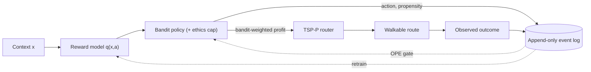

# 09 — Build a Next Best Action System From Scratch

> A complete, first-principles walkthrough of the system in this repository. It assumes you know
> *some* machine learning (you've trained a model, you know what train/test split and
> cross-entropy are) but **nothing** about contextual bandits, off-policy evaluation, or routing.
> Every abbreviation and concept is defined the first time it appears, and every idea is mapped
> onto the actual code so you can build the whole thing yourself.

If you read only one section, read [§2 The big picture](#2-the-big-picture-one-loop). If you want
to *build* it, follow the section order — it is the order in which the code was written.

---

## Table of contents

1. [What problem are we solving?](#1-what-problem-are-we-solving)
2. [The big picture: one loop](#2-the-big-picture-one-loop)
3. [Glossary: every abbreviation, once](#3-glossary-every-abbreviation-once)
4. [The domain model: context, action, reward, propensity](#4-the-domain-model-context-action-reward-propensity)
5. [The simulator and "oracle isolation"](#5-the-simulator-and-oracle-isolation)
6. [Feature engineering and the ethics allow-list](#6-feature-engineering-and-the-ethics-allow-list)
7. [The reward model: estimating q(x, a)](#7-the-reward-model-estimating-qx-a)
8. [Calibration: making scores mean something](#8-calibration-making-scores-mean-something)
9. [Why a model is not enough: explore vs. exploit](#9-why-a-model-is-not-enough-explore-vs-exploit)
10. [Contextual bandits: the three policies](#10-contextual-bandits-the-three-policies)
11. [Propensity and overlap: the non-negotiable](#11-propensity-and-overlap-the-non-negotiable)
12. [Off-policy evaluation (OPE): IPS, SNIPS, DM, DR](#12-off-policy-evaluation-ope-ips-snips-dm-dr)
13. [The promotion gate: shipping a policy safely](#13-the-promotion-gate-shipping-a-policy-safely)
14. [Routing: the bandit proposes, the router disposes](#14-routing-the-bandit-proposes-the-router-disposes)
15. [The orchestrator: wiring it together](#15-the-orchestrator-wiring-it-together)
16. [The event store: append-only logging](#16-the-event-store-append-only-logging)
17. [The API](#17-the-api)
18. [Ethics, end to end](#18-ethics-end-to-end)
19. [Regret and how we measure success](#19-regret-and-how-we-measure-success)
20. [Putting it all together: the demo](#20-putting-it-all-together-the-demo)
21. [Build it yourself: a step-by-step checklist](#21-build-it-yourself-a-step-by-step-checklist)
22. [Pitfalls and hard-won lessons](#22-pitfalls-and-hard-won-lessons)
23. [Where to go next](#23-where-to-go-next)

---

## 1. What problem are we solving?

Imagine a field-sales team that goes **door to door** (D2D). A rep has a finite shift — maybe six
hours — and a neighborhood full of doors. At each door they can take one of several **actions**:
knock right now, leave a flyer, pitch solar panels, pitch a security system, or skip the door
entirely. Each action, at each door, has some chance of producing a valuable **outcome** (a closed
sale, an appointment, some info) or a worthless/negative one (nobody home, a door slammed in your
face).

The business question is deceptively simple:

> **For each door, what is the *next best action* — and which doors are even worth walking to?**

This is a **Next Best Action** (**NBA**) problem. "Next best action" is industry jargon for *a
system that recommends the single most valuable thing to do next for a given customer/prospect in a
given context.* You'll see NBA in banking ("offer this card"), telco ("pitch this upgrade"), and
retail ("send this coupon"). Ours is the door-to-door flavor, which adds a twist most NBA systems
ignore: **geography**. A mathematically perfect recommendation to knock a door five miles away is
operationally useless. So our system has two coupled jobs:

1. **Decide what to do at each door** (the NBA / bandit part), and
2. **Decide the order and subset of doors to physically visit** (the routing part).

The phrase we keep coming back to is: **the bandit proposes, the router disposes.**

### Why this is *not* just a supervised-learning problem

Your first instinct (and a good one) is: "train a model to predict the value of each action, then
always pick the best." That model is real and we build it (§7). But picking the argmax forever has
a fatal flaw: **you only ever collect data about the actions you take.** If your model wrongly
believes "leave a flyer" is best at suburban homes, you'll *only* leave flyers there, *never*
observe what knocking would have done, and *never* learn you were wrong. The data you collect is
shaped by the decisions you make — this is **feedback-loop bias**, and it's why NBA is a
*sequential decision-making under uncertainty* problem, not a static prediction problem. The tool
for that is a **contextual bandit** (§10).

---

## 2. The big picture: one loop

The entire system is a single closed loop. Here it is end to end:

```
            ┌─────────────────────────────────────────────────────────────────────┐
            │                                                                       │
   context x│   reward model        bandit policy        per-door         TSP-P     │
   (a door) ─┼─►  q(x, a)      ─►   (explore a bit)  ─►   profit     ─►   router  ──┼─► walkable route
            │   "what's each       "what to do under     "expected      "what's      │
            │    action worth?"     uncertainty?"         value"         worth the    │
            │                                              walk?"        walk + order" │
            │        ▲                                                                │
            │        │   retrain on accumulated logs                                  │
            │        │                                                                │
            │   ┌────┴───────────────────────────────────────────────────────────┐  │
            │   │  append-only event log:  (context, action, reward, propensity)  │◄─┘
            │   └──────────────────────────────────────────────────────────────────┘
            │              ▲ every decision logs its probability p                    
            │              │                                                          
            │         OPE gate: estimate a *new* policy's value from *old* logs,      
            │         and only promote it if it safely beats what we already do.      
            └─────────────────────────────────────────────────────────────────────┘
```

Read it as a story:

1. A door arrives as a **context** `x` (who lives there, what time it is, the weather, …).
2. The **reward model** scores every possible action: `q(x, a)` = expected reward of action `a`.
3. The **bandit policy** turns those scores into an actual choice — *mostly* the best action, but
   with a sprinkle of deliberate exploration so we keep learning.
4. We **log** the choice *and the probability with which we made it* (the **propensity** `p`).
5. For routing, each door is priced by its **expected value** under the policy, and a
   **TSP-with-Profits** solver builds a walkable route that visits the worthwhile doors and **skips**
   the rest.
6. Outcomes flow back into the log. Periodically we **retrain** the reward model on the accumulated
   logs, and — crucially — we use **off-policy evaluation** to vet any *new* policy *before* it ever
   touches the field.

Every box in that diagram is a module in `src/nba/`. The rest of this document walks each one.

---

## 3. Glossary: every abbreviation, once

Skim this now; refer back as needed. Each term has its own section later.

| Term | Expansion | One-line meaning |
|------|-----------|------------------|
| **NBA** | Next Best Action | A system that recommends the most valuable next action for a prospect. |
| **D2D** | Door-to-door | Field sales by physically visiting homes. |
| **context** `x` | — | Everything we know at decision time (prospect + environment + spatial). |
| **action** `a` | — | One of the discrete choices (knock, flyer, skip, pitch-solar, pitch-security). |
| **reward** `r` | — | A scalar number encoding how good the observed outcome was. |
| **CARP** | Context–Action–Reward–Propensity | The 4-tuple we log for every decision. |
| **q(x, a)** | action-value / Q-value | Expected reward of taking action `a` in context `x`. |
| **policy** `π` | — | A rule mapping a context to a (distribution over) action(s). |
| **propensity** `p` | — | The probability `π(a \| x)` with which we actually chose the logged action. |
| **overlap** | (a.k.a. common support) | Every action has `p > 0` in every context — required for OPE. |
| **explore / exploit** | — | Try uncertain actions to learn vs. take the known-best action to earn. |
| **MAB / CMAB** | (Contextual) Multi-Armed Bandit | The framework for explore/exploit decisions. |
| **ε-greedy** | epsilon-greedy | Exploit the best arm w.p. `1−ε`, pick uniformly at random w.p. `ε`. |
| **UCB** | Upper Confidence Bound | "Optimism under uncertainty": add a bonus to rarely-tried arms. |
| **TS** | Thompson Sampling | Sample from your belief about each arm's value, then act greedily. |
| **OPE** | Off-Policy Evaluation | Estimate a policy's value from logs collected by a *different* policy. |
| **IPS** | Inverse Propensity Scoring | Reweight logged rewards by `1/p` to debias. |
| **SNIPS** | Self-Normalized IPS | IPS with a normalized denominator → lower variance. |
| **DM** | Direct Method | Average the reward model's `q̂` predictions under the new policy. |
| **DR** | Doubly Robust | DM + an IPS correction; unbiased if *either* part is right. |
| **ESS** | Effective Sample Size | How many logged rows your importance weights are "really" using. |
| **CI** | Confidence Interval | A range that plausibly contains the true value. |
| **TSP** | Traveling Salesperson Problem | Find the shortest tour visiting a set of stops. |
| **TSP-P** | TSP with Profits | A TSP where you may *skip* stops, paying a penalty per skipped stop. |
| **VRP** | Vehicle Routing Problem | TSP's big sibling (multiple vehicles, capacities, windows). |
| **LightGBM** | Light Gradient-Boosting Machine | A fast gradient-boosted decision tree library. |
| **isotonic** | isotonic regression | A monotone (non-decreasing) calibration map. |
| **regret** | — | Reward lost vs. an oracle that always picks the truly best action. |
| **oracle** | — | The (simulated) ground truth; used only to *evaluate*, never to *learn*. |

---

## 4. The domain model: context, action, reward, propensity

Everything starts with vocabulary. In `src/nba/schema.py`:

**Actions.** A fixed, ordered set of five — the *arms* of the bandit:

```python
KNOCK_NOW, LEAVE_FLYER, SKIP_DOOR, PITCH_SOLAR, PITCH_SECURITY
```

The order is frozen (`ACTIONS`) because we one-hot encode actions for the model, and the column
order must never shift between training and serving.

**Outcomes and the reward map.** What actually happens is an `Outcome`, and each outcome maps to a
scalar `reward` via the `REWARD` ladder:

```
SLAMMED = -0.2  <  NOT_HOME = 0.0  <  INFO = 0.1  <  APPOINTMENT = 0.3  <  CLOSED = 1.0
```

Two design choices matter here:

- The ladder is **monotone** — better outcomes get strictly higher numbers — so "maximize expected
  reward" means what we want it to.
- `SLAMMED` is **negative**. This is what makes `SKIP_DOOR` (which yields reward 0) a *real*
  decision: skipping is genuinely better than knocking on a door that will slam in your face. If
  all rewards were ≥ 0, you'd never rationally skip.

**Context** (`ProspectContext`). A frozen, validated record with three blocks:

- *Prospect*: `property_value`, `roof_age_years`, `est_income`, `tenure_years`,
  `prior_interactions`.
- *Environment*: `hour`, `dow` (day of week), `weather`, `block_density`,
  `neighbor_recent_conversion`.
- *Spatial*: `lat`, `lon`, `distance_from_rep_km`, `nearby_high_reward_density`, plus an
  `address_id`.

Note what's **absent**: there is no age, race, gender, or any protected attribute. That's
deliberate (§6, §18).

**The logged event** (`BanditEvent`). One decision, fully recorded:

```python
BanditEvent(context, action, propensity, reward?, outcome?, timestamp, decision_id)
```

This 4-tuple — **context, action, reward, propensity** — is so central it has a name: **CARP**.
The `reward`/`outcome` are optional because we log the *decision* immediately but the *outcome*
arrives later (the rep reports back). The `propensity` is the probability with which we chose this
action; we'll spend all of §11–§13 explaining why it's mandatory.

---

## 5. The simulator and "oracle isolation"

We don't have a real sales team to experiment on, and even if we did, you can't learn an NBA system
by flailing in the field. So we build a **simulator** (`src/nba/data/simulator.py`): a synthetic
but realistic ground-truth world. It does three things:

1. **Samples contexts** by joining real Ames, Iowa housing rows (sale price, year built) with
   sampled environment and spatial features.
2. **Defines the ground truth.** `latent_scores(ctx, action)` encodes documented interaction
   effects — e.g. knocking in the evening (17–19h) lifts appointments and closes; bad weather lifts
   "slammed" and "not home"; high property value makes a solar pitch land; many prior interactions
   cause fatigue and more slams. A softmax of those scores gives the true outcome probabilities, and
   from them we get:
   - `true_reward(ctx, action)` — the expected reward (the answer key), and
   - `true_best_action(ctx)` — the oracle-optimal action.
3. **Runs a logging policy.** A *cheap heuristic* `behavior_policy` chooses actions stochastically
   and — critically — **records the propensity**. This produces the historical logs a real system
   would have, complete with the propensities OPE needs.

### Oracle isolation (the single most important discipline)

Here's the rule that keeps the whole project honest:

> The ground-truth functions (`latent_scores`, `true_reward`, `true_best_action`, `outcome_probs`)
> are the **only** source of truth, and the learning modules — `nba.reward`, `nba.bandits`,
> `nba.ope`, `nba.routing`, `nba.api`, `nba.pipeline` — must **never** import them.

Why so strict? Because in the real world there *is* no oracle. If your reward model could peek at
`true_reward`, your offline results would be a fantasy that evaporates in production. The learning
code may only ever see logged `(context, action, reward, propensity)` tuples — exactly what it would
see in the field. The oracle is used *only* by the simulator (to generate data) and by
scripts/notebooks/tests (to *grade* the system after the fact).

This isn't just a convention; it's **tested**. `tests/test_ethics.py::test_no_oracle_leak` parses
every learning-module file with Python's `ast` and fails if any of them so much as references an
oracle symbol. If a teammate accidentally imports `true_reward` into a policy, CI goes red.

---

## 6. Feature engineering and the ethics allow-list

A model can't eat a `ProspectContext`; it needs a fixed-width vector of numbers.
`src/nba/data/features.py` does that with `featurize(ctx, action)`, producing a `float64` vector of
three concatenated blocks:

1. The **allow-listed** numeric/boolean fields (`ALLOWED_FEATURES`).
2. A **one-hot** encoding of `weather` (one column per level: clear/rain/cold/hot — exactly one is
   1, the rest 0).
3. A **one-hot** encoding of the `action`.

The column order is frozen in `FEATURE_NAMES`, the single source of truth. Models persist it and
**refuse to load** if it drifts (this prevents silent *train/serve skew* — the insidious bug where
your serving features are in a different order than your training features).

### The allow-list is an ethics control, not just plumbing

Look closely at how the feature vector is built:

```python
numeric = np.fromiter((float(getattr(ctx, name)) for name in ALLOWED_FEATURES), ...)
```

We assemble the vector **from the allow-list**, never by reflecting over whatever fields the context
happens to have. That means:

- `lat`, `lon`, `address_id` — geographic/identity fields — **cannot** reach the model. (You don't
  want a model that "redlines" by learning a neighborhood is low-value and then never visiting it.)
- Any protected attribute (age, race, gender, …) is excluded *by construction*. It can't sneak in,
  because the only way in is to be named in `ALLOWED_FEATURES`.

This is **ethics by construction**: the safe thing is the default, and doing the unsafe thing would
require deliberately editing the allow-list. `tests/test_ethics.py` asserts no forbidden field
appears in `FEATURE_NAMES` and that the trained model's feature contract equals the allow-list.

---

## 7. The reward model: estimating q(x, a)

Now the ML you know. The **reward model** (`src/nba/reward/model.py`) learns

$$q(x, a) = \mathbb{E}[\,r \mid x, a\,]$$

— the **expected reward** of taking action `a` in context `x`. The `q` notation comes from
reinforcement learning, where `Q(state, action)` is the value of an action; here our "state" is the
context. Because action is one-hot encoded into the feature vector, **a single model** scores all
five actions: to get `q_all(ctx)` we featurize the context against each action in turn and predict.

### Why LightGBM?

**LightGBM** ("Light Gradient-Boosting Machine") is a library for **gradient-boosted decision
trees** (GBDT). Boosting builds an ensemble of small trees, each correcting the previous ones'
errors. For tabular data with mixed numeric/categorical features and nonlinear interactions — like
ours — GBDTs are the workhorse: they're fast, need little preprocessing, handle feature interactions
natively, and tend to beat neural nets on this kind of data. We use the regression objective because
reward is a continuous scalar.

`RewardModel.fit(events, settings)`:

1. Splits logged events into train/validation.
2. Featurizes each `(context, action)` and fits a `LGBMRegressor` with early stopping on the
   validation set (stop adding trees when validation error stops improving — prevents overfitting).
3. Fits a **calibrator** (next section).

It exposes `q(ctx, action)`, `q_all(ctx)` (all five at once), `best_action(ctx)` (the argmax), and
`save`/`load` (which enforce the frozen feature schema).

### The exploitation baseline

`ExploitationBaseline` is a deliberately naive policy: always play `argmax q`, with propensity
`1.0`. It's our cautionary tale — the "always exploit, never explore" strategy. It has a fatal
property we'll exploit (pun intended) later: it has **no overlap** (its propensity is 1 for one
action and 0 for the rest), which makes it impossible to evaluate other policies from its logs. It's
the policy that "goes blind."

---

## 8. Calibration: making scores mean something

A raw regressor's output is *ordered* correctly (higher = better) but its *magnitude* can be off,
especially near the sparse extremes of the reward ladder where data is thin. If the model says
"0.8" we'd like that to actually correspond to an expected reward near 0.8, not just "higher than
0.5".

**Calibration** fixes the magnitude. We use **isotonic regression**: a non-parametric map that is
**monotone** (non-decreasing) — it can bend the prediction-vs-reality curve into shape but can never
reorder predictions. We fit it on a held-out split, learning a function `g` such that
`g(raw_prediction) ≈ observed mean reward`. The calibrated model returns `g(q_raw(x, a))`.

Why monotone specifically? Because the *ranking* of actions is the part we trust; calibration should
only adjust *how far apart* the scores are, never *which is bigger*. (You can see the effect in
`notebooks/display_calibration.ipynb`, which also motivated the "recommendation certainty" idea —
checking that the top action's calibrated probability is meaningfully above the runner-up's before
acting.)

Calibrated scores matter downstream for two reasons: (1) the router prices doors in reward units, so
the units must be real; (2) the **DM/DR** estimators (§12) average `q̂` directly, so a miscalibrated
`q̂` biases your policy evaluation.

---

## 9. Why a model is not enough: explore vs. exploit

Suppose the reward model is trained and you deploy "always pick `argmax q`." Two problems:

1. **You stop learning.** You only ever observe rewards for the actions you take. If the model is
   wrong about an action it considers second-best, it will never take it, never see the reward, and
   never correct itself. The data distribution is *shaped by your own policy* — a self-reinforcing
   blind spot.
2. **The world drifts.** Tastes, seasons, and neighborhoods change (this is *non-stationarity*).
   A frozen argmax can't notice.

The cure is **exploration**: sometimes deliberately take a *not-currently-best* action to gather
information. But exploration costs you short-term reward (you knowingly do something suboptimal). So
you face the **exploration–exploitation trade-off**:

- **Exploit**: take the action you currently believe is best (earn now).
- **Explore**: take an uncertain action to learn (earn later).

The framework for navigating this is the **multi-armed bandit** (MAB) — named for a row of slot
machines ("one-armed bandits"), each with an unknown payout, where you must decide which arms to
pull. A **contextual** MAB (CMAB) adds the context `x`: the best arm depends on who's at the door.
Our reward model *is* the thing that maps context to per-arm value estimates; the **policy** is the
thing that decides how to act on those estimates while still exploring.

---

## 10. Contextual bandits: the three policies

All policies live in `src/nba/bandits/` and share one **protocol** (`base.py`):

```python
Policy:
    recommend(ctx) -> (action, propensity)   # the action we take + the prob we took it with
    action_dist(ctx) -> {action: probability} # the full distribution over actions
```

Two rules every policy must obey:

- `action_dist` sums to 1 (it's a probability distribution), and
- it has **full support**: every action gets `p > 0`. (We'll see in §11 why a single zero is
  catastrophic.) The helper `validate_dist` enforces both.

We ship **all three** classic algorithms so you can compare them; the OPE gate picks the winner.

### 10.1 ε-greedy (epsilon-greedy)

The simplest idea that works. With probability `1−ε` take the greedy action (`argmax q`); with
probability `ε` pick **uniformly at random** among all arms. As a distribution:

$$\pi(a \mid x) = \frac{\varepsilon}{|A|} + (1-\varepsilon)\,\mathbb{1}[a = \arg\max_{a'} q(x,a')]$$

So every arm gets at least `ε/|A|` (full support ✔), and the greedy arm gets a big bonus. One knob,
`ε`, slides from pure greedy (`ε=0`) to pure uniform (`ε=1`). Ties for the argmax split the exploit
mass evenly. Dead simple, surprisingly hard to beat.

### 10.2 UCB (Upper Confidence Bound)

The principle is **"optimism in the face of uncertainty"**: prefer arms that are either *good* or
*under-explored*. UCB adds a **bonus** to each arm's estimate that grows when the arm has been tried
few times:

$$\text{score}(a) = q(x, a) + c\sqrt{\frac{\ln(t+1)}{n(a)+1}}$$

where `n(a)` is how often arm `a` has been chosen, `t` is the total count, and `c` tunes how
adventurous you are. Rarely-tried arms get a big bonus (you're *optimistic* they might be great);
well-tried arms rely on their estimate. Over time the bonus shrinks and UCB converges to exploiting.

A practical wrinkle: our contexts are continuous, so a context literally never repeats — "count how
often we tried arm `a` *here*" is ill-defined. We keep counts on a **coarse discretization** of the
context (a bucketizer), a pragmatic stand-in for the fancier *LinUCB* (which assumes a linear
reward model). Then we **softmax** the optimistic scores into a smooth, full-support distribution.

### 10.3 Thompson Sampling (TS)

The most elegant of the three, and often the best in practice. Instead of a point estimate of each
arm's value, maintain a **probability distribution over what the value might be** (your "belief").
To act: **sample** one value per arm from your beliefs, then play the arm with the highest *sampled*
value. Arms you're unsure about have wide beliefs, so they sometimes sample high and get explored;
arms you're confident are bad rarely win. Exploration falls out naturally from uncertainty.

How do we get a "belief" out of a gradient-boosted model? With a **bootstrap ensemble**
(`BootstrapEnsemble`): train `B` reward models, each on a different bootstrap resample of the logs
(sample rows with replacement). The spread of the `B` predictions for `q(x, a)` approximates the
posterior uncertainty. `recommend` plays a random member's argmax; `action_dist` is the Monte-Carlo
estimate of `P(arm is best)` across the ensemble, floored to keep full support.

### A real lesson about scale

There's a caveat documented right in the code (`ARCHITECTURE.md` §5, and you'll feel it if you
tune): our calibrated `q`-gaps are tiny — on the order of 0.1 reward units. The default UCB knobs
(`ucb_c=1.0`, `softmax_temp=0.25`) make the optimism bonus *dwarf* that 0.1 signal, flattening UCB
toward uniform. The fix is **reward-scaled knobs** (e.g. `c≈0.3`). The meta-lesson: **bandit
hyperparameters live in reward units**, so you must tune them to your reward scale, not copy them
from a paper that used a different one. In the demo, Thompson and ε-greedy usually outperform the
flattened UCB for exactly this reason.

---

## 11. Propensity and overlap: the non-negotiable

Here is the idea that separates a real NBA system from a static recommender, and the one most teams
get wrong: **log the propensity of every decision, from day one.**

The **propensity** is `p = π(a | x)`: the probability with which your *current* system chose the
action it chose. Not "was this a good action" — the *probability* you'd have chosen it. Why do you
need it?

Because later you'll want to answer: *"What would a **different** policy have earned?"* Your logs
were collected by the old policy, so they're **biased** toward the actions the old policy liked. To
remove that bias you reweight each logged reward by how much more (or less) the new policy would have
favored that action — and that reweighting is `π_new(a|x) / p`. **No `p`, no debiasing, no honest
evaluation.** And you cannot reconstruct `p` after the fact: once the moment of decision has passed,
the probability is gone. This is why it's "mandatory from day one."

**Overlap** (a.k.a. *common support*) is the companion requirement: every action must have `p > 0`
in every context. Intuitively, you can only estimate "what if we'd done `a` more often" if you
*sometimes did* `a`. If the logging policy *never* knocks at suburban homes (`p = 0` there), no
amount of math can tell you what knocking there would yield — you have zero evidence. A single zero
propensity makes the importance weight `1/p` blow up to infinity. This is exactly why every serving
policy emits a **full-support** distribution, and why `ExploitationBaseline` (propensity 1 for one
arm, 0 for the rest) is *unusable* for evaluating anything else.

In code: `Orchestrator.recommend` logs `(action, propensity)` on every single call (§15–§16), and
`LoggedBatch.__post_init__` *refuses* to build a batch with any non-positive propensity.

---

## 12. Off-policy evaluation (OPE): IPS, SNIPS, DM, DR

**Off-Policy Evaluation** answers the central safety question:

> Given logs collected by a *logging* policy (the "behavior" policy, with its propensities), what is
> the **value** of a *different* **target** policy `π_e` — *without deploying it*?

"Value" means the expected reward per decision: $V(\pi_e) = \mathbb{E}_x\,\mathbb{E}_{a\sim\pi_e(\cdot|x)}[\,r\,]$.
The estimators live in `src/nba/ope/estimators.py`, operating on a `LoggedBatch` (int-encoded
actions, rewards, and positive propensities). Three families trade **bias** against **variance**.

### 12.1 IPS — Inverse Propensity Scoring

The foundational trick. For each logged row, weight its reward by how much more the target policy
favors that action than the logging policy did:

$$\hat V_{\text{IPS}} = \frac{1}{n}\sum_{i=1}^{n} \frac{\pi_e(a_i \mid x_i)}{p_i}\, r_i$$

The ratio `w_i = π_e(a_i|x_i) / p_i` is the **importance weight**. Intuition: if the target would
pick this action twice as often as the logger did, count this reward double. IPS is **unbiased**
given overlap — in expectation it's exactly right. Its weakness is **variance**: when some `p_i` is
tiny, `1/p_i` is huge, and one lucky/unlucky row dominates the estimate.

### 12.2 SNIPS — Self-Normalized IPS

Same idea, but divide by the *sum of weights* instead of `n`:

$$\hat V_{\text{SNIPS}} = \frac{\sum_i w_i\, r_i}{\sum_i w_i}$$

This trades a little bias for a lot less variance (the weights can't conspire to inflate the whole
estimate). A standard, almost-free improvement over raw IPS.

### 12.3 DM — Direct Method

Ignore the logged rewards entirely; trust the reward model. Average `q̂(x, a)` under the target:

$$\hat V_{\text{DM}} = \frac{1}{n}\sum_i \sum_a \pi_e(a \mid x_i)\, \hat q(x_i, a)$$

**Low variance** (no exploding weights), but **biased** by exactly however wrong `q̂` is. If your
model is poorly calibrated, DM lies confidently.

### 12.4 DR — Doubly Robust

The best of both. Start from the DM estimate, then add an IPS-style correction on the *residual*
(the part of the reward the model failed to predict):

$$\hat V_{\text{DR}} = \frac{1}{n}\sum_i\Big[\sum_a \pi_e(a|x_i)\,\hat q(x_i,a) \;+\; \frac{\pi_e(a_i|x_i)}{p_i}\big(r_i - \hat q(x_i, a_i)\big)\Big]$$

It's called **doubly robust** because it's unbiased if **either** the propensities are right **or**
the model `q̂` is right — you get two chances to be correct. And because the IPS correction acts only
on the residual (usually small if `q̂` is decent), its variance is far lower than plain IPS. **DR is
our primary estimator.**

### 12.5 Guardrails: ESS and clipping

Two safety features in the code:

- **ESS (Effective Sample Size).** When importance weights are concentrated on a few rows, your
  10,000-row dataset might be "really" using only 150 rows' worth of information. We compute
  $\text{ESS} = (\sum w_i)^2 / \sum w_i^2$ and **warn** when it's low — a loud signal that overlap
  is poor and the estimate is shaky. (You'll see this warning in the test output; it's intentional.)
- **Weight clipping.** Optionally cap `w_i` at some maximum to trade a little bias for much lower
  variance when a few weights are extreme.

Every estimator also reports a **standard error** so we can build **confidence intervals** (CIs) —
essential for the gate. And none of this code touches the oracle: it sees only logged CARP tuples.
We validate the estimators against the **Open Bandit Pipeline** (OBP, a published benchmark) in
`tests/test_ope.py` to make sure our math matches a trusted reference.

---

## 13. The promotion gate: shipping a policy safely

Estimating a value is not the same as *deciding to ship*. The **PromotionGate**
(`src/nba/ope/gate.py`) is the safety valve before "the bandit proposes" reaches a real rep.

The rule is deliberately **conservative**. We don't promote a candidate just because its *point
estimate* beats the logging baseline — point estimates are noisy, and acting on an over-optimistic
one is the expensive failure mode (you deploy a worse policy and lose real money). Instead:

> Promote the candidate **only if the lower bound of its DR confidence interval** clears the logging
> baseline by a margin `min_lift`.

In symbols, with `z` controlling the CI width (e.g. `z=1.96` for ~95%):

$$\hat V_{\text{DR}} - z\cdot \text{SE}_{\text{DR}} \;>\; V_{\text{baseline}} + \text{min lift} \;\Rightarrow\; \textbf{PROMOTE}$$

The **logging baseline** is just the mean reward in the held-out logs — the on-policy value of the
policy that *made* the logs, which is what we're currently doing and must beat. The gate also reports
IPS, SNIPS, and DM alongside DR, and raises a **caution flag if IPS and DM disagree** — that
disagreement means one of the assumptions (overlap, or `q̂` accuracy) is shaky, so a human should
look.

This conservatism is real, not cosmetic. In the bundled demo at moderate data sizes you'll sometimes
see the gate say **HOLD** even when the candidate's point estimate is slightly above baseline,
because the lower bound hasn't cleared it yet. That's the gate doing its job: *"promising, but not
yet proven — collect more data."*

---

## 14. Routing: the bandit proposes, the router disposes

A perfect per-door recommendation is worthless if the door is across town. Routing
(`src/nba/routing/`) turns "what to do at each door" into "which doors to walk, in what order."

### 14.1 Distances are *times*, and the engine is pluggable

`distance.py` defines a `DistanceEngine` protocol that returns a **travel-time matrix** in seconds
(not raw distance — what a rep budgets is *time*). `HaversineEngine` computes great-circle distances
(the straight-line distance over a sphere) and divides by a walking speed — a fast, vectorized
approximation. `OSRMEngine` is a conforming **stub** documenting the seam where a real road-network
router (OSRM = Open Source Routing Machine) would drop in later. Callers never change when you swap
engines — that's the point of programming to a protocol.

### 14.2 Territories keep problems small

`territories.py` uses **K-means** clustering (in equal-area-rescaled lat/lon so the geometry isn't
distorted) to carve a big pile of doors into **walkable territories**. Each territory becomes a small
routing instance that stays in one neighborhood. This is both a performance trick (routing is
expensive; small instances solve fast) and an operational one (reps work a neighborhood, not a
zigzag across the map).

### 14.3 TSP-with-Profits: the right problem

The classic **TSP** (Traveling Salesperson Problem) asks for the shortest tour visiting *all* stops.
But we *don't* want to visit all doors — some aren't worth the walk. So we solve **TSP-with-Profits**
(TSP-P): every non-depot door is **optional**, and skipping it costs a **drop penalty** equal to its
profit. The solver (built on Google **OR-Tools**, a production constraint-optimization library) then
balances two competing costs:

- the **travel time** to include a door, against
- the **profit forgone** by dropping it (the drop penalty).

A door gets **visited** only if its profit justifies the detour; otherwise it's **dropped**. This is
implemented with OR-Tools' `AddDisjunction` (a way to say "this stop is optional, with this penalty
for skipping"). We also support **capacity** (a rep can only do so many doors per shift) and
per-node **time windows** (residential visiting hours). Fixed inputs + a fixed time limit + a single
thread make the routes **deterministic** (same input → same route), which matters for reproducible
tests.

The output is a `Route`: the visiting `order`, the `visited` and `dropped` door indices, the total
travel time, and the total profit captured.

---

## 15. The orchestrator: wiring it together

`src/nba/pipeline/orchestrator.py` is the **seam** where proposing meets disposing — and the *only*
place a decision is logged. It's plain Python with everything injected (`policy`, `reward_model`,
`distance_engine`, `store`, `settings`), so the same loop runs in tests with fakes and in production
with disk-backed artifacts.

- **`recommend(ctx)`** asks the policy for `(action, propensity)`, appends a decision to the store,
  and returns a `RecommendResult` carrying the `decision_id`, the chosen `action`, its `propensity`,
  and the full `q_values`.
- **`feedback(decision_id, outcome)`** appends the observed outcome for a prior decision.
- **`plan_route(contexts)`** prices each door and routes them.

### The key idea: bandit-weighted profit

How should the router price a door? The naive answer is "the value of the best action,"
`max_a q(x, a)`. But that ignores that the policy *explores* — it won't always take the argmax. So
the door's *true expected value under the policy we're actually running* is the
**probability-weighted** value:

$$\text{profit}(x_d) = \sum_a \pi(a \mid x_d)\,\cdot\,q(x_d, a)$$

This is `Orchestrator.door_profit`. It threads the policy's exploration directly into the routing
economics: a door where the policy will probably explore a so-so action is worth a bit less than one
where it will confidently close. (An `argmax_profit=True` toggle recovers the naive greedy pricing,
which the demo compares against.) The depot is taken as the centroid of the doors (a stand-in for
the rep's start), and every door inherits the configured residential time window. `replan(remaining)`
re-solves over the doors not yet visited — so when reality diverges from the plan, you can re-route.

---

## 16. The event store: append-only logging

`src/nba/api/store.py` is the system's memory: an **append-only** SQLite database (`EventStore`)
with two tables — `decisions` (one row per recommendation, with `propensity NOT NULL`) and a 1-to-N
`outcomes` table linked by `decision_id`.

"**Append-only**" is a strict invariant: **no `UPDATE`, no `DELETE`**, ever. If an outcome needs
correcting, you write a *new* outcome row; readers take the latest by autoincrement id. This
preserves a complete **audit trail** — you can always reconstruct exactly what the system knew and
decided at any past moment, which is essential for debugging, compliance, and trustworthy OPE.

The full `ProspectContext` is stored as JSON, so `load_events()` reconstructs faithful
`BanditEvent`s that drop straight back into `RewardModel.fit(...)` and `LoggedBatch.from_events(...)`
— closing the loop from serving back to training and evaluation.

---

## 17. The API

`src/nba/api/app.py` exposes the orchestrator over HTTP with **FastAPI** (a modern, type-driven
Python web framework). `models.py` defines thin **pydantic** request/response schemas that reuse the
domain types, so validation lives in one place. Four endpoints:

- `POST /recommend` → choose + log an action, return `{decision_id, action, propensity, q_values}`.
- `POST /feedback` → append an outcome (returns 204; unknown `decision_id` → 404).
- `POST /route` → plan a walkable route over a batch of doors.
- `GET /health` → liveness + the active policy name + decision count.

A `build_app(orchestrator)` factory lets tests inject a seeded/fake orchestrator without touching
disk (via `TestClient`); the production `app` uses a *lifespan* hook to load real settings, the
reward model, an ε-greedy logging policy, a Haversine engine, and the store. Malformed bodies → 422,
unknown ids → 404 — the HTTP layer is a thin, honest adapter over the orchestrator.

---

## 18. Ethics, end to end

Ethics shows up in **two** layers, by design:

1. **Structural (can't-happen-by-construction).** The feature allow-list (§6) means no protected
   attribute and no geo/identity field ever reaches a model. This is enforced and tested.

2. **Behavioral (decision-time).** `src/nba/ethics.py` adds a guardrail for *sensitive* contexts. A
   door is flagged **sensitive** by `is_sensitive(ctx, settings)` on a **non-protected** behavioral
   signal — too many `prior_interactions` (repeatedly knocking someone who's already been contacted
   many times edges toward harassment). In a sensitive context, `EthicalPolicy` wraps the base
   policy and **caps how much it may explore**:

   `cap_exploration(dist, ceiling)` shrinks the distribution toward its mode so the non-modal
   ("explore") probability mass is `≤ ceiling` (default 0.05) — *while keeping every arm `> 0`*. That
   last clause is subtle but vital: we reduce experimentation on sensitive doors **without breaking
   full support**, so the logs from those doors are *still valid for OPE*. You don't have to choose
   between ethics and evaluability.

`EthicalPolicy` is a transparent pass-through in ordinary contexts and a capped version in sensitive
ones (only when `cap_exploration_in_sensitive` is set). Because it only reshapes the action
distribution, it still satisfies the `Policy` protocol and slots in anywhere a policy goes — the
demo runs the whole shift through it.

And the **no-oracle-leak** rule (§5) is itself an integrity guardrail, tested repo-wide.

---

## 19. Regret and how we measure success

How do you know the system is any good? The cleanest yardstick is **regret**: the reward you *left
on the table* versus an oracle that always picks the truly best action. Over a sequence of `T`
decisions:

$$\text{Regret} = \sum_{t=1}^{T}\Big(\underbrace{r^\star(x_t)}_{\text{true reward of oracle's best}} - \underbrace{r(x_t, a_t)}_{\text{true reward of what we did}}\Big)$$

Regret uses the oracle (`true_reward`, `true_best_action`) — so it is strictly an **evaluation**
metric, computed in scripts/tests, never inside the learning code.

A subtle but important point this repo is honest about. The classic bandit slogan is "**cumulative
regret trends down**." That downward *curve* is an **online-learning** phenomenon: as the model
improves over thousands of rounds, each new decision is a little better, so per-round regret shrinks.
But a single deployed shift runs a **fixed, already-gated** policy — there's no within-shift
learning curve. So its per-round regret is **stationary** (roughly constant), and the meaningful,
*verifiable* claim is not "the curve slopes down" but:

> The bandit's average regret sits **far below** a uniform-random policy's — it is close to optimal.

That's exactly what `tests/test_e2e.py::test_regret_stays_well_below_uniform` asserts (the bandit
recovers most of the achievable reward; its regret is well under random's). The demo plots the full
cumulative-regret curve so you can *see* the stationarity, and the docs say so plainly rather than
overclaiming a textbook curve the setup can't produce. Knowing *which* claim your setup supports is
itself a core skill.

---

## 20. Putting it all together: the demo

`scripts/run_demo.py` (run it with `make demo`) executes the **entire loop offline for one simulated
shift**, and is the best single artifact to study. Its pipeline:

1. **Generate logs** from the simulator and split them train / held-out.
2. **Fit** the calibrated reward model on the train split.
3. **Build** all three policies (ε-greedy, UCB, Thompson).
4. **OPE-select**: run each policy through the promotion gate on the held-out split; pick the best,
   and report the IPS/SNIPS/DM/DR table plus the promote/hold verdict.
5. **Walk a shift** over a dense, walkable neighborhood: plan a route, then for each visited door
   `recommend → simulate the outcome → feedback`, replanning every few doors — the selected policy
   wrapped in `EthicalPolicy`, every decision logging its propensity.
6. **Compare**: the bandit's expected reward vs. **uniform-random** and **exploit-only** baselines on
   the same doors; **regret** vs. the oracle; **routing** time saved vs. a naive "visit-all
   nearest-neighbor" tour.

It prints a report and writes `artifacts/demo_report.json`. A representative run:

```
selected: thompson  (gate PROMOTED, DR lb +0.0946 vs baseline +0.0935)
expected reward over 40 doors:  bandit +6.88   uniform +5.36   exploit +7.04
avg regret/round:  bandit ≈ 47% of a uniform-random policy's
routing: visited 40, dropped the far low-value doors; walk-time saved ≈ 68 min vs visit-all
propensity logged on every decision: min p > 0  (overlap holds → logs are OPE-valid)
```

`notebooks/end_to_end_demo.ipynb` mirrors this with plots (the OPE value chart, the reward
comparison, the regret curve, the route map, and the ethics cap). And the *claims* the demo makes are
locked down by automated tests:

- `tests/test_e2e.py` — bandit beats uniform; selected policy's value beats the logging baseline;
  regret far below random; the router drops injected far outliers; propensity on every decision; a
  full `recommend → feedback → route` API roundtrip.
- `tests/test_ethics.py` — the feature allow-list excludes protected/geo fields; exploration is
  capped (with full support preserved) in sensitive contexts; and the AST scan proving no learning
  module imports the oracle.

---

## 21. Build it yourself: a step-by-step checklist

If you wanted to recreate this from an empty folder, here's the dependency-ordered path — the same
order the phases in [PLAN.md](../PLAN.md) follow. For **why** each step exists and **which
alternatives** were considered, see
[10-implementation-rationale-and-alternatives.md](10-implementation-rationale-and-alternatives.md).

1. **Scaffold.** A `pyproject.toml` (LightGBM, OR-Tools, FastAPI, pydantic, pandas, numpy,
   scikit-learn), a `Settings` config object with a single `seed`, and a `Makefile`.
2. **Domain model.** Define `Action`, `Outcome`, the `REWARD` ladder, `ProspectContext`, and
   `BanditEvent`. Decide your reward numbers carefully — they encode your priorities.
3. **Simulator + oracle.** Build a ground-truth world with documented effects, a `true_reward`
   oracle, and a stochastic logging policy **that records propensity**. Quarantine the oracle.
4. **Features + allow-list.** `featurize(ctx, action)` from an explicit allow-list; freeze the
   column order; exclude protected/geo fields by construction.
5. **Reward model.** Fit `q(x, a)` (LightGBM regression), add isotonic calibration, persist with a
   feature-schema guard.
6. **Bandit policies.** A `Policy` protocol (`recommend`, `action_dist`, full support), then
   ε-greedy, UCB, and Thompson (bootstrap ensemble). Tune knobs *in reward units*.
7. **OPE + gate.** Implement IPS/SNIPS/DM/DR over a `LoggedBatch`; add ESS warnings and clipping;
   validate against a reference (OBP); build a conservative lower-bound promotion gate.
8. **Routing.** A `DistanceEngine` (time matrix), K-means territories, and an OR-Tools
   TSP-with-Profits solver with drop penalties, capacity, and time windows.
9. **Orchestrator.** Wire policy + model + distance + store; price doors by **bandit-weighted
   profit**; log every decision.
10. **Event store + API.** Append-only SQLite; a thin FastAPI service; a `build_app` factory for
    tests.
11. **Ethics layer.** `is_sensitive`, `cap_exploration` (full-support-preserving), `EthicalPolicy`.
12. **Demo + verification.** An end-to-end `run_demo.py` and a system-level test suite that asserts
    the claims you care about.

At each step, write the test *with* the code (the repo does), and keep `ruff`/`pyright`/`pytest`
green via `make check`.

---

## 22. Pitfalls and hard-won lessons

- **Forgetting propensity.** The #1 mistake. Without `p` logged at decision time, you can never
  honestly evaluate a new policy. You cannot backfill it. Log it from day one.
- **Killing overlap.** A single `p = 0` makes `1/p` explode and breaks OPE for that slice. Always
  emit full-support distributions; treat the exploit-only baseline as un-evaluable on purpose.
- **Trusting point estimates.** OPE estimates are *noisy*. Ship on a **lower confidence bound**, not
  the mean, or you'll deploy policies that looked good by luck.
- **Miscalibrated `q̂`.** DM and DR lean on the model; an over-confident `q̂` biases your evaluation.
  Calibrate, and watch the IPS-vs-DM disagreement flag.
- **Copying bandit knobs from papers.** Exploration bonuses live in *reward units*. Our 0.1-scale
  rewards made default UCB collapse to uniform. Tune to *your* scale.
- **Over-claiming regret.** A fixed deployed policy has stationary regret, not a textbook downward
  curve. Claim "near-optimal vs. random," which you can actually prove.
- **Letting the oracle leak.** It's tempting to peek at ground truth "just for a feature." Don't —
  enforce it with a test. Offline results that used the oracle are fiction.
- **Routing the math, not the rep.** The optimal recommendation to a far door is operationally
  absurd. Constrain geographically: the bandit proposes, the router disposes.

---

## 23. Where to go next

This prototype is deliberately offline and self-contained. Real-world extensions, roughly in order
of value:

- **A real road network.** Implement `OSRMEngine` against OSRM/Valhalla so travel times reflect
  actual streets, not great-circle approximations.
- **Drift monitoring + conditional retrain.** Serve a frozen model; score drift on append-only logs
  (reward PSI, calibration, feature shift); retrain and promote **only when signals fire**, through
  the same DR gate — see [Phase 18](../plans/phase-18-drift-monitoring-retrain-loop.md),
  [doc 22](22-drift-monitoring-retrain-loop.md), and the [monitoring operator guide](24-monitoring-operator-guide.md).
  Phase 19 adds a **live-streaming demo** (`make online-drift-demo`) and **email alerts** on significant
  drift. Demos that retrain every run are teaching sandboxes, not production ops.
- **Smarter contextual exploration.** Swap the bucketed UCB for **LinUCB** or a neural bandit; add
  **non-stationarity** handling (discount old data).
- **Productionizing.** Move the event store to a managed database, add an A/B testing harness to
  confirm OPE's promotion decisions in the field, and stand up the AWS architecture sketched in
  [06-cloud-architecture.md](06-cloud-architecture.md) and [07-deployment-roadmap.md](07-deployment-roadmap.md).
- **Deeper OPE.** Add switch-DR, more-robust doubly-robust variants, and bootstrap confidence
  intervals for the gate.

If you've followed this far, you understand every moving part of a working NBA system — the reward
model, the bandit, propensity logging, off-policy evaluation, the safety gate, geographic routing,
the orchestrator, and the ethics guardrails — and how they snap together into one closed loop. Open
`scripts/run_demo.py` and the notebooks, run `make demo`, and watch it all turn.


