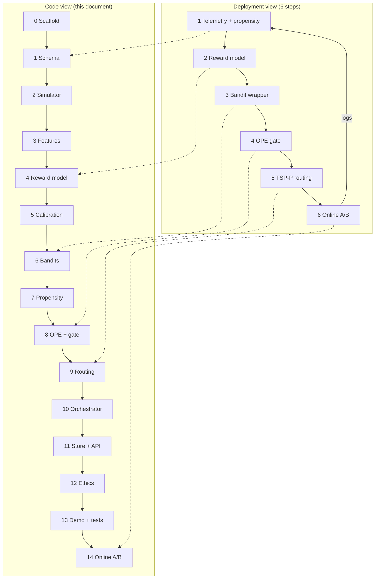

# 10. Extended Implementation Guide — Why Each Step, and What We Didn't Choose

> This document extends [05-implementation-steps.md](05-implementation-steps.md) and
> [§21 of 09-build-nba-from-scratch.md](09-build-nba-from-scratch.md). Those guides tell you
> *what* to build and in what order. **This one tells you why each step exists, what would break
> without it, and which reasonable alternatives were considered — and when you might pick them
> instead.**

Read [09-build-nba-from-scratch.md](09-build-nba-from-scratch.md) first if you are new to
contextual bandits or OPE. Use this document when you are implementing and keep asking "could we
have done X differently?"

---

## Table of contents

1. [Two views of the same build](#1-two-views-of-the-same-build)
2. [Step 0 — Scaffold and tooling](#step-0--scaffold-and-tooling)
3. [Step 1 — Domain model (schema)](#step-1--domain-model-schema)
4. [Step 2 — Simulator and oracle isolation](#step-2--simulator-and-oracle-isolation)
5. [Step 3 — Feature engineering and ethics allow-list](#step-3--feature-engineering-and-ethics-allow-list)
6. [Step 4 — Reward model](#step-4--reward-model)
7. [Step 5 — Calibration](#step-5--calibration)
8. [Step 6 — Bandit policies](#step-6--bandit-policies)
9. [Step 7 — Propensity logging discipline](#step-7--propensity-logging-discipline)
10. [Step 8 — Off-policy evaluation and promotion gate](#step-8--off-policy-evaluation-and-promotion-gate)
11. [Step 9 — Routing and geographic constraining](#step-9--routing-and-geographic-constraining)
12. [Step 10 — Orchestrator](#step-10--orchestrator)
13. [Step 11 — Event store and API](#step-11--event-store-and-api)
14. [Step 12 — Ethics layer](#step-12--ethics-layer)
15. [Step 13 — Demo, tests, and verification](#step-13--demo-tests-and-verification)
16. [Step 14 — Online loop and A/B test (production)](#step-14--online-loop-and-ab-test-production)
17. [Cross-cutting decision matrix](#cross-cutting-decision-matrix)
18. [What to read next](#what-to-read-next)

---

## 1. Two views of the same build

The docs describe the same system at two granularities. They are not contradictory — they answer
different questions.

| View | Source | Granularity | Best for |
|------|--------|-------------|----------|
| **Deployment phases** | [05-implementation-steps.md](05-implementation-steps.md), [07-deployment-roadmap.md](07-deployment-roadmap.md) | 6 steps | Rolling out to a real sales org |
| **Code phases** | [09 §21](09-build-nba-from-scratch.md), [PLAN.md](../PLAN.md) | 12+ steps | Building the repo from an empty folder |

**How to use this document:** follow the code steps in order when building. Each section has three
blocks — **What**, **Why**, **Alternatives** — plus a **Repo choice** line showing what this
project actually ships.

---

## Step 0 — Scaffold and tooling

**Maps to:** PLAN Phase 0 · prerequisite for everything

### What

Create the project skeleton: `pyproject.toml`, package layout (`src/nba/`), a typed `Settings`
object with a reproducible `seed`, a `Makefile` (`check`, `test`, `demo`), and lint/type
tooling (`ruff`, `pyright`, `pytest`).

### Why

Every later step depends on **reproducibility** and **fast feedback**. A single `Settings.seed`
means the simulator, train/val splits, bandit tie-breaking, and routing all produce identical
results on every machine — without that, you cannot tell whether a regression came from your
code or from randomness. A `Makefile` with one `make check` entry point prevents the classic
"tests pass locally but CI fails" drift. Pinning dependencies in `pyproject.toml` (via **uv** in
this repo) locks the versions of LightGBM, OR-Tools, and scikit-learn that your OPE math was
validated against.

Skipping scaffold feels fast on day one and costs weeks later: without a frozen seed you cannot
reproduce OPE gate failures; without a single check command, ethics and oracle-leak tests get
run manually (i.e., never).

### Alternatives

| Alternative | Pros | Cons | When to pick |
|-------------|------|------|--------------|
| **Poetry / pip + requirements.txt** | Familiar, wide adoption | Lockfile drift; slower resolves | Teams already standardized on Poetry |
| **uv** (this repo) | Very fast installs; strict lock | Newer tool | Greenfield Python; CI speed matters |
| **Monorepo with shared ML lib** | Reuse across products | Heavy upfront; NBA is small | Large org with many bandit systems |
| **Notebook-only prototype** | Zero ceremony | No tests, no API, no deploy path | 48-hour feasibility spike only |
| **No Makefile — invoke pytest/ruff directly** | One fewer file | Every contributor runs different commands | Tiny solo projects |

**Repo choice:** `uv` + `pyproject.toml` + `Makefile` + `ruff`/`pyright`/`pytest`. AWS and
Docker deferred to [06-cloud-architecture.md](06-cloud-architecture.md).

---

## Step 1 — Domain model (schema)

**Maps to:** Deployment Step 1 (telemetry) · PLAN Phase 1 · `src/nba/schema.py`

### What

Define the vocabulary the entire system speaks:

- `Action` — discrete arms (`KNOCK_NOW`, `LEAVE_FLYER`, `SKIP_DOOR`, `PITCH_SOLAR`,
  `PITCH_SECURITY`), frozen order for one-hot encoding.
- `Outcome` + `REWARD` ladder — scalar rewards with monotone ordering; `SLAMMED` is negative so
  `SKIP_DOOR` is a rational choice.
- `ProspectContext` — prospect + environment + spatial fields (no protected attributes).
- `BanditEvent` — the logged **CARP** tuple: context, action, reward, propensity.

### Why

Machine learning systems fail most often at the **data contract**, not the algorithm. Fixing the
action enum order now prevents train/serve skew later (column 3 must always mean
`PITCH_SOLAR`). Making `SLAMMED` negative is not pedantry — if all rewards are ≥ 0, a greedy
model never learns to skip hostile doors, and your bandit wastes rep time. Naming propensity on
`BanditEvent` at schema time signals to every engineer that `p` is not optional metadata; it is
as important as `r`.

The reward ladder encodes **business priorities in code**. Changing it later invalidates every
historical log comparison, so we lock the numbers early and treat changes like a database
migration.

### Alternatives

| Alternative | Pros | Cons | When to pick |
|-------------|------|------|--------------|
| **Flat stringly-typed dicts** | Fast to hack | No validation; action order drifts | Throwaway spike only |
| **Pydantic models** (this repo) | Runtime validation; JSON-serializable | Slight boilerplate | Any system with an API or store |
| **Protobuf / Avro schema registry** | Strong cross-service contracts | Ops overhead | Multi-language microservices |
| **Continuous action space** (e.g. "minutes to pitch") | Finer control | Bandits + OPE much harder | Not D2D — different problem |
| **Binary reward** (sale / no sale) | Simple | Loses appointment/info signal; exploration harder | Very early MVP with tiny data |
| **Multi-objective reward vector** | Captures revenue *and* NPS | Need scalarization or Pareto bandits | Mature org with explicit trade-off UI |
| **Include protected attributes in context** | Might improve AUC | Legal/ethical risk; redlining | **Never** for field sales |

**Repo choice:** Five discrete actions, monotone ladder with negative `SLAMMED`, pydantic
`ProspectContext`, CARP `BanditEvent`. See [03-data.md §3.1](03-data.md).

---

## Step 2 — Simulator and oracle isolation

**Maps to:** PLAN Phase 2 · `src/nba/data/simulator.py`

### What

Build a synthetic ground-truth world that:

1. Samples realistic contexts (Ames housing + environment + spatial draws).
2. Defines `latent_scores` / `true_reward` / `true_best_action` — documented interaction
   effects (evening boosts appointments, bad weather boosts slams, etc.).
3. Runs a stochastic **logging policy** that records propensity `p` on every action.

**Oracle isolation:** learning modules (`reward`, `bandits`, `ope`, `routing`, `api`,
`pipeline`) must **never** import oracle functions. The oracle exists only for data generation
and post-hoc evaluation in tests/scripts.

### Why

You cannot learn an NBA system by flailing in the field — reps are expensive, exploration is
costly, and a bad policy burns trust. A simulator gives you infinite labeled `(x, a, r, p)` tuples
*before* you have production data, so you can build and test OPE, routing, and the API in CI.

Oracle isolation is the discipline that keeps offline results honest. If `RewardModel` could call
`true_reward` during training, your offline metrics would be a fantasy that evaporates in
production — because in the real world there is no answer key. The AST-based test
(`test_no_oracle_leak`) enforces this mechanically.

The logging policy in the simulator is not an afterthought — it must emit proper propensities
because **OPE is only testable if the data-generating process logged `p`**.

### Alternatives

| Alternative | Pros | Cons | When to pick |
|-------------|------|------|--------------|
| **Wait for real field logs** | No simulation bias | Months of blind building; no OPE tests | You already have 6+ months of logged `(x,a,r,p)` |
| **Open Bandit Dataset only** | Real bandit logs; OPE benchmark | No geography; different domain | OPE unit tests (this repo uses OBP for that) |
| **Simple Bernoulli per arm** | Easy | No context structure; routing untestable | Teaching bandits only |
| **Full agent-based simulation** (synthetic households) | Rich dynamics | Months to build; hard to validate | Research or very large budget |
| **Logged replay of CRM exports** | Realistic marginals | Usually **no propensity** → OPE impossible | Supplement context sampling, not replace logging policy |
| **Oracle peeking "just for debugging"** | Faster iteration | Invalidates every offline claim | **Never** in learning code |

**Repo choice:** Documented latent simulator + strict oracle quarantine + Ames for realistic
prospect features. OBP used only to validate OPE estimators, not as the D2D world model.

---

## Step 3 — Feature engineering and ethics allow-list

**Maps to:** PLAN Phase 1 (featurize) · `src/nba/data/features.py`

### What

Implement `featurize(ctx, action) → float64 vector`:

1. Numeric fields from an explicit **`ALLOWED_FEATURES`** list.
2. One-hot `weather`.
3. One-hot `action`.

Freeze column order in `FEATURE_NAMES`; models refuse to load if the schema drifts.

### Why

Models cannot consume pydantic objects directly — they need a fixed-width numeric matrix. Freezing
column order is how you prevent **train/serve skew**: the insidious bug where serving swaps two
columns and accuracy silently drops.

The allow-list is an **ethics control**, not just plumbing. Field-sales models can redline by
learning `lat`/`lon` proxies for neighborhood demographics. Excluding geo-coordinates and
identity fields *by construction* means the unsafe path requires a deliberate code change, not
an accidental feature addition. Tests assert forbidden fields never appear in `FEATURE_NAMES`.

Including `action` in the feature vector lets **one model** score all arms: `q(x, a)` is a single
`LGBMRegressor` rather than five separate models — simpler serving, shared statistical strength.

### Alternatives

| Alternative | Pros | Cons | When to pick |
|-------------|------|------|--------------|
| **Reflect all `ProspectContext` fields** | Auto-updates when schema grows | Geo/protected fields leak in | **Avoid** |
| **Explicit allow-list** (this repo) | Safe by default; auditable | Must update list for new safe features | Any regulated or field-sales use case |
| **Separate model per action** | Per-arm specialization | 5× training/serving; sparse arms suffer | Actions are wildly different feature spaces |
| **Embeddings for categoricals** | Compact | Needs more data; harder to audit | Large-scale digital NBA |
| **AutoML feature generation** | Might find signal | Black box; ethics review nightmare | Internal ops tools only |
| **Hashing trick** | Bounded dimension | Loses interpretability | Streaming / very high cardinality |

**Repo choice:** Allow-list + frozen `FEATURE_NAMES` + action one-hot in the same vector.

---

## Step 4 — Reward model

**Maps to:** Deployment Step 2 · PLAN Phase 3 · `src/nba/reward/model.py`

### What

Train a supervised model for

$$q(x, a) = \mathbb{E}[r \mid x, a]$$

on logged CARP events. Deploy first as a **pure exploitation baseline** (`argmax q`) to
establish measurable performance before wrapping the bandit.

### Why

The bandit does not magically know which action is best — it needs **per-arm value estimates**.
Supervised regression on logged rewards is the standard, data-efficient way to learn `q` from
historical decisions. Training it *before* the bandit wrapper gives you:

1. A **baseline** you must beat (if the bandit cannot beat exploit-only, exploration is pure
   cost).
2. The **`q̂` predictions** that DM and DR estimators need in OPE.
3. **Door profits** for the router (expected value in reward units).

We deploy exploit-first not because exploitation is the end state, but because it isolates
"is our feature stack and reward model sane?" from "is our exploration policy helping?" If the
reward model is bad, no bandit algorithm rescues you.

### Alternatives

| Alternative | Pros | Cons | When to pick |
|-------------|------|------|--------------|
| **LightGBM / XGBoost** (this repo) | Fast; great on tabular; native categoricals | Not ideal for raw images/text | Tabular D2D context (ours) |
| **Logistic regression per arm** | Interpretable; stable | Misses nonlinear interactions | Very small data; regulatory explainability |
| **Neural net (MLP)** | Flexible | Needs more data; harder to calibrate | Huge digital logs (Criteo-scale) |
| **Linear contextual bandit (LinUCB only)** | No separate reward model | Assumes linearity; weak on interactions | Ultra-simple baseline |
| **Causal forest / DR-Learner** | Targets CATE directly | Heavier; needs good overlap | Uplift-heavy marketing |
| **Skip reward model — model `P(outcome)`** | Probabilistic | Must still convert outcomes → scalar `r` | When reward is inherently probabilistic |
| **Multi-task learning** (predict outcome class) | Rich predictions | Bandit needs scalar `q`; extra step | You also need outcome dashboards |

**Repo choice:** Single calibrated `LGBMRegressor` over `featurize(ctx, action)`, with
`ExploitationBaseline` as the cautionary tale (propensity 1.0 on one arm → no overlap).

---

## Step 5 — Calibration

**Maps to:** §8 of [09-build-nba-from-scratch.md](09-build-nba-from-scratch.md) · part of
`RewardModel`

### What

After fitting the regressor, fit a **monotone calibration map** (isotonic regression) on a
held-out split: `g(raw_prediction) ≈ observed mean reward`.

### Why

Raw GBDT outputs are usually **ranked** correctly but **miscalibrated in magnitude** — especially
in the sparse tails of the reward ladder where training examples are few. That matters for two
downstream consumers:

1. **Router pricing** — door profit is in reward units; "0.8" should mean ~0.8 expected reward,
   not merely "bigger than 0.5."
2. **DM / DR estimators** — they average `q̂`; a systematically overconfident model biases OPE
   and can promote a worse policy.

Monotone calibration (isotonic) is chosen because we trust the **ordering** of actions from the
raw model; we only want to fix **scale**, never swap which action looks best.

### Alternatives

| Alternative | Pros | Cons | When to pick |
|-------------|------|------|--------------|
| **Isotonic regression** (this repo) | Nonparametric; monotone | Needs enough val data per region | Default for scalar rewards |
| **Platt scaling** | Simple | Not guaranteed monotone | Binary outcomes |
| **Beta calibration** | Good for probabilities | Overkill for scalar reward | Classification-first pipelines |
| **No calibration** | One less step | Router and DM/DR lie in wrong units | Never if `q̂` feeds OPE or routing |
| **Quantile regression** | Uncertainty for free | Heavier; bandit integration differs | Thompson without bootstrap |
| **Separate calibrator per action** | Arm-specific | More parameters; sparse arms | Very imbalanced action counts |

**Repo choice:** Isotonic on held-out split, applied inside `RewardModel.predict`.

---

## Step 6 — Bandit policies

**Maps to:** Deployment Step 3 · PLAN Phase 4 · `src/nba/bandits/`

### What

Wrap `q(x, a)` in an exploration policy implementing the `Policy` protocol:

- `recommend(ctx) → (action, propensity)`
- `action_dist(ctx) → {action: probability}` with **full support** (every `p > 0`)

Ship three algorithms: **ε-greedy**, **UCB**, **Thompson Sampling** (bootstrap ensemble).

### Why

A pure argmax policy **stops learning**: you only observe rewards for actions you take, so
model errors on unexplored arms never get corrected. This is **feedback-loop bias** — the core
reason NBA is a bandit problem, not vanilla supervised learning.

Exploration costs short-term reward but buys information. The bandit formalizes how much to pay.
We ship three policies because:

- No single algorithm wins on every dataset (see UCB scale issue in this repo).
- The **OPE gate** can empirically pick the winner on *your* logs rather than betting on a paper.

Full-support distributions are non-negotiable: a single `p = 0` makes importance weights infinite
and breaks OPE for that context slice.

### Alternatives

| Alternative | Pros | Cons | When to pick |
|-------------|------|------|--------------|
| **ε-greedy** (this repo) | Dead simple; surprisingly strong | Fixed exploration rate; wasteful late | Default starting point |
| **UCB** (this repo) | Principled optimism; adapts exploration | Knobs are in reward units; needs counts | After tuning `c` to your scale |
| **Thompson Sampling** (this repo) | Elegant; often best empirically | Needs uncertainty estimates | When bootstrap ensemble is affordable |
| **LinUCB / neural bandit** | Proper contextual uncertainty | More complex; LinUCB assumes linearity | Continuously rich context; big data |
| **EXP3 / adversarial bandits** | Robust to non-stationarity | Worst-case mindset; often conservative | Hostile non-stationary env |
| **Pure exploitation** | Max short-term reward | Goes blind; unevaluable logs | Baseline only — never ship |
| **Human-in-the-loop only** | Reps know the turf | No propensity; no OPE | Legacy — migrate off |
| **Bayesian optimization per door** | Fancy | Absurd at D2D scale | Not for 200 doors/shift |

**Repo choice:** All three behind one protocol; ε-greedy as default API policy; OPE selects among
them. Thompson uses bootstrap LightGBM ensemble for uncertainty.

---

## Step 7 — Propensity logging discipline

**Maps to:** Deployment Step 1 (critical field) · woven through orchestrator and store

### What

At **every** decision, persist:

- the chosen `action`
- the **propensity** `p = π(a | x)` under the policy that made the decision
- the `context` snapshot
- later, the observed `reward`

Enforce `p > 0` in validation (`LoggedBatch`, SQLite `NOT NULL`).

### Why

Propensity is the denominator in IPS. Without `p`, logged data reflects **what the old policy
liked**, not what a new policy would earn — and no amount of post-hoc ML fixes that. You
**cannot reconstruct `p` after the fact** because it depends on the random seed, tie-breaking,
and exploration draw at the moment of decision.

This step is listed separately because teams routinely build a beautiful reward model and forget
`p` — then discover six months later they can never safely ship policy v2. Logging `p` from day
one is cheaper than re-running the experiment.

Even "the rep just decides" can be modeled: e.g. uniform over offered actions, or a learned
behavior clone — as long as you record the probability **at decision time**.

### Alternatives

| Alternative | Pros | Cons | When to pick |
|-------------|------|------|--------------|
| **Log `p` at decision time** (this repo) | Enables IPS/DR; auditable | Requires policy to expose `action_dist` | **Always** |
| **Backfill `p` from a behavior model** | Salvages old logs | Biased; legally dubious for promotion | Exploratory analysis only — not gating |
| **Log only the action** | Simple | OPE impossible | Unacceptable for NBA |
| **Deterministic policy, log `p=1`** | Easy | Zero overlap for other actions | Exploit baseline only |
| **Propensity from bandit continuous score** | Granular | Not a valid probability without softmax | **Invalid** for OPE |

**Repo choice:** `Orchestrator.recommend` always logs `(action, propensity)`; store rejects null
`p`; tests assert `min(p) > 0` on every decision.

---

## Step 8 — Off-policy evaluation and promotion gate

**Maps to:** Deployment Step 4 · PLAN Phase 5 · `src/nba/ope/`

### What

Before any new policy touches the field:

1. Estimate its value on held-out logs with **IPS**, **SNIPS**, **DM**, **DR**.
2. Monitor **ESS** (effective sample size) and optional weight clipping.
3. Run the **promotion gate**: promote only if the **lower bound** of DR clears the logging
   baseline by `min_lift`.

### Why

Deploying bandit policies is an experiment on expensive humans. OPE is how you run that
experiment **on paper first**. IPS reweights logged rewards to debias toward the target policy;
DM uses the reward model; DR combines both and is unbiased if **either** propensities or `q̂` is
correct.

Point estimates are noisy. Promoting on the mean is how you ship policies that looked good by
luck. The conservative gate (lower confidence bound) trades a slower rollout for **not burning
rep-hours on a worse policy**. IPS-vs-DM disagreement flags tell humans overlap or calibration
is shaky.

Validating estimators against **Open Bandit Pipeline** catches implementation bugs before they
influence promotion decisions.

### Alternatives

| Alternative | Pros | Cons | When to pick |
|-------------|------|------|--------------|
| **IPS / SNIPS** | Unbiased (with overlap) | High variance | Diagnostic; sanity check |
| **DM** | Low variance | Biased by bad `q̂` | When model is trusted |
| **DR** (this repo primary) | Doubly robust; lower variance than IPS | Still needs some overlap | **Default gate estimator** |
| **Switch-DR / MRDR** | Lower bias variants | More complex | Mature OPE stack |
| **Bootstrap CIs** | Nonparametric uncertainty | Compute cost | High-stakes promotion |
| **Ship on offline AUC** | Familiar to ML teams | Wrong objective; ignores exploration | **Wrong tool** for bandits |
| **Shadow mode in field** | Real outcomes | Costs rep time; slower | Complement OPE, not replace |
| **No gate — YOLO deploy** | Fast | Expensive failures | Never in field sales |

**Repo choice:** IPS + SNIPS + DM + DR; ESS warnings; promote on DR lower bound vs logging
baseline. See [08-bandits-and-offline-evaluation.md](08-bandits-and-offline-evaluation.md).

---

## Step 9 — Routing and geographic constraining

**Maps to:** Deployment Step 5 · PLAN Phase 6 · `src/nba/routing/`

### What

Turn per-door bandit recommendations into a **walkable route**:

1. `DistanceEngine` → travel-**time** matrix (seconds).
2. **K-means territories** to keep instances small and neighborhood-coherent.
3. **OR-Tools TSP-with-Profits**: optional stops, drop penalty = door profit, plus capacity and
   time windows.

### Why

The bandit answers "what should we do at each door?" It does **not** answer "which doors are
worth walking to in what order?" A top-scoring door five miles away is operations poison. Field
reps budget **time**, not Euclidean distance — so the matrix is in seconds, not miles.

Classic TSP visits **every** stop; D2D needs **selective visiting**. TSP-P (optional nodes with
drop penalties) is the right problem statement: skip a door if travel cost exceeds profit.
K-means territories keep solve times sub-second and match how reps work one neighborhood per
shift.

**The bandit proposes; the router disposes.** Pricing doors with bandit-weighted profit
(§Step 10) connects exploration to routing economics.

### Alternatives

| Alternative | Pros | Cons | When to pick |
|-------------|------|------|--------------|
| **TSP-P + OR-Tools** (this repo) | Industry standard; constraints | Setup complexity | D2D with skip decisions |
| **Plain TSP (visit all)** | Simpler | Visits low-value far doors | **Wrong** for D2D |
| **VRP multi-vehicle** | Fleet routing | Heavier; overkill for one rep | Multi-rep coordinated sweeps |
| **Greedy nearest-neighbor** | Instant | 2×+ longer walks; misses profits | Demo baseline only |
| **Euclidean distance** | No routing engine | Ignores rivers, highways, fences | **Never** for production |
| **Haversine × walk speed** (this repo v1) | Fast; no external deps | ~10–20% time error | Prototype / offline demo |
| **OSRM / Valhalla** | Road-network accurate | Infra + latency | Production (stub ready) |
| **Commercial Maps API** | Turn-by-turn ready | Cost; ToS | Enterprise with budget |
| **No routing — bandit order only** | Zero solver work | Rep walks inefficiently | Unacceptable at scale |

**Repo choice:** `HaversineEngine` first, `OSRMEngine` stub, K-means territories, OR-Tools
TSP-P with disjunction drop penalties.

---

## Step 10 — Orchestrator

**Maps to:** PLAN Phase 7 · `src/nba/pipeline/orchestrator.py`

### What

Wire policy + reward model + distance engine + event store:

- `recommend(ctx)` — policy choice, log decision, return `q_values`.
- `feedback(decision_id, outcome)` — append outcome.
- `plan_route(contexts)` — price doors, solve TSP-P, return walkable route.
- `replan(remaining)` — re-solve mid-shift.

**Door profit:**

$$\text{profit}(x) = \sum_a \pi(a \mid x)\, q(x, a)$$

not naive `max_a q(x,a)`.

### Why

Without a single orchestration seam, every API handler and script re-implements logging,
propensity, and profit math — and one copy will forget `p`. The orchestrator is the **only**
place decisions are logged, which makes the audit story simple: if it happened, it went through
`recommend`.

Bandit-weighted profit matters because under ε-greedy the system **does not always take the
argmax** — a door where the policy explores weak arms is worth less than one where it
confidently closes. Using `max q` overstates route value and sends reps on detours for doors the
bandit would often skip anyway.

Dependency injection (`policy`, `model`, `store` passed in) lets tests use fakes without HTTP.

### Alternatives

| Alternative | Pros | Cons | When to pick |
|-------------|------|------|--------------|
| **Central orchestrator** (this repo) | One logging seam; testable | Must keep it thin | **Default** |
| **Logic in API handlers** | Fewer files | Duplication; missed propensities | Anti-pattern |
| **Argmax profit routing** | Simpler math | Optimistic routes under exploration | Comparison baseline (`argmax_profit=True`) |
| **Event-driven microservices** | Scale | Ops burden | Production AWS path in doc 06 |
| **Batch-only offline planner** | No serving | No mid-shift replan | Static route cards only |

**Repo choice:** Injected orchestrator; bandit-weighted profit default; replan support.

---

## Step 11 — Event store and API

**Maps to:** PLAN Phase 7 · `src/nba/api/`

### What

- **Append-only SQLite** `EventStore` — `decisions` + `outcomes` tables; no `UPDATE`/`DELETE`.
- **FastAPI** service: `POST /recommend`, `POST /feedback`, `POST /route`, `GET /health`.
- `build_app(orchestrator)` factory for tests.

### Why

The event store is the system's memory and audit trail. Append-only means you can always answer
"what did we know and decide at 4:32pm?" — critical for debugging, compliance, and trustworthy
OPE. Corrections are new outcome rows, not silent overwrites.

HTTP is the thinnest adapter between mobile clients and the orchestrator. FastAPI gives typed
request/response validation sharing pydantic models with the domain layer. The factory pattern
keeps tests fast (in-memory orchestrator, no disk).

SQLite is enough for a prototype and single-rep demos; the interface is simple enough to swap for
Postgres/Kinesis later ([06-cloud-architecture.md](06-cloud-architecture.md)).

### Alternatives

| Alternative | Pros | Cons | When to pick |
|-------------|------|------|--------------|
| **SQLite append-only** (this repo) | Zero ops; portable | Single-writer limits | Prototype / single-tenant |
| **Postgres + event sourcing** | Durable; queryable | Ops | Production |
| **Parquet data lake** | Cheap analytics | Not for online serving | Offline training pipeline |
| **Kafka / Kinesis stream** | Real-time fan-out | Complexity | High-volume telemetry |
| **Mutable rows (UPDATE)** | Familiar CRUD | Broken audit trail | **Avoid** for bandit logs |
| **gRPC instead of REST** | Performance | Mobile integration cost | Internal service mesh |
| **GraphQL** | Flexible queries | Overkill for 4 endpoints | Not here |

**Repo choice:** SQLite append-only + FastAPI + `build_app` test factory.

---

## Step 12 — Ethics layer

**Maps to:** PLAN Phase 8 · `src/nba/ethics.py`

### What

Two layers:

1. **Structural** — feature allow-list (Step 3).
2. **Behavioral** — `is_sensitive(ctx)` flags high `prior_interactions`; `EthicalPolicy` caps
   exploration mass on sensitive doors while keeping **full support** (`p > 0` still).

### Why

Field sales sits at the intersection of optimization and **harassment risk**. Repeatedly knocking
a household that has rejected contact many times is not just bad ethics — it creates brand and
legal liability.

A naive fix is "always exploit on sensitive doors" — but that sets some action's propensity to
1 and others to 0, **destroying overlap** and making those logs useless for OPE. The cap
reshapes the distribution toward the mode while bounding exploration probability — ethics **and**
evaluability.

Structural exclusion of protected attributes is stronger than a "don't use race" policy document:
the model literally cannot access the field.

### Alternatives

| Alternative | Pros | Cons | When to pick |
|-------------|------|------|--------------|
| **Allow-list + exploration cap** (this repo) | Safe default; OPE-valid | Needs tuning `ceiling` | Field sales |
| **Hard rule: force SKIP on sensitive** | Simple | Changes action space; overlap issues | Legal mandate to not contact |
| **Post-hoc fairness metrics only** | Easy to bolt on | Harm already done | Insufficient alone |
| **Human approval per door** | Maximum control | Unscalable | High-value enterprise only |
| **Ignore ethics for MVP** | Faster | Liability | Unacceptable |

**Repo choice:** `EthicalPolicy` wrapper with `cap_exploration`; tested in `test_ethics.py`.

---

## Step 13 — Demo, tests, and verification

**Maps to:** PLAN Phase 8 · `scripts/run_demo.py` · `tests/`

### What

- `make demo` — full simulated shift: logs → train → OPE gate → route → walk → regret report.
- System tests locking claims: bandit beats uniform, gate promotes correctly, propensity always
  logged, router drops outliers, no oracle leak.
- Module tests per component; OPE validated against OBP.

### Why

A bandit system is **not correct because the math looks right** — it is correct because measured
end-to-end behavior matches claims. The demo is executable documentation: if `make demo` fails,
the loop is broken somewhere between simulator and router.

Tests encode invariants that humans forget:

- propensity on every decision
- append-only store
- no forbidden features
- regret below random (not "curve must go down" — see [09 §19](09-build-nba-from-scratch.md))

Writing tests *with* each step (per PLAN) prevents a big-bang integration nightmare at the end.

### Alternatives

| Alternative | Pros | Cons | When to pick |
|-------------|------|------|--------------|
| **pytest system + unit tests** (this repo) | CI-enforced claims | Upfront cost | Any serious system |
| **Notebook-only validation** | Visual | Not CI-gated | Exploration |
| **Manual QA in field** | Ground truth | Slow; pre-OPE risk | Final phase only |
| **Property-based testing** | Finds edge cases | Harder to write | High-risk math modules |

**Repo choice:** `run_demo.py` + `test_e2e.py` + `test_ethics.py` + `make check`.

---

## Step 14 — Online loop and A/B test (production)

**Maps to:** Deployment Step 6 · [07-deployment-roadmap.md](07-deployment-roadmap.md) Phase 5

### What

Route a **small fraction of reps** (e.g. 10%) through the gated bandit; hold out the rest on
legacy. Ingest outcomes in near real time; **re-solve** remaining route when context changes;
feed logs back to training and the next OPE round.

### Why

OPE is necessary but not sufficient — logs are noisy, non-stationary, and never perfectly
overlapping. A controlled online experiment is the final confirmation that offline promotion
decisions translate to real closed deals and walk-time efficiency.

Mid-shift replanning matters because D2D is dynamic: a "callback in two days" outcome changes
the door's value **now**; weather shifts; the rep falls behind schedule. Static morning routes
decay by 10am.

The loop closing `logs → retrain → OPE → promote` is what makes NBA a **learning system** rather
than a one-shot model deployment.

### Alternatives

| Alternative | Pros | Cons | When to pick |
|-------------|------|------|--------------|
| **10/90 A/B for ~4 weeks** (docs) | Limits blast radius | Slower full rollout | Default enterprise path |
| **50/50 split** | Faster significance | More exposure to bad policy | Only after strong OPE + shadow |
| **Champion/challenger auto-promote** | Continuous | Complex guardrails | Mature MLOps |
| **Big-bang 100% cutover** | Fast | Catastrophic if wrong | **Never** without online proof |
| **Offline-only forever** | Safe | No adaptation to drift | Prototype stopping point |
| **Multi-armed platform (Optimizely-style)** | Productized | Generic; weak on routing | Marketing site, not D2D |

**Repo choice:** Offline prototype complete; online loop documented in deployment roadmap, not
yet implemented in AWS.

---

## Cross-cutting decision matrix

Quick reference for "why this stack?"

| Layer | This repo | Main alternative | Why we picked ours |
|-------|-----------|------------------|-------------------|
| Decision framework | Contextual bandit | Pure supervised ranking | Feedback-loop bias; must explore |
| Reward model | LightGBM | Neural net | Tabular data; speed; calibration |
| Exploration | ε-greedy / UCB / Thompson | LinUCB only | Compare via OPE; GBDT already nonlinear |
| OPE | DR + conservative gate | IPS only | Variance + doubly robust |
| Routing | TSP-P (OR-Tools) | Nearest-neighbor | Skip low-value far doors |
| Distance | Haversine → OSRM stub | Maps API | Offline-first; seam for production |
| Store | SQLite append-only | Postgres | Prototype simplicity |
| API | FastAPI | Flask / gRPC | Typed contracts; async-ready |
| Ethics | Allow-list + cap | Rules engine only | Structural + behavioral |
| Data | Simulator + Ames | Field-only | Testable without reps |

---

## What to read next

| If you want… | Read |
|--------------|------|
| Concept definitions and code map | [09-build-nba-from-scratch.md](09-build-nba-from-scratch.md) |
| Short 6-step deployment checklist | [05-implementation-steps.md](05-implementation-steps.md) |
| Bandit and OPE math | [08-bandits-and-offline-evaluation.md](08-bandits-and-offline-evaluation.md) |
| Data schema and datasets | [03-data.md](03-data.md) |
| AWS production path | [06-cloud-architecture.md](06-cloud-architecture.md) |
| Phased enterprise rollout | [07-deployment-roadmap.md](07-deployment-roadmap.md) |
| Run the working system | `make demo` and `scripts/run_demo.py` |

The through-line, unchanged across every step and every alternative analysis:

> **Log propensities from day one. Explore deliberately. Gate promotions offline. Price routes in
> reward units. The bandit proposes; the router disposes.**
