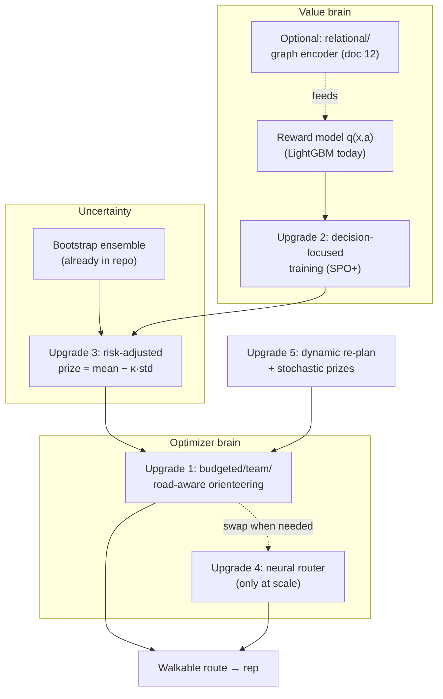

# 11 — Improving NBA: From Predict-then-Route to a Unified Optimizer

> A from-zero guide to making the Next Best Action (NBA) system in this repo **measurably better**
> by closing the gap between *what a door is worth* (the reward model) and *which doors we actually
> visit* (the router). It assumes you have read — or are willing to skim —
> [09-build-nba-from-scratch.md](09-build-nba-from-scratch.md), but it re-explains every new concept
> (the Orienteering Problem, decision-focused learning, neural combinatorial optimization,
> risk-aware optimization, dynamic routing) from scratch. No prior knowledge of operations research
> or graph learning is assumed.
>
> **Scope note.** This document is a *design + research roadmap*, not a description of code that
> already exists. Everything here is proposed work, mapped onto the modules it would touch
> (`src/nba/reward/`, `src/nba/routing/`, `src/nba/pipeline/`). Where the current code already does
> part of the job, the doc says so explicitly.

---

## Table of contents

1. [The one-paragraph thesis](#1-the-one-paragraph-thesis)
2. [Where the current system leaves value on the table](#2-where-the-current-system-leaves-value-on-the-table)
3. [Background from zero: the Orienteering Problem](#3-background-from-zero-the-orienteering-problem)
4. [Upgrade 1 — Make the optimizer honest: budgeted, team, road-aware orienteering](#4-upgrade-1--make-the-optimizer-honest-budgeted-team-road-aware-orienteering)
5. [Upgrade 2 — Decision-focused learning: train the model on *route value*, not *prediction error*](#5-upgrade-2--decision-focused-learning-train-the-model-on-route-value-not-prediction-error)
6. [Upgrade 3 — Risk-aware routing using uncertainty you already have](#6-upgrade-3--risk-aware-routing-using-uncertainty-you-already-have)
7. [Upgrade 4 — Neural combinatorial optimization (only if you outgrow OR-Tools)](#7-upgrade-4--neural-combinatorial-optimization-only-if-you-outgrow-or-tools)
8. [Upgrade 5 — Dynamic & stochastic routing: re-planning done right](#8-upgrade-5--dynamic--stochastic-routing-re-planning-done-right)
9. [How it all composes, and the order to adopt it in](#9-how-it-all-composes-and-the-order-to-adopt-it-in)
10. [Measuring success: extend the demo and the tests](#10-measuring-success-extend-the-demo-and-the-tests)
11. [Glossary](#11-glossary)
12. [References](#12-references)

---

## 1. The one-paragraph thesis

The NBA system has two brains that are trained and tuned **separately**: a *reward model* that
predicts how good each action is at each door (`q(x, a)`), and a *router* that decides which doors
are worth the walk (TSP-with-Profits). The reward model is optimized to be **accurate** (low
prediction error). The router is optimized to be **cheap** (short walk, high profit captured). But
nobody optimizes the thing the business actually cares about: **the total real-world value of the
route we send the rep on.** This document shows five increasingly ambitious ways to close that gap —
starting with a free re-framing that needs almost no new code, and ending with learned optimizers
and uncertainty-aware routing. The single highest-leverage idea is **Upgrade 2: decision-focused
learning**, which trains the reward model to make the *router* produce better routes, not to win a
prediction contest the business never asked for.

---

## 2. Where the current system leaves value on the table

Recall the loop (from [09](09-build-nba-from-scratch.md), [README](../README.md)):

```
context x → reward model q(x,a) → bandit policy → per-door profit → TSP-with-Profits route
```

Concretely, in code:

- `RewardModel` (`src/nba/reward/model.py`) is a **LightGBM regressor** fit to minimize squared
  error against logged rewards, then isotonic-**calibrated**. Its training objective is *"predict
  the reward accurately."*
- `Orchestrator.door_profit` (`src/nba/pipeline/orchestrator.py`) prices each door as the
  bandit-weighted value $\sum_a \pi(a\mid x)\,q(x,a)$.
- `solve_tsp_profits` (`src/nba/routing/tsp_profits.py`) takes those per-door prices and a
  travel-time matrix and returns a route, dropping doors whose profit doesn't justify the detour
  (OR-Tools `AddDisjunction` with a penalty equal to the door's scaled profit).

This is a **two-stage (predict-then-optimize) pipeline**, and it has three structural weaknesses.

### 2.1 The training/usage mismatch (the big one)

The reward model is graded on **prediction accuracy** (squared error, calibration). But its numbers
are only ever *used* to make one decision: **include this door or skip it, and in what order.** A
model can be a percentage point worse at raw prediction yet produce *better routes*, and vice-versa.
Squared error spends the model's capacity equally on every door — including doors whose value is so
high or so low that the routing decision is obvious and a wrong prediction costs nothing. We are
optimizing a proxy (accuracy) instead of the goal (route value). Fixing this is
[Upgrade 2](#5-upgrade-2--decision-focused-learning-train-the-model-on-route-value-not-prediction-error).

### 2.2 The constraint that matters most is implicit

A field shift ends when **time runs out** (e.g. an 8-hour day, or the 16:00–19:00 residential
window). The current solver models time only indirectly: per-node **time windows** plus an optional
**capacity** (max doors). It does *not* maximize value subject to an explicit **total-time budget**.
The cleanest formulation of "collect as much value as possible before the clock runs out" is a named
problem — the **Orienteering Problem** — and stating it that way unlocks a large, battle-tested
toolbox ([§3](#3-background-from-zero-the-orienteering-problem),
[Upgrade 1](#4-upgrade-1--make-the-optimizer-honest-budgeted-team-road-aware-orienteering)).

### 2.3 The router treats predictions as certainties

`door_profit` collapses the model's belief about a door into **one number**. But some of those
numbers are confident and some are wild guesses. A door the model is *unsure* about is riskier to
build a route around than a door it's *confident* about, even at the same expected value. The repo
already produces the raw material to handle this — the **bootstrap ensemble** in
`src/nba/bandits/thompson.py` gives a *spread* of predictions per door — but the router throws that
spread away. Using it is [Upgrade 3](#6-upgrade-3--risk-aware-routing-using-uncertainty-you-already-have).

---

## 3. Background from zero: the Orienteering Problem

You do not need any operations-research background for this section.

### 3.1 The sport it's named after

In the sport of *orienteering*, you get a map dotted with checkpoints, each worth some points, and a
**fixed time limit**. You start and finish at known places. You can't reach every checkpoint, so you
choose a *subset* and an *order* that maximizes points collected before time runs out. That is
**exactly** the field-sales problem: checkpoints are doors, points are expected reward, the time
limit is the shift.

### 3.2 The formal problem

The **Orienteering Problem (OP)** — Tsiligirides (1984); Golden, Levy & Vohra (1987) — is: given
nodes $v$ each with a prize $\rho(v) \ge 0$, travel times $\tau(u,v)$, a start and end node, and a
budget $B$, choose a path that

$$\text{maximize } \sum_{v \in \text{path}} \rho(v) \quad\text{subject to}\quad \sum_{(u,v)\in\text{path}} \tau(u,v) \;\le\; B.$$

It has well-known relatives you'll see in the literature, and each maps to a real product feature:

| Variant | What it adds | NBA meaning |
|---|---|---|
| **Prize-Collecting TSP (PCTSP)** | pay a penalty for each *skipped* node instead of a hard budget | exactly what `solve_tsp_profits` does today (drop penalty = profit) |
| **Orienteering Problem (OP)** | a hard **time/budget** limit | "fit the most value into the 8-hour shift" |
| **Team Orienteering (TOP)** | **multiple** vehicles/reps sharing the prizes | route a *whole sales team*, no two reps double-serving a door |
| **OP with Time Windows (OPTW)** | per-node open/close times | residential 16:00–19:00, business hours |
| **Stochastic OP** | uncertain prizes or travel times | leads convert probabilistically; traffic varies ([Upgrade 3](#6-upgrade-3--risk-aware-routing-using-uncertainty-you-already-have), [Upgrade 5](#8-upgrade-5--dynamic--stochastic-routing-re-planning-done-right)) |

**Why this matters for you:** the moment you call your problem "an Orienteering Problem with time
windows" you inherit 40 years of exact algorithms (branch-and-cut), metaheuristics, and benchmarks
(see the survey by Gunawan, Lau & Vansteenwegen, 2016). You stop inventing and start reusing. The
SR-SLM proposal that prompted this work claimed this fusion of *value* and *cost* was an open
research frontier; it is in fact this 40-year-old, named, solved problem class. The repo's TSP-P is
already a member of the family — the upgrades below just make the membership explicit and complete.

### 3.3 Where today's code already sits

`solve_tsp_profits` is a **single-vehicle Prize-Collecting TSP with time windows and a capacity
cap.** That is genuinely good and covers most of the value. The gaps to close are: (a) an explicit
**time budget** (OP), (b) **multiple reps** (TOP), (c) **real road travel times** (today's
`HaversineEngine` is great-circle; `OSRMEngine` is a stub), and (d) feeding the optimizer *better,
decision-aware, uncertainty-aware prizes* (Upgrades 2 and 3).

---

## 4. Upgrade 1 — Make the optimizer honest: budgeted, team, road-aware orienteering

**Goal:** state the real problem and solve the real problem. **Cost:** low — mostly configuration
and a few new OR-Tools dimensions; no machine learning. **This is the cheapest value in the doc and
should be done first.**

### 4.1 Add an explicit shift-time budget (OP, not just PCTSP)

Today the "Time" dimension in `solve_tsp_profits` enforces per-node windows but not a single global
cap on the rep's working time. Add a **route-duration budget**: bound the cumulative time dimension
at the depot's end node by `B = shift_hours * 3600`. In OR-Tools this is one line — set an upper
bound on the end node's cumulative `Time` var — and it turns the PCTSP into a true OP: *maximize
profit collected, but the whole route must finish within the shift.* This directly encodes
[§2.2](#22-the-constraint-that-matters-most-is-implicit).

### 4.2 Route the whole team (Team Orienteering)

`pywrapcp.RoutingIndexManager` already supports multiple vehicles — today it's hard-coded to `1`.
If all reps share one depot, `RoutingIndexManager(n, num_vehicles, depot)` is sufficient; if reps have
distinct starts/ends, use the `RoutingIndexManager(n, num_vehicles, starts, ends)` overload (or model per-rep depots as nodes).
OR-Tools then partitions doors across reps and routes each, never double-serving a door (each non-depot node still has its single `AddDisjunction`).
This is the **Team Orienteering Problem**, and it's the difference between a single-rep toy and a dispatch system.

### 4.3 Use real road travel times

`HaversineEngine` computes straight-line ("great-circle") distance over a sphere ÷ walking speed —
fast but optimistic (it ignores rivers, one-ways, and that you can't walk through buildings). The
repo already defines the seam: `OSRMEngine` in `src/nba/routing/distance.py` is a conforming stub.
Implement it against a real router — **OSRM** (Open Source Routing Machine) or **Valhalla**, both
free and self-hostable on OpenStreetMap data — so `time_matrix` reflects actual streets. Because
everything is programmed to the `DistanceEngine` protocol, **no caller changes**; you swap the engine
and every route gets more realistic. This is listed as a "where to go next" item in
[09 §23](09-build-nba-from-scratch.md#23-where-to-go-next) and is a prerequisite for trusting any of
the gains below in the field.

### 4.4 Consider a stronger metaheuristic for large instances

OR-Tools' Guided Local Search is excellent. If you scale to thousands of doors per instance and hit
its time limit before converging, the orienteering literature's go-to is **Adaptive Large
Neighborhood Search (ALNS)** — repeatedly *destroy* part of the route (remove a cluster of doors)
and *repair* it (greedily reinsert the most valuable reachable doors), adapting which destroy/repair
operators it uses based on what's working. It is the standard heavy-duty solver for OP/TOP variants
and is worth reaching for only when OR-Tools demonstrably can't keep up. **Do not** add it
speculatively; measure first ([§10](#10-measuring-success-extend-the-demo-and-the-tests)).

---

## 5. Upgrade 2 — Decision-focused learning: train the model on *route value*, not *prediction error*

This is the highest-value idea in the document and the genuinely interesting research direction. It
directly fixes [§2.1](#21-the-trainingusage-mismatch-the-big-one).

### 5.1 The core idea, from zero

Today's pipeline is **"predict, then optimize"**:

1. **Predict:** train `q̂(x, a)` to minimize prediction error vs. logged rewards.
2. **Optimize:** feed `q̂` into the router, get a route.

The model is trained in step 1 **without any knowledge of step 2.** It doesn't know that its numbers
will be turned into include/skip/order decisions. **Decision-focused learning** (also called
*end-to-end predict-then-optimize*, or *smart predict-then-optimize*) changes the training objective
to: *"produce predictions that, when fed to the optimizer, yield the best real-world decisions."*

A tiny example makes the difference vivid. Suppose two doors are *clearly* the best in a
neighborhood and will be visited under almost any reasonable prediction. A squared-error model still
spends effort nailing their exact values — effort that changes **no decision**. Meanwhile a third
door sits right at the include/skip boundary, where a small prediction error flips the decision and
costs real money. Decision-focused learning automatically reallocates the model's attention toward
the doors **where being wrong changes the route**, and stops sweating the doors where it doesn't.

### 5.2 The obstacle, and how the field gets around it

To train "through" the optimizer with gradient descent, you'd differentiate *route value* with
respect to the *predictions*. But routing decisions are **discrete** (a door is in or out), and the
gradient of a discrete choice is zero almost everywhere — change a prediction by a hair and the
route usually doesn't change at all, so the learning signal vanishes. (This is the same
"argmax has no gradient" wall the SR-SLM proposal flagged as a research gap; it is, in fact, solved.)
Three standard tools get around it; pick by how much engineering you want:

- **SPO+ loss (Smart "Predict, then Optimize")** — Elmachtoub & Grigas (2017/2021). A convex
  *surrogate* loss whose (sub)gradient you *can* compute, designed specifically so that minimizing it
  minimizes **decision regret** (value lost vs. an oracle that knew the true prizes). This is the
  cleanest fit for a linear/optimizer objective like orienteering and the recommended starting point.
- **Differentiable optimization layers** — Wilder, Dilkina & Tambe, "Melding the Data-Decisions
  Pipeline" (AAAI 2019), and `cvxpylayers`/`qpth`. You add a small smoothing/regularizer to the
  combinatorial problem so it becomes differentiable, then backprop through it. More general, more
  finicky.
- **Score-function / policy-gradient estimators** (REINFORCE) — treat "which route the optimizer
  returns" as a stochastic policy and optimize expected route value directly, bypassing
  differentiation of the discrete step. This is the bridge into
  [Upgrade 4](#7-upgrade-4--neural-combinatorial-optimization-only-if-you-outgrow-or-tools).

### 5.3 How to wire it into *this* repo without breaking anything

The beautiful part: you do **not** need to throw away the existing model. Two pragmatic on-ramps:

1. **Decision-aware re-weighting (cheap).** Keep LightGBM, but weight training rows by how
   *decision-relevant* they are — upweight doors near the historical include/skip boundary, downweight
   doors that were obvious includes/skips. This is a crude, gradient-free approximation of
   decision-focused learning that you can ship in an afternoon and A/B against the plain model.
2. **An SPO+ fine-tuning stage (the real thing).** Add an optional training mode in
   `src/nba/reward/` that, after the standard fit, runs an SPO+ loop: for a batch of historical
   neighborhoods, call `solve_tsp_profits` with the current predicted prizes, compare the resulting
   route's *true* value to the oracle's, and take an SPO+ subgradient step. Keep it **behind a flag**
   and behind the existing `QModel` protocol so the orchestrator, API, and tests don't change.

### 5.4 Keeping the safety rails

Two repo disciplines are **non-negotiable** and decision-focused learning must respect both:

- **No oracle leak at serve time** ([09 §5](09-build-nba-from-scratch.md#5-the-simulator-and-oracle-isolation)).
  SPO+ uses the *true* prize only as a *training label* (regret needs an oracle), exactly like the
  `regret` metric already does in scripts/tests — never inside the served model. In production you
  replace the oracle label with the **realized logged reward**, which is what SPO+ is designed for.
- **OPE still gates promotion** ([09 §12–13](09-build-nba-from-scratch.md#12-off-policy-evaluation-ope-ips-snips-dm-dr)).
  A decision-focused model is just another candidate policy: it must clear the same
  lower-confidence-bound DR gate before it reaches a rep. The win you must *prove* is higher route
  value at equal-or-better OPE — not a prettier training curve.

### 5.5 Why this is the right place to spend effort

The two-stage critique that motivated this whole document ([§2.1](#21-the-trainingusage-mismatch-the-big-one))
is real, and decision-focused learning is its **principled** fix — and the one genuinely fresh,
publishable seam if you ever want a research contribution out of this codebase, *especially* combined
with a relational value model ([12-relational-deep-learning-mixin.md](12-relational-deep-learning-mixin.md)).

---

## 6. Upgrade 3 — Risk-aware routing using uncertainty you already have

**Goal:** stop pretending every predicted prize is equally trustworthy. **Cost:** low-to-medium; the
uncertainty source already exists.

### 6.1 The free uncertainty in the repo

`src/nba/bandits/thompson.py` builds a **bootstrap ensemble**: $B$ reward models, each trained on a
resampled copy of the logs. For any door you can ask all $B$ of them for `q(x, a)` and get a
**distribution**, not a point. Its spread *is* the model's uncertainty. Today the router only ever
sees the mean (via `door_profit`); the spread is discarded.

### 6.2 What to do with it

Price doors with a **risk-adjusted** value instead of the bare mean:

$$\text{profit}_{\text{risk}}(x_d) \;=\; \mathbb{E}[\rho(x_d)] \;-\; \kappa \cdot \text{std}[\rho(x_d)],$$

where the expectation and standard deviation are taken across the $B$ ensemble members and $\kappa$
tunes risk appetite ($\kappa = 0$ recovers today's behavior). A door the model loves *on average*
but disagrees about *wildly* gets discounted relative to an equally-valuable door it's *sure* about.
For a more principled version, optimize a **CVaR** (Conditional Value-at-Risk — the average value in
the worst, say, 10% of scenarios) of total route value; this is the standard objective for
**stochastic/robust orienteering** and protects the rep's day against a few overconfident bets.

### 6.3 How to wire it in

This is a localized change: extend `Orchestrator.door_profit` (or add `door_profit_risk`) to query
the ensemble for per-door mean and std, subtract $\kappa\cdot\text{std}$, and pass the result as the
prize to `solve_tsp_profits`. Nothing downstream changes. Add `risk_kappa` to `Settings`. Then prove
it helps: a risk-aware route should show **lower variance** in realized shift value across many
simulated shifts at comparable mean — measure it in the demo
([§10](#10-measuring-success-extend-the-demo-and-the-tests)).

---

## 7. Upgrade 4 — Neural combinatorial optimization (only if you outgrow OR-Tools)

**Goal:** millisecond routing at fleet scale, or routes that learn instance-specific structure.
**Cost:** high. **Adopt only when you have a measured reason to.**

### 7.1 What it is, from zero

**Neural combinatorial optimization (NCO)** trains a neural network to *emit* solutions to
combinatorial problems directly, instead of searching for them with a classical solver. For routing,
the canonical recipe is an **attention-based encoder–decoder** that reads the set of nodes (their
coordinates and prizes) and **autoregressively points at the next node to visit**, trained by
reinforcement learning to maximize route value. The landmark papers:

- **Pointer Networks** — Vinyals, Fortunato & Jaitly (2015): a network that outputs a *permutation*
  of its inputs (i.e. a tour).
- **Neural Combinatorial Optimization with RL** — Bello et al. (2016): trains such a network with
  policy gradients (no labeled optimal tours needed).
- **"Attention, Learn to Solve Routing Problems!"** — Kool, van Hoof & Welling (ICLR 2019): the
  standard attention model, trained with REINFORCE, that **already solves TSP, CVRP, the Orienteering
  Problem, and the Prize-Collecting TSP.** This is, to a first approximation, the architecture an
  ambitious version of this project would reach for — and notably it is the *same* family the SR-SLM
  proposal described as a novel "Spatio-Relational SLM."
- **POMO** — Kwon et al. (2020): a stronger training scheme; near state-of-the-art for these sizes.

### 7.2 Why you probably don't need it yet (and when you will)

OR-Tools solves neighborhood-sized instances (tens to low hundreds of doors) to near-optimality in
seconds, **deterministically**, with first-class support for time windows and capacities. A learned
policy gives up determinism and optimality *guarantees* in exchange for **speed at scale** and the
ability to amortize solving across many similar instances. You want it when:

- you must (re)route **thousands** of doors **many times per minute** (a large live fleet), or
- you want the router to exploit **statistical regularities** across your specific neighborhoods that
  a general solver can't, or
- you're pursuing the **end-to-end** vision where the value model and the router are *one* network
  trained jointly (this is where NCO and [Upgrade 2](#5-upgrade-2--decision-focused-learning-train-the-model-on-route-value-not-prediction-error)
  merge, and where [relational deep learning](12-relational-deep-learning-mixin.md) plugs in as the encoder).

### 7.3 The honest caveat to bake into any claim

A learned router produces **heuristic** solutions: usually excellent, **never provably optimal**.
Never advertise "the mathematically guaranteed best route" from an RL policy — that guarantee belongs
to exact solvers (branch-and-cut MILP), which trade speed for the certificate. If you add NCO, keep
OR-Tools as the **reference oracle in tests**: assert the learned router gets within an acceptable
optimality gap of OR-Tools on held-out instances. That is how you keep yourself honest.

---

## 8. Upgrade 5 — Dynamic & stochastic routing: re-planning done right

**Goal:** handle the day as it actually unfolds — outcomes arrive, traffic shifts, new leads appear.
**Cost:** medium.

### 8.1 What the repo does today

`Orchestrator.replan(remaining)` re-solves the route over the not-yet-visited doors. That's a solid
**re-optimize-on-event** baseline and already better than a static plan.

### 8.2 What "done right" adds

- **Stochastic prizes.** A door's reward is realized only after the knock. Plan against the
  *distribution* of outcomes (ties straight into [Upgrade 3](#6-upgrade-3--risk-aware-routing-using-uncertainty-you-already-have)),
  not a frozen point estimate, so the plan is robust to the inevitable surprises.
- **Anticipatory routing.** Instead of greedily re-optimizing only the present, account for the fact
  that you'll *re-plan again later*. The principled framing is a **Markov Decision Process** over the
  shift; tractable approximations include rollout/lookahead heuristics and sampling future scenarios
  before committing the next leg. This is the **dynamic & stochastic VRP** literature.
- **Live travel times.** Pair with the real road engine ([§4.3](#43-use-real-road-travel-times)) so
  re-plans use *current* traffic, not a one-shot matrix computed at shift start.

### 8.3 Keep it cheap where you can

Most of the value of "dynamic" is captured by **(a) re-planning on every meaningful event** (already
present) **+ (b) risk-aware prizes** (Upgrade 3). Full MDP/anticipatory machinery is the last 10–20%
and should be justified by measurement, not assumed.

---

## 9. How it all composes, and the order to adopt it in

The upgrades are deliberately **layered**: each is useful alone, and they stack.



**Recommended adoption order — cheapest, surest value first:**

1. **Upgrade 1** (orienteering formalization: time budget, team, real road times). Low risk, high
   realism, no ML. Do this first.
2. **Upgrade 3** (risk-aware prizes). Reuses the ensemble you already have; small, localized change.
3. **Upgrade 2** (decision-focused learning). The biggest *quality* win and the real research seam;
   start with decision-aware row weighting, graduate to SPO+.
4. **Upgrade 5** (dynamic/stochastic). Mostly already half-done via `replan`; add stochastic prizes.
5. **Upgrade 4** (neural CO). Only when scale or end-to-end training demands it.

**The cheapest path to most of the business value** is steps 1–2 with off-the-shelf tools (OR-Tools
+ a calibrated/decision-aware GBDT). You do **not** need a novel architecture or a from-scratch
"foundation model" to capture the bulk of the ROI — that was the central misjudgment in the SR-SLM
proposal this work responds to.

---

## 10. Measuring success: extend the demo and the tests

Every upgrade must **prove itself**, in the spirit of [09 §19–20](09-build-nba-from-scratch.md#19-regret-and-how-we-measure-success).
Reuse the existing yardsticks and add a few:

- **Realized shift value** (primary). Run many simulated shifts (`scripts/run_demo.py` style) and
  compare the upgrade against today's pipeline on **total true reward captured per shift**, using the
  simulator's oracle *only for grading* (never for serving).
- **Decision regret** (for Upgrade 2). Value lost vs. an oracle that knew the true prizes. This is
  the quantity SPO+ minimizes, so it's the most direct evidence the upgrade works.
- **Value variance / CVaR** (for Upgrade 3). Spread of realized shift value across runs; risk-aware
  routing should *shrink the downside* at comparable mean.
- **Optimality gap** (for Upgrade 4). Learned-router value ÷ OR-Tools value on held-out instances.
- **OPE gate, unchanged.** Any new value model is a candidate policy and must clear the same
  lower-confidence-bound DR gate ([09 §13](09-build-nba-from-scratch.md#13-the-promotion-gate-shipping-a-policy-safely))
  before promotion.
- **Tests.** Mirror the existing system tests: e.g. `test_e2e`-style assertions that the budgeted
  orienteering route never exceeds the shift budget, that team routes never double-serve a door, that
  risk-aware routing reduces variance, and that the neural router stays within its optimality-gap
  bound of OR-Tools.

A good rule, lifted from the repo's own ethos: **write the test with the upgrade**, and only claim a
win the demo and tests can actually prove.

---

## 11. Glossary

| Term | Expansion | One-line meaning |
|---|---|---|
| **OP** | Orienteering Problem | Collect max prize visiting a subset of nodes within a time budget. |
| **PCTSP** | Prize-Collecting TSP | Visit nodes; pay a penalty for each one you skip (what TSP-P does today). |
| **TOP** | Team Orienteering Problem | OP with several vehicles/reps sharing the prizes. |
| **OPTW** | OP with Time Windows | OP where each node has open/close times. |
| **predict-then-optimize** | — | The two-stage "train a model, then feed an optimizer" pipeline. |
| **decision-focused learning** | a.k.a. end-to-end / smart predict-then-optimize | Train the model to make the *optimizer's decisions* good, not predictions accurate. |
| **SPO+** | Smart Predict-then-Optimize (loss) | A convex surrogate whose gradient reduces decision regret. |
| **decision regret** | — | Value lost vs. an oracle that knew the true prizes. |
| **NCO** | Neural Combinatorial Optimization | A neural net that emits solutions to combinatorial problems. |
| **ALNS** | Adaptive Large Neighborhood Search | Destroy-and-repair metaheuristic; the OP/TOP heavy lifter. |
| **CVaR** | Conditional Value-at-Risk | Average outcome in the worst x% of scenarios; a risk measure. |
| **MDP** | Markov Decision Process | The formal model for sequential decisions under uncertainty. |
| **OSRM / Valhalla** | — | Free, self-hostable road routers over OpenStreetMap data. |
| **MILP** | Mixed-Integer Linear Program | Exact optimization; gives provable optimality (slowly). |

---

## 12. References

- Tsiligirides, T. (1984). *Heuristic methods applied to orienteering.* J. Operational Research Soc.
- Golden, B., Levy, L. & Vohra, R. (1987). *The orienteering problem.* Naval Research Logistics.
- Balas, E. (1989). *The prize collecting traveling salesman problem.* Networks.
- Gunawan, A., Lau, H. C. & Vansteenwegen, P. (2016). *Orienteering problem: a survey of recent
  variants, solution approaches and applications.* European J. of Operational Research.
- Elmachtoub, A. & Grigas, P. (2017/2021). *Smart "Predict, then Optimize" (SPO).* Management Science.
- Wilder, B., Dilkina, B. & Tambe, M. (2019). *Melding the Data-Decisions Pipeline: Decision-Focused
  Learning for Combinatorial Optimization.* AAAI.
- Vinyals, O., Fortunato, M. & Jaitly, N. (2015). *Pointer Networks.* NeurIPS.
- Bello, I. et al. (2016). *Neural Combinatorial Optimization with Reinforcement Learning.* arXiv.
- Kool, W., van Hoof, H. & Welling, M. (2019). *Attention, Learn to Solve Routing Problems!* ICLR.
- Kwon, Y.-D. et al. (2020). *POMO: Policy Optimization with Multiple Optima for RL.* NeurIPS.
- Pillac, V. et al. (2013). *A review of dynamic vehicle routing problems.* European J. of OR.

> Next: [12-relational-deep-learning-mixin.md](12-relational-deep-learning-mixin.md) asks whether the
> *value brain* — the reward model — should become a **relational/graph** model, and where that pays
> off versus the LightGBM baseline.
