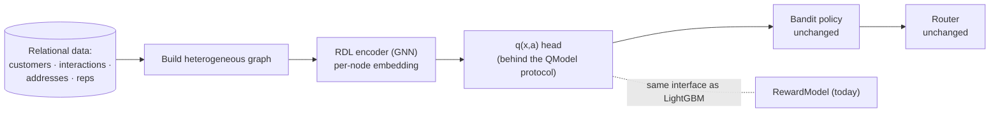

# 12 — Is There Value in Mixing in Relational Deep Learning?

> **Short answer: yes — but as an *optional, evidence-gated upgrade to the value model*, not as a
> rewrite, and not as the "foundation model" the SR-SLM proposal imagined.** This doc explains, from
> zero, what Relational Deep Learning (RDL) is, exactly where it would slot into the NBA system, when
> it beats the current LightGBM reward model and when it doesn't, and the one combination that is
> genuinely novel and worth real research effort.
>
> Read [11-improving-nba-spatio-relational-optimization.md](11-improving-nba-spatio-relational-optimization.md)
> first: this doc is about the **value brain** (the reward model `q(x, a)`); doc 11 is about the
> **optimizer brain** (the router). They meet in [§7](#7-the-one-genuinely-novel-combination-decision-focused-rdl).

---

## Table of contents

1. [The question, sharpened](#1-the-question-sharpened)
2. [Relational Deep Learning from zero](#2-relational-deep-learning-from-zero)
3. [Where RDL would plug into this repo](#3-where-rdl-would-plug-into-this-repo)
4. [Why it *could* help here (the honest upside)](#4-why-it-could-help-here-the-honest-upside)
5. [Why it might *not* (the honest downside)](#5-why-it-might-not-the-honest-downside)
6. [A concrete, incremental adoption path](#6-a-concrete-incremental-adoption-path)
7. [The one genuinely novel combination: decision-focused RDL](#7-the-one-genuinely-novel-combination-decision-focused-rdl)
8. [The legitimate kernel of the "spatio-relational" idea](#8-the-legitimate-kernel-of-the-spatio-relational-idea)
9. [Verdict: when to adopt, when to skip](#9-verdict-when-to-adopt-when-to-skip)
10. [Glossary & references](#10-glossary--references)

---

## 1. The question, sharpened

The NBA system's value brain today is a **LightGBM regressor** over a flat, hand-engineered feature
vector (`src/nba/reward/model.py`, `src/nba/data/features.py`). It eats one prospect at a time as a
fixed-width row of numbers and predicts `q(x, a)`.

But real field-sales value is **relational**. A prospect's worth depends not only on their own
attributes but on a web of relationships: prior interactions over time, household/business
hierarchy, what *neighbors* recently did, competitor presence nearby, which rep last touched them.
The current code already *senses* this — it hand-crafts features like `neighbor_recent_conversion`,
`nearby_high_reward_density`, and `prior_interactions`. Those are **manual, lossy summaries of a
graph.** The question is: **should we let a model learn from the graph directly instead of from our
hand-rolled summaries of it?** That is exactly what Relational Deep Learning offers.

---

## 2. Relational Deep Learning from zero

You don't need any graph-ML background here.

### 2.1 Your data is already a graph

A normal company database (CRM, Snowflake, Postgres) is a set of **tables linked by foreign keys**:
`customers`, `interactions`, `addresses`, `reps`, `deals`. Those foreign keys *are edges*. So the
database is secretly a **heterogeneous graph**: different kinds of nodes (customer, interaction,
address) connected by different kinds of relationships. "Heterogeneous" just means *more than one
type of node/edge*.

### 2.2 What a graph neural network does

A **Graph Neural Network (GNN)** learns a vector ("embedding") for each node by **message passing**:
each node repeatedly gathers information from its neighbors, mixes it with its own, and updates its
vector. After a few rounds, a customer's embedding has absorbed signal from their interactions, their
address's neighborhood, similar customers, and so on — *automatically*, instead of you writing a SQL
query to compute `neighbor_recent_conversion` by hand. Classic message-passing layers you'll see
named: **GraphSAGE**, **GCN/R-GCN** (the "R" = *relational*, for multiple edge types), **GAT**
(attention over neighbors).

### 2.3 What "Relational Deep Learning" specifically means

**Relational Deep Learning (RDL)** is the recent program of applying GNNs **directly to relational
databases** — turning the foreign-key graph into the input of a GNN so you skip most manual feature
engineering. The reference academic effort is **RelBench** (Fey, Lenssen, Hu et al., 2023–2024),
which provides standardized relational-DB benchmarks and a `PyTorch Geometric`-based pipeline; the
commercial archetype is **Kumo.ai**. The SR-SLM proposal cited exactly this lineage (R-GCN /
GraphSAGE over enterprise databases) — and on *this* point it was pointing at something real and
useful.

---

## 3. Where RDL would plug into this repo

RDL is **not** a replacement for the bandit, the OPE gate, the router, or the ethics layer. It
replaces (or augments) exactly **one** box: the reward model `q(x, a)`.

The crucial engineering point: the orchestrator already talks to the reward model through the
**`QModel` protocol** (`src/nba/bandits/base.py` — a single `q_all(ctx)` method; the production
`RewardModel` adds `q`/`best_action` on top). An RDL model that implements that protocol drops in
**without touching** the bandit, OPE, router, API, or ethics code.
That makes RDL a *contained, reversible experiment*, not a rewrite — which is the only responsible way
to introduce it.

---

## 4. Why it *could* help here (the honest upside)

1. **It learns the graph features you currently hand-craft.** `neighbor_recent_conversion`,
   `nearby_high_reward_density`, interaction-history summaries — these are crude, fixed aggregations.
   A GNN learns richer, task-tuned versions automatically and can capture higher-order structure
   (neighbors-of-neighbors, temporal interaction patterns) you'd never hand-code.
2. **It shines exactly where the domain is relational.** B2B territory sales (account hierarchies,
   buying committees, competitor overlap) and dense B2C canvassing (block-level social proof,
   referral chains) are graph-shaped. The richer the relationships, the bigger RDL's edge over flat
   tabular models.
3. **It scales feature engineering.** Adding a new data source becomes "add a node/edge type," not
   "design and backfill a dozen new columns."
4. **It's the natural encoder for the end-to-end vision.** If you pursue decision-focused or neural
   routing (doc 11, Upgrades 2 & 4), a GNN encoder over the relational+spatial graph is the right
   front end — and that combination is where the real research value lives ([§7](#7-the-one-genuinely-novel-combination-decision-focused-rdl)).

---

## 5. Why it might *not* (the honest downside)

Be skeptical; RDL is not free lunch.

1. **GBDTs are a *very* strong tabular baseline.** On flat, modest-sized tabular data, gradient-boosted
   trees (LightGBM) routinely **match or beat** neural networks, train in seconds, need little tuning,
   and handle mixed feature types natively. [09 §7](09-build-nba-from-scratch.md#7-the-reward-model-estimating-qx-a)
   chose LightGBM for exactly these reasons. RDL only pulls ahead when there's **real relational
   signal** that the hand-crafted features fail to capture. If your hand-crafted graph features
   already capture most of it, RDL buys little.
2. **The current simulator doesn't even produce a graph.** `src/nba/data/simulator.py` samples
   *independent* prospects with a few spatial/neighbor scalars. There is no relational substrate for a
   GNN to chew on. **You must first build relational/temporal structure into the data** (or bring a
   real CRM dataset) before RDL can possibly help — otherwise a GNN is an expensive way to relearn a
   tabular model.
3. **Every safety rail must survive the swap.** The repo's discipline is non-negotiable and harder to
   uphold with a GNN:
   - **Propensity & overlap** ([09 §11](09-build-nba-from-scratch.md#11-propensity-and-overlap-the-non-negotiable))
     — unchanged in principle (the bandit still wraps the model), but the model must stay **calibrated**
     ([09 §8](09-build-nba-from-scratch.md#8-calibration-making-scores-mean-something)) because DM/DR
     OPE estimators average `q̂` directly. Neural nets are famously miscalibrated; you'd need
     temperature scaling or isotonic calibration on top.
   - **Ethics by construction** ([09 §6, §18](09-build-nba-from-scratch.md#6-feature-engineering-and-the-ethics-allow-list))
     — the allow-list keeps protected/geo/identity fields out of the model. A GNN over a relational DB
     makes leakage *easier*: a node can absorb a forbidden attribute from a neighbor via message
     passing, or "redline" by learning neighborhood identity through graph proximity. You'd need an
     allow-list at the **graph-construction** layer (which node/edge features may enter) plus tests
     analogous to `tests/test_ethics.py`.
   - **No oracle leak** ([09 §5](09-build-nba-from-scratch.md#5-the-simulator-and-oracle-isolation))
     — same rule; the GNN trains only on logged tuples.
4. **Operational cost.** A GNN needs PyTorch/PyG, GPUs to train comfortably, graph-construction
   plumbing, and more careful serving (sub-graph sampling for low latency). That's a real jump from a
   single `pip`-installable LightGBM artifact.

---

## 6. A concrete, incremental adoption path

Do this **only** after doc 11's Upgrade 1 (it's cheaper and surer). Keep every step behind the
`QModel` protocol and gate every promotion through OPE.

1. **Give the data a graph to learn from.** Extend `src/nba/data/simulator.py` so the ground truth
   includes genuine relational/temporal effects: explicit neighbor edges, household/account
   groupings, an interaction history per prospect, maybe competitor-overlap edges. Without this, RDL
   has nothing to do.
2. **Build the graph + an RDL reward model.** Add a `src/nba/reward/` implementation (e.g.
   `graph_model.py`) that constructs the heterogeneous graph and runs a small R-GCN/GraphSAGE, with a
   `q(x, a)` head, implementing the `QModel` protocol. Add a **graph-feature allow-list** mirroring
   `ALLOWED_FEATURES`, and a test that forbidden fields can't enter via nodes *or* edges.
3. **Calibrate it.** Wrap the GNN output in the same isotonic calibration the LightGBM model uses, so
   DM/DR stay trustworthy.
4. **Bench it head-to-head, fairly.** Compare RDL vs. LightGBM on (a) held-out prediction error, and
   — more importantly — (b) **realized route value** and **OPE value** in the demo
   ([11 §10](11-improving-nba-spatio-relational-optimization.md#10-measuring-success-extend-the-demo-and-the-tests)).
   Adopt RDL **only if it clears the LightGBM baseline through the same DR gate.** If it ties, keep
   LightGBM — it's cheaper.

This path makes RDL a falsifiable experiment with a clean off-ramp, instead of a one-way architectural
bet.

---

## 7. The one genuinely novel combination: decision-focused RDL

Here is where mixing in RDL stops being "a maybe-better predictor" and becomes a **real research
contribution** — and it's the defensible core that the SR-SLM proposal was groping toward.

Take the two ideas that are individually established:

- **Relational Deep Learning** — a GNN that turns the CRM graph into per-door value estimates
  ([§2](#2-relational-deep-learning-from-zero)).
- **Decision-focused learning** — training the value model so the *router's decisions* are good, not
  so predictions are accurate ([11 §5](11-improving-nba-spatio-relational-optimization.md#5-upgrade-2--decision-focused-learning-train-the-model-on-route-value-not-prediction-error)).

**Compose them:** train a *relational* value model **end-to-end through an orienteering optimizer**,
so the GNN learns to predict prizes that make the *route* maximally valuable under a real
time/road/team budget. Each half exists; their **combination on relational enterprise data, gated by
honest off-policy evaluation, is fresh** and squarely useful. This — not a from-scratch "Structural
Tokenizer SLM" — is the version of the SR-SLM vision worth pursuing, and it lives naturally inside
this repo's existing protocols and safety rails.

---

## 8. The legitimate kernel of the "spatio-relational" idea

The SR-SLM framing was right that **value lives in a relational space** and **cost lives in a spatial
space**, and that fusing them matters. The honest, buildable version:

- **Relational signal** → an RDL/GNN encoder produces `q(x, a)` (this doc).
- **Spatial signal** → real road travel times via OSRM/Valhalla feed the **optimizer**
  ([11 §4.3](11-improving-nba-spatio-relational-optimization.md#43-use-real-road-travel-times)), and
  coordinate features can enter the encoder via standard spatial embeddings (sinusoidal/Fourier
  features, or `Space2Vec`-style encodings) — a routine multimodal concatenation, not a research gap.
- **The fusion** → happens in the **objective**: orienteering maximizes relational prize subject to
  spatial budget ([11 §3](11-improving-nba-spatio-relational-optimization.md#3-background-from-zero-the-orienteering-problem)),
  optionally trained end-to-end ([§7](#7-the-one-genuinely-novel-combination-decision-focused-rdl)).

That delivers the *intent* of "spatio-relational autonomous routing" with named, testable components
— and without the overclaims (no "zero-hallucination," no "guaranteed mathematical maximum," because
learned policies give neither).

---

## 9. Verdict: when to adopt, when to skip

**Adopt RDL when:**
- your real data has rich relational structure (B2B account hierarchies, dense referral/social-proof
  graphs, multi-touch interaction histories) that flat features demonstrably under-capture, **and**
- you've already done the cheap wins (doc 11 Upgrade 1), **and**
- it beats the LightGBM baseline through the same OPE gate on **route value**, not just prediction
  error, **and**
- you can uphold calibration + the ethics allow-list at the graph layer.

**Skip (or defer) RDL when:**
- you're on flat, modest tabular data where GBDTs already win — which is the repo's current state, and
- the hand-crafted neighbor/spatial features already explain most of the variance, and
- the operational cost (PyG/GPU/serving) outweighs a marginal accuracy gain.

**Bottom line:** there **is** real value in mixing in Relational Deep Learning — but as a *contained,
OPE-gated upgrade to the value model*, most powerfully when **fused with decision-focused learning**
([§7](#7-the-one-genuinely-novel-combination-decision-focused-rdl)). It is an upgrade to one box in a
proven loop, not a reason to rebuild the loop. The biggest, cheapest wins still come first from the
optimizer-side upgrades in doc 11; RDL is the right *next* bet only once the data is genuinely
relational and the cheap wins are banked.

---

## 10. Glossary & references

| Term | Expansion | One-line meaning |
|---|---|---|
| **RDL** | Relational Deep Learning | Applying GNNs directly to relational-database (foreign-key) graphs. |
| **GNN** | Graph Neural Network | A model that learns node embeddings by message passing over a graph. |
| **message passing** | — | Each node repeatedly aggregates neighbor info to update its embedding. |
| **heterogeneous graph** | — | A graph with multiple node and edge types (customers, interactions, …). |
| **R-GCN / GraphSAGE / GAT** | — | Common message-passing layer types (relational / sampled / attention). |
| **GBDT** | Gradient-Boosted Decision Trees | The strong tabular baseline (LightGBM) used today. |
| **PyG** | PyTorch Geometric | The standard graph-learning library RDL is built on. |
| **calibration** | — | Making predicted scores match real frequencies (vital for DM/DR OPE). |

**References**

- Fey, M., Lenssen, J. E., Hu, W. et al. (2023–2024). *Relational Deep Learning* and **RelBench**:
  benchmarks for machine learning on relational databases.
- Hamilton, W., Ying, R. & Leskovec, J. (2017). *Inductive Representation Learning on Large Graphs*
  (**GraphSAGE**). NeurIPS.
- Schlichtkrull, M. et al. (2018). *Modeling Relational Data with Graph Convolutional Networks*
  (**R-GCN**). ESWC.
- Veličković, P. et al. (2018). *Graph Attention Networks* (**GAT**). ICLR.
- Grinsztajn, L., Oyallon, E. & Varoquaux, G. (2022). *Why do tree-based models still outperform deep
  learning on typical tabular data?* NeurIPS.
- Mai, G. et al. (2020). *Multi-Scale Representation Learning for Spatial Feature Distributions*
  (**Space2Vec**). ICLR.
- Elmachtoub, A. & Grigas, P. (2021). *Smart "Predict, then Optimize."* Management Science. (the
  decision-focused half of [§7](#7-the-one-genuinely-novel-combination-decision-focused-rdl))

> Companion: [11-improving-nba-spatio-relational-optimization.md](11-improving-nba-spatio-relational-optimization.md)
> (the optimizer-side upgrades) and [09-build-nba-from-scratch.md](09-build-nba-from-scratch.md)
> (the system these docs extend).
