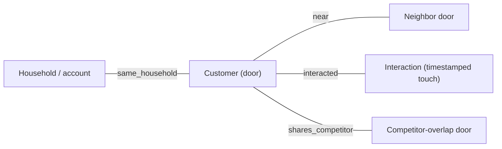

# 13 — Building the relational dataset (step by step)

> The companion build doc for [Phase 9](../plans/phase-09-relational-dataset.md). It explains, from
> zero, *why* the current simulator can't feed a graph model, *what* relational structure we add, and
> *how* to build a second dataset that **mirrors** the flat one — same `BanditEvent` stream, same
> rails — while carrying real relational/temporal signal. Read
> [12-relational-deep-learning-mixin.md](12-relational-deep-learning-mixin.md) §2 and §6 first.

This is the **foundation** for Relational Deep Learning ([18](18-relational-deep-learning.md)) and it
enriches the dynamic and decision-focused phases too. It changes nothing until you set
`NBA_DATASET_MODE=relational`.

## 1. Why a new dataset at all

Today's `src/nba/data/simulator.py` samples **independent** prospects: each door's
`prior_interactions`, `neighbor_recent_conversion`, and `nearby_high_reward_density` are drawn in
isolation (see `sample_context`). There is no actual neighbor, no household, no interaction log — just
scalars that *summarize* a graph that doesn't exist. As doc 12 §5.2 puts it: a GNN over this data is
"an expensive way to relearn a tabular model." So before any relational model can help, the **ground
truth itself must be relational**.

We do this as a *new* dataset, not a rewrite, for two reasons:

1. **Safety:** the flat simulator is the substrate of 143 passing tests and the whole verified loop.
   It stays the default and untouched.
2. **Honest comparison:** keeping both lets us prove (doc 12 §6.4) whether RDL actually beats
   LightGBM, rather than assuming it.

## 2. The relational substrate we add

A real CRM is tables linked by foreign keys — and those keys are edges (doc 12 §2.1). We synthesize
the same shape:



- **Household nodes** group spatially-coherent addresses (reuse the territory-clustering idea from
  `routing/territories.py`).
- **`near` edges** connect doors within `neighbor_radius_km` (vectorized haversine, reusing
  `routing/distance.py`).
- **Interaction history** gives each door up to `history_len` timestamped touches, so
  `prior_interactions` is now *explained* by an event log rather than sampled.
- **Competitor-overlap edges** depress conversion where a competitor is present.

## 3. The ground truth gains relational effects

`relational_simulator.latent_scores` extends the flat effects (`simulator.latent_scores`) with
effects that **require the graph** — and these are the only thing a GNN can learn that LightGBM's
hand-crafted features can't fully capture:

- **Neighbor social proof:** a nearby recent `CLOSED`/`APPOINTMENT` lifts this door's
  `APPOINTMENT`/`CLOSED`.
- **Household momentum:** a prior `CLOSED` in the same household lifts engagement.
- **Temporal fatigue:** realistic decay over the door's *own* interaction history.
- **Competitor overlap:** a shared-competitor edge lowers `CLOSED`.

Crucially, **a degenerate world (no edges, no history) collapses to the flat oracle** — the
relational world is a strict superset, which we assert in tests.

## 4. The mirror contract (why downstream code doesn't move)

`generate_logs` emits the *same* `BanditEvent` schema as the flat simulator. So `RewardModel`, the
bandits, OPE, the orchestrator, and the API consume relational logs **without any change**. The extra
structure rides alongside in a `RelationalWorld` and a serialized graph, consumed only by the RDL
model in [Phase 14](../plans/phase-14-relational-deep-learning.md). This is the same discipline as the
rest of the repo: new capability behind a stable interface.

## 5. The graph builder and its ethics allow-list

`src/nba/data/graph.py` turns a `RelationalWorld` into typed node/edge arrays — but only through a
**graph allow-list** (`GRAPH_NODE_FEATURES`) mirroring `features.ALLOWED_FEATURES`. This matters
because a GNN makes leakage *easier* (doc 12 §5.3): a node can absorb a forbidden attribute from a
neighbor via message passing, or "redline" by learning neighborhood identity through proximity. By
filtering at construction, a forbidden field can enter neither a node feature nor an edge — verified
by a test mirroring `tests/test_ethics.py`. The builder returns plain numpy (no torch), so this phase
adds **zero heavy dependencies**.

## 6. The two rails we keep

- **Oracle isolation:** `latent_scores`/`true_reward`/`true_best_action` in the relational simulator
  are oracle-only, exactly like the flat ones. The Phase 2 AST guard
  (`tests/test_ethics.py::test_no_oracle_leak`) is extended to scan the new module.
- **Determinism & offline-first:** an independent `relational_seed` makes the world reproducible; Ames
  falls back to synthetic offline, like today.

## 7. How to run it

```bash
uv run python scripts/generate_relational_logs.py --n 20000 --seed 7 --out data/relational
# -> data/relational/{logs.parquet, households.parquet, edges.parquet, graph.npz}
# prints arm frequencies, min propensity (>0), node/edge counts, neighborhood coverage
```

Then anything downstream can train on `data/relational/logs.parquet` with `NBA_DATASET_MODE=relational`
exactly as it does on `data/logs.parquet`.

## 8. What "done" looks like

The acceptance checks in [Phase 9](../plans/phase-09-relational-dataset.md): logs round-trip
identically to the flat ones, every propensity > 0, the relational effects are real (social proof
raises a door's true value; competitor overlap lowers it), the degenerate world equals the flat world,
and the graph allow-list blocks geo/identity/protected fields. With `dataset_mode="flat"`, nothing
changes.

> Next: [14-orienteering-upgrade.md](14-orienteering-upgrade.md) — the cheapest optimizer-side win.
