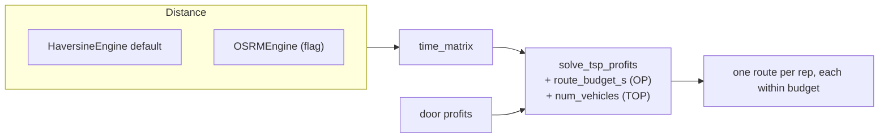

# 14 — The orienteering upgrade (step by step)

> The companion build doc for [Phase 10](../plans/phase-10-orienteering.md). It turns the router from
> an implicit Prize-Collecting TSP into an explicit **Orienteering Problem** — with a shift-time
> budget, multiple reps, and real road times — without breaking a single existing route. Read
> [11-improving-nba-spatio-relational-optimization.md](11-improving-nba-spatio-relational-optimization.md)
> §3-4 for the theory; this doc is the wiring.

This is **Upgrade 1**, the cheapest, surest value in the roadmap (doc 11 §4): mostly configuration and
a few OR-Tools dimensions, no machine learning.

## 1. Where the code already sits

`src/nba/routing/tsp_profits.py::solve_tsp_profits` is already a single-vehicle **Prize-Collecting
TSP with time windows and a capacity cap** — genuinely good and covering most of the value (doc 11
§3.3). It builds:

- an arc-cost callback (travel time),
- an `AddDisjunction` per non-depot door (drop penalty = scaled profit),
- an optional `Capacity` dimension,
- an optional `Time` dimension with per-node windows.

Three gaps remain: no **global time budget**, no **multiple reps**, and `OSRMEngine` is a stub. We
close all three additively, each behind a flag that defaults to today's behavior.

## 2. Upgrade 1a — the explicit shift-time budget (the OP)

A shift ends when the clock runs out, but today the `Time` dimension only enforces *per-node* windows,
not a single cap on the whole route (doc 11 §2.2). The fix is one line per vehicle after the `Time`
dimension is built:

```python
time_dim.CumulVar(routing.End(v)).SetMax(int(route_budget_s))
```

This bounds the cumulative time at the end node, turning "skip low-value far doors" (PCTSP) into
"collect as much value as possible **before the shift ends**" (OP). Driven by `use_time_budget` +
`shift_hours`; off by default.

## 3. Upgrade 1b — routing the whole team (TOP)

`RoutingIndexManager` already accepts a vehicle count — it's just hard-coded to `1`. With
`num_vehicles=k` (and a shared depot, or the `(n, k, starts, ends)` overload for distinct depots),
OR-Tools partitions doors across reps and routes each. Because every non-depot node keeps its single
`AddDisjunction`, **no two reps serve the same door** (doc 11 §4.2). `solve_tsp_profits` returns one
`Route` per vehicle when `num_vehicles > 1`, and the existing single-`Route` return path is preserved
when it equals 1 — so Phase 6 tests pass verbatim.

## 4. Upgrade 1c — real road travel times

`HaversineEngine` is straight-line distance over a sphere — fast but optimistic (it ignores rivers,
one-ways, buildings). The repo already defines the seam: `OSRMEngine` conforms to the `DistanceEngine`
protocol. We implement its `time_matrix` against the OSRM Table service:

```
GET {base_url}/table/v1/foot/{lon,lat;...}?annotations=duration  ->  durations (n×n seconds)
```

Because every consumer depends only on the protocol, **no caller changes** — the orchestrator just
constructs `OSRMEngine` when `distance_engine="osrm"`. Network access is opt-in (default Haversine),
and tests mock the HTTP call so CI stays offline.

## 5. How it composes



## 6. The metaheuristic caveat (don't over-build)

OR-Tools' Guided Local Search is excellent for neighborhood-sized instances. ALNS (adaptive
large-neighborhood search) is the OP/TOP heavy lifter, but **only reach for it when OR-Tools
demonstrably can't keep up at scale** (doc 11 §4.4) — measure first, don't add speculatively.

## 7. Proving it (doc 11 §10)

Extend the demo/tests to assert: a budgeted route never exceeds `shift_hours`; a team route's served
doors are the disjoint union across reps (no double-serve); switching to OSRM changes only the matrix.
All defaults reproduce today's deterministic routes.

> Next: [15-risk-aware-routing.md](15-risk-aware-routing.md) — spend the uncertainty you already have.
