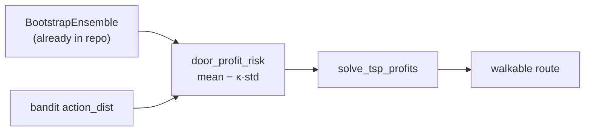

# 15 — Risk-aware routing (step by step)

> The companion build doc for [Phase 11](../plans/phase-11-risk-aware-routing.md). It shows how to
> stop pretending every predicted prize is equally trustworthy — using uncertainty the repo
> **already produces** — with a change localized to one method. Read
> [11-improving-nba-spatio-relational-optimization.md](11-improving-nba-spatio-relational-optimization.md)
> §6.

This is **Upgrade 3**: low-to-medium cost, because the uncertainty source already exists.

## 1. The free uncertainty in the repo

`src/nba/bandits/thompson.py::BootstrapEnsemble` fits `B` reward models, each on a bootstrap resample
of the logs. `q_all_members(ctx)` returns a `(B, |A|)` matrix — a **distribution** of `q` per door,
not a point. Its spread *is* the model's uncertainty. Today the orchestrator's `door_profit` only ever
uses the mean (via the policy-weighted `q`), and the spread is discarded (doc 11 §6.1).

## 2. The risk-adjusted prize

Instead of pricing a door by its bare mean, subtract a penalty proportional to its spread:

\[ \text{profit}_{\text{risk}}(x_d) = \mathbb{E}[\rho(x_d)] - \kappa \cdot \text{std}[\rho(x_d)] \]

A door the model loves *on average* but disagrees about *wildly* is discounted relative to an
equally-valuable door it's *sure* about. `κ` (`risk_kappa`) tunes risk appetite, and **`κ = 0`
recovers today's behavior exactly** — so the flag is a safe no-op until you tune it.

In code, the per-member route-relevant value is the bandit-weighted `q` per ensemble member; we take
the mean and std across members:

```python
members = ensemble.q_all_members(ctx)          # (B, |A|)
w = action_dist weights                         # bandit exploration weights
v = members @ w                                  # (B,) per-member door value
prize = v.mean() - risk_kappa * v.std()
```

## 3. The more principled version: CVaR

For a stronger guarantee, optimize the **Conditional Value-at-Risk** — the average value in the worst,
say, 10% of scenarios — of *total route value* (doc 11 §6.2). This is the standard objective for
stochastic/robust orienteering and protects the rep's whole day against a few overconfident bets. It
ties directly into the scenario machinery of [Phase 13](../plans/phase-13-dynamic-stochastic-routing.md).
`mean_std` is the default; `cvar` is the opt-in extension.

## 4. Where it plugs in

This is a **localized** change. The orchestrator gains an optional `reward_ensemble` and a
`door_profit_risk` method; `plan_route` calls it only when `use_risk_aware_routing` is set. Nothing
downstream of the prize vector changes — the same `solve_tsp_profits` consumes the (now risk-adjusted)
prizes.



## 5. Proving it (doc 11 §10)

The claim is **variance reduction**: across many simulated shifts, a risk-aware route should show
**lower variance** of realized shift value at comparable mean. The test asserts exactly this with
seeded comparisons, plus the no-op check (`κ=0` equals mean pricing) and a config guard (risk routing
on without an ensemble raises clearly).

> Next: [16-decision-focused-learning.md](16-decision-focused-learning.md) — the biggest quality win.
