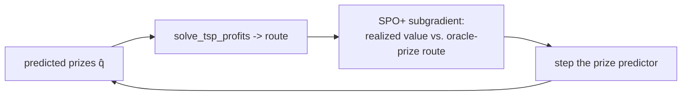

# 16 — Decision-focused learning (step by step)

> The companion build doc for [Phase 12](../plans/phase-12-decision-focused-learning.md). It explains,
> from zero, the highest-value idea in the roadmap: train the reward model so the **router's
> decisions** are good, not so its predictions win an accuracy contest the business never asked for.
> Read [11-improving-nba-spatio-relational-optimization.md](11-improving-nba-spatio-relational-optimization.md)
> §5.

This is **Upgrade 2** — the biggest *quality* win and the real research seam (doc 11 §1, §5.5).

## 1. The mismatch we're fixing

Today's pipeline is **predict-then-optimize**:

1. **Predict:** `RewardModel` (LightGBM) is trained to minimize squared error vs. logged rewards.
2. **Optimize:** the router consumes `q̂` and produces a route.

The model is trained in step 1 with **no knowledge of step 2.** But its numbers are only ever used to
make include/skip/order decisions. Squared error spends capacity equally on every door — including
doors whose value is so high or low that the routing decision is obvious and a wrong prediction costs
nothing (doc 11 §2.1). We optimize a proxy (accuracy) instead of the goal (route value).

**Decision-focused learning** changes the objective to: *produce predictions that, when fed to the
optimizer, yield the best real-world decisions.* It automatically reallocates the model's attention
toward the doors **where being wrong changes the route**.

## 2. The obstacle: argmax has no gradient

To train "through" the optimizer you'd differentiate route value w.r.t. predictions. But routing
decisions are **discrete** — a door is in or out — so the gradient is zero almost everywhere (doc 11
§5.2). Three standard tools get around it; we use the two practical ones:

- **SPO+ loss** (Elmachtoub & Grigas) — a convex surrogate whose subgradient you *can* compute,
  designed so minimizing it minimizes **decision regret** (value lost vs. an oracle that knew the true
  prizes). The cleanest fit for a linear orienteering objective.
- **Decision-aware reweighting** — a crude, gradient-free approximation you can ship in an afternoon.

(The third, differentiable optimization layers / policy gradients, is the bridge to neural routing —
[Phase 15](../plans/phase-15-neural-combinatorial-optimization.md).)

## 3. On-ramp 1 — decision-aware reweighting (cheap)

Keep LightGBM, but weight training rows by how *decision-relevant* they are: **upweight** doors near
the historical include/skip boundary, **downweight** obvious includes/skips (doc 11 §5.3.1). The
boundary is estimated from the per-door bandit-weighted prize distribution on the logs; the weights
flow straight into LightGBM's `sample_weight`. No new model, no torch, A/B-able immediately.

## 4. On-ramp 2 — the SPO+ fine-tune (the real thing)

After the standard fit, run an SPO+ loop over batches of historical neighborhoods:

The model stays a `RewardModel` behind the `QModel` protocol, so the orchestrator, API, bandits, and
OPE don't move. The isotonic calibrator is **refit after fine-tuning** so DM/DR stay valid.

## 5. The safety rails (non-negotiable, doc 11 §5.4)

- **No oracle leak at serve time.** SPO+ uses the *true* prize only as a *training label* for regret —
  exactly like the existing `regret` metric in scripts/tests — never inside the served model. In
  production the oracle label is replaced by the **realized logged reward**, which is what SPO+ is
  designed for.
- **OPE still gates promotion.** A decision-focused model is just another candidate policy: it must
  clear the same DR lower-confidence-bound gate (`ope/gate.py`) before it reaches a rep. The win you
  must *prove* is higher route value at equal-or-better OPE — not a prettier training curve.

## 6. Proving it (doc 11 §10)

The direct evidence is **decision regret** — value lost vs. an oracle that knew the true prizes — the
quantity SPO+ minimizes. The test asserts lower regret than the plain model at equal-or-better OPE on
seeded synthetic neighborhoods, plus the default-off no-op check and the QModel/calibration
conformance.

## 7. Why this is the right place to spend effort

The two-stage critique that motivated the whole roadmap is real, and decision-focused learning is its
principled fix — and the genuinely fresh, publishable seam, *especially* combined with a relational
value model ([20-decision-focused-rdl.md](20-decision-focused-rdl.md)).

> Next: [17-dynamic-stochastic-routing.md](17-dynamic-stochastic-routing.md) — handle the day as it
> unfolds.
