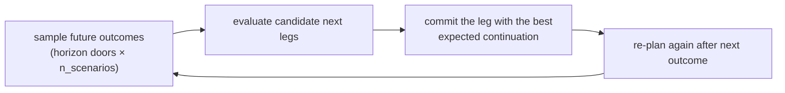

# 17 — Dynamic & stochastic routing (step by step)

> The companion build doc for [Phase 13](../plans/phase-13-dynamic-stochastic-routing.md). It shows
> how to handle the day as it actually unfolds — outcomes arrive, prizes are uncertain, traffic
> shifts — building on the re-planning the repo already has. Read
> [11-improving-nba-spatio-relational-optimization.md](11-improving-nba-spatio-relational-optimization.md)
> §8.

This is **Upgrade 5**: medium cost, and most of its value is captured cheaply.

## 1. What the repo already does

`Orchestrator.replan(remaining)` re-solves the route over the not-yet-visited doors. That's a solid
**re-optimize-on-event** baseline and already better than a static plan (doc 11 §8.1). The demo's
shift walk calls it as outcomes come in.

## 2. What "done right" adds

- **Stochastic prizes.** A door's reward is realized only after the knock. Plan against the
  *distribution* of outcomes — not a frozen point estimate — so the plan is robust to surprises. This
  ties straight into the ensemble uncertainty of
  [Phase 11](../plans/phase-11-risk-aware-routing.md).
- **Anticipatory routing.** Instead of greedily re-optimizing only the present, account for the fact
  that you'll *re-plan again later*. The principled framing is a Markov Decision Process over the
  shift; the tractable approximation is rollout/lookahead — sample future scenarios before committing
  the next leg (doc 11 §8.2).
- **Live travel times.** Pair with the real road engine ([14](14-orienteering-upgrade.md)) so re-plans
  use *current* traffic.

## 3. Stochastic prizes in practice

```python
def scenario_prizes(ensemble, contexts, policy, *, n_scenarios, rng):
    # (n_scenarios, n_doors): draw an ensemble member per scenario, price each door by its
    # bandit-weighted q under that member
```

`replan` then solves on a scenario-robust prize (e.g. a CVaR-style quantile across scenarios), reusing
the Phase 11 machinery. With the flag off, it falls back to the point estimate — today's behavior.

## 4. Anticipatory (lookahead) replanning



This is a rollout approximation of the shift MDP — OR-Tools still does each per-leg optimization, so it
is a thin layer over the existing solver.

## 5. Keep it cheap (doc 11 §8.3)

Most of the value of "dynamic" is already captured by **(a) re-planning on every meaningful event**
(present) **+ (b) risk-aware prizes** (Phase 11). The full MDP/anticipatory machinery is the last
10-20% and should be justified by measurement, not assumed. That's why every piece here is a flag,
off by default.

## 6. Proving it (doc 11 §10)

The tests assert: with flags off, `replan` is identical to Phase 7; stochastic prizes shrink the
worst-decile realized value (downside) at comparable mean; lookahead doesn't regress mean value; and
everything stays deterministic under fixed seeds.

> Next: [18-relational-deep-learning.md](18-relational-deep-learning.md) — the value-side upgrade.
