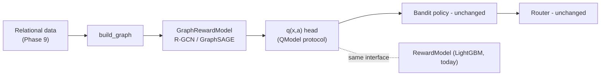

# 18 — Building the Relational Deep Learning value model (step by step)

> The companion build doc for [Phase 14](../plans/phase-14-relational-deep-learning.md). It explains
> how to add a GNN reward model that learns from the relational graph — as a **contained, reversible,
> OPE-gated** experiment behind the `QModel` protocol. Read
> [12-relational-deep-learning-mixin.md](12-relational-deep-learning-mixin.md) end-to-end first; this
> doc is the build, that doc is the *why and when*.

This phase is worth doing **only after** the relational dataset exists ([13](13-relational-dataset.md))
and the cheap optimizer wins are banked ([14](14-orienteering-upgrade.md)) — doc 12 §6.

## 1. What RDL is, in one paragraph

A company database is tables linked by foreign keys, i.e. a **heterogeneous graph** (doc 12 §2). A
**Graph Neural Network** learns a vector per node by **message passing**: each node repeatedly gathers
info from neighbors and updates its embedding. After a few rounds, a door's embedding has absorbed
signal from its interactions, its household, its neighbors — *automatically*, instead of hand-writing
`neighbor_recent_conversion` in SQL. **Relational Deep Learning** is applying GNNs directly to that
foreign-key graph.

## 2. Where it plugs in — exactly one box

The orchestrator talks to the reward model only through `QModel.q_all` (`bandits/base.py`). A GNN that
implements that protocol drops in **without touching** the bandit, OPE, router, API, or ethics code
(doc 12 §3). That makes RDL a falsifiable experiment with a clean off-ramp, not a rewrite.

## 3. The build

`src/nba/reward/graph_model.py` defines `GraphRewardModel`:

1. **Construct** the heterogeneous graph from the `RelationalWorld` via `data.graph.build_graph`
   (allow-listed nodes/edges only).
2. **Encode** with `gnn_layers` rounds of R-GCN or GraphSAGE message passing.
3. **Predict** `q(x, a)` with a small head.
4. **Train** on logged `(context, action, reward)` tuples — the same labels LightGBM uses.
5. **Calibrate** the output with the *same* isotonic wrapper.

Heavy deps (`torch`, `torch_geometric`) are an **optional extra** (`uv sync --extra rdl`); with the
default `reward_model_kind="lightgbm"` they're never imported, so the base install and existing tests
are untouched.

## 4. The rails are harder here — and we keep them all (doc 12 §5.3)

- **Ethics allow-list at the graph layer.** A GNN makes leakage *easier*: a node can absorb a
  forbidden attribute from a neighbor via message passing, or "redline" by learning neighborhood
  identity through proximity. The allow-list is enforced in `build_graph`, so forbidden fields enter
  neither nodes nor edges. A leakage test mirrors `tests/test_ethics.py`.
- **Calibration is mandatory.** DM/DR OPE average `q̂` directly, and neural nets are famously
  miscalibrated. The isotonic calibrator on top keeps DM/DR trustworthy.
- **No oracle leak.** Trains only on logged tuples; the AST guard covers the new module.
- **Frozen schema.** A graph-feature manifest is persisted and verified on load, like
  `feature_names.json`.

## 5. The honest comparison (the whole point)

GBDTs are a *very* strong tabular baseline (doc 12 §5.1): on flat, modest data they routinely match or
beat neural nets, train in seconds, and calibrate easily. RDL only pulls ahead when there's **real
relational signal** the hand-crafted features miss — which is exactly what the Phase 9 dataset injects.
So `train_reward.py` emits a head-to-head: prediction error *and*, more importantly, **realized route
value + OPE value** for both models (doc 12 §6.4).

**Adopt RDL only if it clears the LightGBM baseline through the same DR gate on route value. If it
ties, keep LightGBM — it's cheaper** (doc 12 §9).

## 6. Proving it

Phase 14's acceptance: `GraphRewardModel` satisfies `QModel`, save/load round-trips with the schema
guard, the graph allow-list blocks forbidden fields (and they're not recoverable from embeddings),
calibration is present, and the bench harness computes route value + DR for both models so promotion
uses the same gate. Base install (no `rdl` extra) is unchanged.

> Next (deferred): [19-neural-combinatorial-optimization.md](19-neural-combinatorial-optimization.md)
> and [20-decision-focused-rdl.md](20-decision-focused-rdl.md) — the research frontier.
