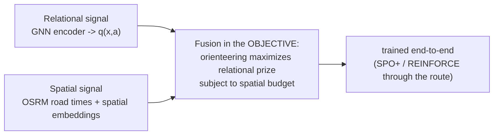

# 20 — Decision-focused RDL: the one genuinely novel combination (deferred / optional)

> The companion doc for [Phase 16](../plans/phase-16-decision-focused-rdl.md). **This is the research
> frontier** — deferred until the relational data, decision-focused learning, and RDL value model are
> all in place. Read [12-relational-deep-learning-mixin.md](12-relational-deep-learning-mixin.md) §7-8.

## 1. The composition

Two ideas that are individually established:

- **Relational Deep Learning** — a GNN that turns the CRM graph into per-door value estimates
  ([18](18-relational-deep-learning.md)).
- **Decision-focused learning** — training the value model so the *router's decisions* are good, not so
  predictions are accurate ([16](16-decision-focused-learning.md)).

**Compose them:** train the *relational* value model **end-to-end through an orienteering optimizer**,
so the GNN learns to predict prizes that make the *route* maximally valuable under a real
time/road/team budget. Each half exists; their combination on relational enterprise data, gated by
honest OPE, is the fresh and defensible core of the original "spatio-relational" vision (doc 12 §7).

## 2. The legitimate kernel of "spatio-relational" (doc 12 §8)

- **Relational signal** -> the GNN encoder produces `q(x, a)`.
- **Spatial signal** -> real road travel times (OSRM, [14](14-orienteering-upgrade.md)) feed the
  optimizer; coordinates enter the encoder via standard spatial embeddings (sinusoidal/Fourier,
  Space2Vec-style) — a routine multimodal concatenation, not a research gap.
- **The fusion** -> happens in the objective, optionally trained end-to-end.

## 3. The rails still bind (doc 12 §7, §9)

- No "zero-hallucination" or "guaranteed maximum" claims — learned policies give neither.
- Calibration re-applied after end-to-end training; ethics allow-list at the graph layer; no oracle at
  serve time; **promotion only through the same DR gate on route value.**

## 4. The bar for adoption

The fused model must beat **both** the LightGBM baseline and the standalone RDL model on **route
value** through the DR gate, on genuinely relational data. Otherwise it is not promoted. This — not a
from-scratch "foundation model" — is the version of the spatio-relational vision worth pursuing, and it
lives naturally inside this repo's existing protocols and safety rails.

> Back to the start of the upgrade arc: [11-improving-nba-spatio-relational-optimization.md](11-improving-nba-spatio-relational-optimization.md),
> [12-relational-deep-learning-mixin.md](12-relational-deep-learning-mixin.md).
