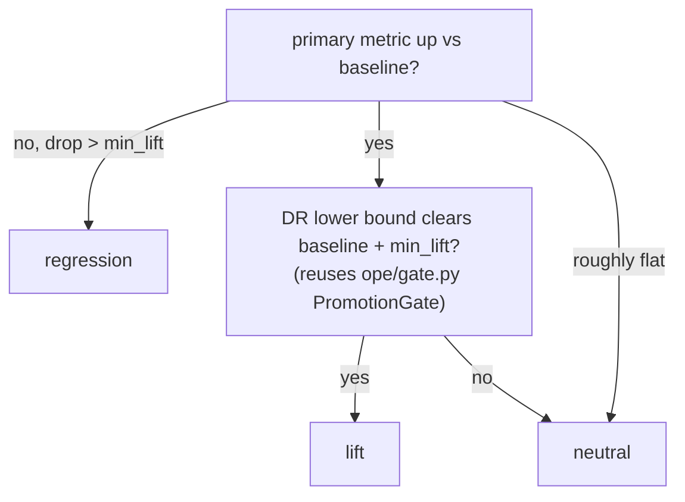

# 21 — The experiment leaderboard: proving every phase lifts (or doesn't)

> The companion build doc for [Phase 17](../plans/phase-17-experiment-leaderboard.md). It explains how
> every feature flag in Phases 9-16 is **measured against the baseline and judged a lift, a
> regression, or neutral**, and how those judgments accumulate into a single append-only, logged
> leaderboard. This is the harness that makes "every upgrade must prove itself"
> ([11 §10](11-improving-nba-spatio-relational-optimization.md)) a hard requirement, not a hope.

Build this **right after the relational dataset** ([Phase 9](13-relational-dataset.md)) and **before
any upgrade is graded**: it is sequenced after Phase 9 so experiments can be scored on both the flat
and the relational datasets, and every later upgrade (Phases 10-16) must record a lift/neutral row —
**no regressions** — before it is adopted. (Its file number is 17, but its build order is fixed by its
dependency on Phase 9, the same way Phase 6 is built "parallel with 3-5".)

> **Status: built.** Ships `src/nba/eval/{oracle,metrics,leaderboard}.py` and
> `scripts/run_experiment.py`, with `tests/test_eval_metrics.py`, `tests/test_leaderboard.py`, and
> `tests/test_demo_dataset_modes.py`. The shipped `artifacts/leaderboard.jsonl` (+ `leaderboard.md`)
> carries the `baseline` and a `phase09-relational` row — the latter a deliberate **neutral**, since
> the relational dataset is a substrate, not a value change. Grading reaches the oracle only through
> the dataset-aware `eval/oracle.py` facade (see
> [decisions/2026-06-18-dataset-aware-grading-oracle.md](../decisions/2026-06-18-dataset-aware-grading-oracle.md)),
> so the flat pipeline stays byte-identical.

```
Phase 9 (relational dataset)  ->  this leaderboard  ->  Phases 10-16, each tested + proven here
```

## 1. The problem it solves

The roadmap adds eight flags that **compose** — risk-aware routing on relational data with a
decision-focused model, etc. Judging each by eyeballing `run_demo` output doesn't scale and isn't
durable. We need a record that answers, for any experiment:

- **What** was run (which dataset, which `NBA_*` flags, which seeds)?
- **How** did it score on the common metrics?
- **Did it beat the baseline**, and is the improvement *real* (through the DR gate) or noise?
- **Lift, regression, or neutral** — one word, logged forever.

## 2. The baseline is sacred

The reference experiment, `baseline`, is **today's pipeline**: all upgrade flags off
(`dataset_mode=flat`, `risk_kappa=0`, `reward_model_kind=lightgbm`, …). Every other run is a delta
against it. You record it once:

```bash
uv run python scripts/run_experiment.py --baseline-only
```

Because all phases default their flags off, the baseline is reproducible at any time — it is literally
the verified 0-8 loop.

## 3. The common metric set (doc 11 §10)

`src/nba/eval/metrics.py::evaluate` walks `eval_n_shifts` simulated shifts (over `eval_seeds`) and
aggregates:

| Metric | Direction | Used by |
|---|---|---|
| `realized_shift_value_mean` | higher better | **primary**, all phases |
| `realized_shift_value_std` | lower better | risk-aware (Phase 11) |
| `realized_shift_value_cvar` | higher better | risk-aware / dynamic (11, 13) |
| `decision_regret_mean` | lower better | decision-focused (Phase 12) |
| `ope_value` / `ope_lcb` | higher better | the DR gate (all value models) |
| `optimality_gap` | → 1.0 | neural router (Phase 15) |
| `route_time_s_mean` | lower better | operational sanity |

The simulator oracle is used **only for grading** here, exactly as in the demo and tests — it never
enters a served model (the AST guard covers the serving modules; `nba.eval` is eval code).

## 4. How a verdict is decided

`record_experiment` computes per-metric deltas vs the baseline (sign-normalized so `+` always means
"better") and then:



The key discipline: **a lift requires both a higher primary metric and passing the same DR gate that
governs promotion.** A flag that looks better on the mean but can't clear the gate is `neutral`, not a
win — so the leaderboard can't be gamed by noise. This is the same bar doc 11 §5.4 / doc 12 §9 set for
any new value model.

## 5. Append-only, like the event store

Results are facts. `leaderboard.jsonl` gets **one appended line per run**; nothing is ever
overwritten (mirrors `api/store.py`). Corrections are new rows; readers rank by the latest. This keeps
an honest audit trail of what was tried and what happened — including the regressions, which are as
informative as the wins.

## 6. Reading the board

```bash
uv run python scripts/run_experiment.py \
  --experiment-id phase11-risk-kappa0.5 --phase 11 \
  --set NBA_USE_RISK_AWARE_ROUTING=1 NBA_RISK_KAPPA=0.5
```

prints, best-first:

```
| rank | experiment              | phase | dataset    | value (Δ)      | regret (Δ) | var (Δ) | gate | verdict    |
|-----:|-------------------------|------:|------------|----------------|------------|---------|------|------------|
| 1    | phase12-spo             | 12    | flat       | 0.842 (+0.061) | -0.039     | +0.00   | pass | lift       |
| 2    | phase11-risk-kappa0.5   | 11    | flat       | 0.788 (+0.007) | +0.00      | -0.052  | pass | lift       |
| 3    | baseline                | base  | flat       | 0.781 ( —  )   |  —         |  —      |  —   | reference  |
| 4    | phase10-team2           | 10    | flat       | 0.776 (-0.005) | +0.00      | +0.00   | fail | neutral    |
```

(illustrative numbers). Each phase's own build doc points back here for how its win is recorded.

## 7. What every phase must do

Each of Phases 9-16 has a **"Leaderboard entry (lift/regression)"** section naming the experiment id,
the flags that define it, and the metric on which it must show a lift. The phase is not "done" until
that row exists and is a `lift` (or a deliberate, documented `neutral` when the upgrade is about robustness
rather than mean value — e.g. risk-aware routing, judged on variance/CVaR).

> Back to: [11-improving-nba-spatio-relational-optimization.md §10](11-improving-nba-spatio-relational-optimization.md)
> (the yardsticks this harness operationalizes).
