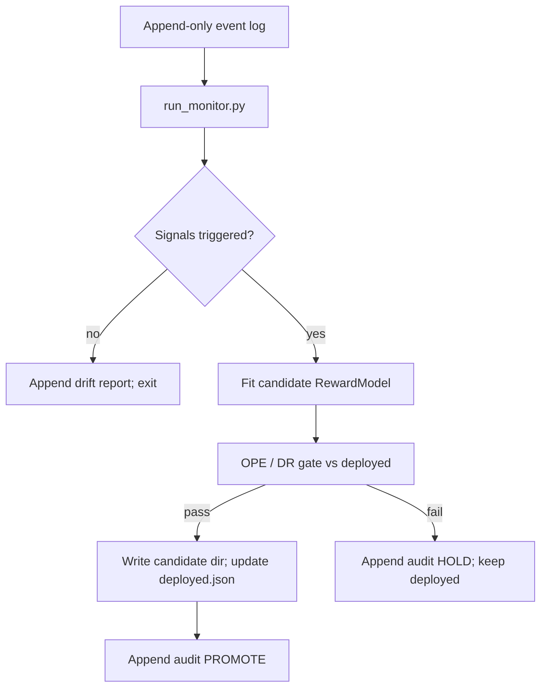

# 22 — Drift monitoring + conditional retraining loop

> The companion build doc for [Phase 18](../plans/phase-18-drift-monitoring-retrain-loop.md). It closes
> the **production ML loop** the demos only simulate: serve with a **frozen** model by default, **monitor**
> accumulated logs for drift, and **retrain + promote only when signals fire** — always through the same
> DR gate as initial policy selection.

Build this **right after the experiment leaderboard** ([Phase 17](21-experiment-leaderboard.md)) and
**before or in parallel with the value/routing upgrades** (Phases 10–16). Order: **9 → 17 → 18 → 10–16**.

> **Status: planned.** The teaching demos (`run_demo`, `my_territory_demo`) retrain from scratch each
> run for self-containment. That is **not** production ops. Phase 18 specifies the real pattern:
> conditional retrain triggered by evidence, not a daily cron.

```
Phase 17 (leaderboard)  ->  this monitor + retrain loop  ->  Phases 10-16 (each still graded on the board)
```

## 1. The problem it solves

Non-stationarity is real — seasons change, neighborhoods turn over, product mix shifts. A model
promoted in June can be miscalibrated by August. Two bad answers exist:

1. **Retrain every day** — wastes compute, promotes noise, and bypasses the safety gate on a schedule.
2. **Never retrain** — regret and calibration error creep up silently until reps stop trusting the app.

The correct pattern is **monitor → trigger → candidate fit → DR gate → promote or hold**. The serving
path (`recommend`, `plan_route`) stays unchanged; only the **batch retrain job** and **audit trail**
are new.

## 2. What "frozen serve" means

On a normal shift:

1. Load `artifacts/models/deployed.json` → active model dir + policy config.
2. Run the orchestrator; append `(context, action, reward, propensity)` to the event store.
3. **Do not** call `RewardModel.fit`.

Retraining is a **separate job** (`scripts/run_retrain_loop.py`) that runs after enough new labeled
outcomes accumulate or on a nightly schedule. Demos that set `TRAIN=True` are sandboxes — document
that distinction in notebooks, not in ops runbooks.

## 3. Drift signals (reference vs recent)

Every monitor run compares two windows from the append-only log:

| Window | Source | Typical size |
|--------|--------|--------------|
| **Reference** | Events since last promotion (capped) | up to 20k |
| **Recent** | Last M labeled outcomes | ~2k |

Five signals, each with a threshold in `Settings`:

| Signal | What it detects | Default trigger |
|--------|-----------------|-----------------|
| **Reward PSI** | Outcome mix shifted | PSI > 0.15 |
| **Calibration Δ** | `\|q − r\|` worse than at ship time | Δ MAE > 0.05 |
| **Feature PSI (max)** | Context distribution shifted (allow-list only) | max PSI > 0.20 |
| **Overlap health** | `min(p)` or ESS/n too low for OPE | warn + block promote |
| **Rolling DR drop** | Policy value falling on recent logs | drop > 0.03 |

**Trigger rule:** retrain if *any* primary signal fires, *or* a scheduled ceiling is reached
(`retrain_max_age_days` with `retrain_min_new_events`). Overlap failures **warn** and block promotion
until logging overlap is restored — retraining on invalid logs makes things worse.

PSI bins are **fixed from the reference window** at promotion time and stored in `deployed.json`, so
scores are comparable across monitor runs.

## 4. The retrain loop



Key invariants:

- **No in-place overwrite** of `model.joblib`. Candidates live under
  `artifacts/models/candidates/<timestamp>/`; promotion updates `deployed.json` atomically.
- **Same gate** as Phase 5/17: DR lower bound must clear deployed baseline + `min_lift`.
- **Append-only audit** at `artifacts/monitoring/retrain_audit.jsonl` — trigger reasons, metrics,
  verdict.

## 5. Simulated drift for demos and grading

Ground-truth drift injection lives in `src/nba/data/drift.py` (oracle-prefixed, eval-only):

```python
DriftSpec(at_fraction=0.5, reward_scale=1.3, knock_evening_boost=0.15)
```

`scripts/simulate_drift_demo.py` runs the narrative:

1. Train on **pre-drift** logs; record baseline DR and regret.
2. Generate **post-drift** logs; serve K shifts with **frozen** model → calibration MAE rises, regret
   rises, monitor **fires**.
3. Run retrain loop → candidate passes gate → promote.
4. Serve K more shifts → metrics recover toward pre-drift baseline.

`notebooks/drift_retrain_demo.ipynb` plots reward histograms, signal time series, and regret curves.

## 6. Feature flags

All off by default (`NBA_USE_DRIFT_MONITORING=0`). With monitoring off, behavior is byte-identical to
today.

| Flag | Role |
|------|------|
| `use_drift_monitoring` | Master switch |
| `monitor_reference_window` / `monitor_recent_window` | Window sizes |
| `monitor_interval_events` | Cadence (every N new labeled outcomes) |
| `retrain_min_new_events` / `retrain_max_age_days` | Scheduled safety retrain |
| `drift_*_threshold` | Per-signal triggers |
| `retrain_time_decay_halflife_days` | Optional sample weights for fit |
| `use_simulated_drift` | Enable `DriftSpec` in log generation (demo/grading only) |

Full table in [phase-18 plan § Feature flags](../plans/phase-18-drift-monitoring-retrain-loop.md).

## 7. Leaderboard entries

Grade on the **simulated drift world** via Phase 17:

```bash
# Frozen model under drift — expect regression
uv run python scripts/run_experiment.py --experiment-id phase18-frozen-under-drift --phase 18 \
  --set NBA_USE_SIMULATED_DRIFT=1

# Drift-triggered retrain loop — expect lift vs frozen
uv run python scripts/run_experiment.py --experiment-id phase18-drift-retrain --phase 18 \
  --set NBA_USE_DRIFT_MONITORING=1 NBA_USE_SIMULATED_DRIFT=1
```

Primary metric: `realized_shift_value_mean` and `decision_regret_mean` after drift onset. The
retrain-enabled row should **lift**; monitor-only (no promote) should **regress** under drift.

## 8. What every acceptance check proves

- `use_drift_monitoring=False` → no code path changes in serve/demo.
- `run_monitor.py` appends a complete `DriftReport` with all signals.
- Retrain runs **only** when `RetrainTrigger.should_retrain` (unit-tested).
- Promotion clears `PromotionGate`; HOLD leaves `deployed.json` unchanged.
- `simulate_drift_demo.py` shows fire → retrain → recovery on seeded drift.

> Back to: [09-build-nba-from-scratch.md §23](09-build-nba-from-scratch.md) (online/continual learning
> bullet — this phase operationalizes it with drift signals, not blind periodic retrain).
