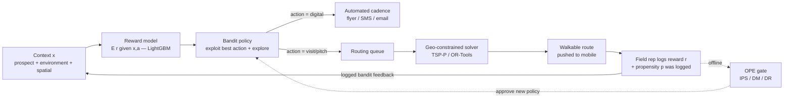

# Next Best Action (NBA) for Field Sales — Documentation

This documentation set breaks down the blueprint for building a **Next Best Action (NBA)
and algorithmic routing system** for door-to-door (B2C) and territory-based (B2B) field
sales from scratch.

The goal of the system is to allocate expensive human selling capacity toward the
highest-reward opportunities while minimizing wasted travel ("empty miles"). The central
algorithmic engine is a **contextual multi-armed bandit (CMAB)** — not plain supervised
learning — because the system must *act under uncertainty*, learn from its own decisions, and
adapt to a non-stationary world. It combines four disciplines:

1. **Reward modeling / lead scoring** — estimate the expected reward $\mathbb{E}[r \mid x, a]$
   of taking action $a$ in context $x$ (tree-based models such as **LightGBM** dominate here).
2. **Sequential decision-making under uncertainty (the bandit)** — pick the next action per
   prospect (knock, flyer, skip, pitch-A, pitch-B, …) balancing **exploitation** vs.
   **exploration** (ε-greedy, UCB, Thompson Sampling).
3. **Offline Policy Evaluation (OPE)** — score a *new* policy on *old, biased* logs **before**
   risking it in the field, using Inverse Propensity Scoring (IPS), Direct Method (DM), and
   Doubly Robust (DR). This is why **propensity logging is mandatory from day one**.
4. **Constrained geospatial optimization** — turn the bandit's "visit" recommendations into a
   physically walkable route by solving the Vehicle Routing Problem / Traveling Salesperson
   with Profits (TSP-P).

## Reading order

| # | Document | What it covers |
|---|----------|----------------|
| 1 | [01-project-landscape.md](01-project-landscape.md) | Market context, SPOTIO as the archetype, pricing, and how NBA turns a tracking tool into an active co-pilot. |
| 2 | [02-concepts-to-learn.md](02-concepts-to-learn.md) | Deep prerequisites: contextual bandits, reward modeling, exploration strategies, OPE/IPS, MDPs, VRP/TSP-P, geospatial. |
| 3 | [03-data.md](03-data.md) | The Context–Action–Reward–Propensity schema and a catalog of **real** datasets (Ames, ACS, Open Bandit, Yahoo R6, Criteo, OSM). |
| 4 | [04-learning-curriculum.md](04-learning-curriculum.md) | A sequential 6-month learning plan with bandit + OPE practical exercises. |
| 5 | [05-implementation-steps.md](05-implementation-steps.md) | Step-by-step build: schema/telemetry, reward model, bandit wrapper, OPE gate, geographic constraining, online loop. |
| 6 | [06-cloud-architecture.md](06-cloud-architecture.md) | AWS reference architecture, propensity logging, and bandit serving. |
| 7 | [07-deployment-roadmap.md](07-deployment-roadmap.md) | Phased rollout: telemetry → LightGBM baseline → bandit wrapper → geo-constraining → online A/B. |
| 8 | [08-bandits-and-offline-evaluation.md](08-bandits-and-offline-evaluation.md) | Deep dive: bandit math, why bandits beat pure supervised learning, IPS/DM/DR, cold start, non-stationarity. |
| 9 | [09-build-nba-from-scratch.md](09-build-nba-from-scratch.md) | **The complete build, from zero.** Every concept and abbreviation explained, mapped onto the actual code in this repo — read this to learn how to build the whole system yourself. |
| 10 | [10-implementation-rationale-and-alternatives.md](10-implementation-rationale-and-alternatives.md) | **Extended build guide:** every implementation step with *why* it exists and which alternatives were considered (and when to pick them). Companion to docs 05 and 09. |
| 11 | [11-improving-nba-spatio-relational-optimization.md](11-improving-nba-spatio-relational-optimization.md) | **Upgrade roadmap (optimizer side):** close the predict-then-route gap via the Orienteering Problem, decision-focused learning, risk-aware routing, neural combinatorial optimization, and dynamic VRP — cheapest, surest wins first. |
| 12 | [12-relational-deep-learning-mixin.md](12-relational-deep-learning-mixin.md) | **Upgrade roadmap (value side):** is there value in mixing in Relational Deep Learning? When a GNN over the CRM graph beats the LightGBM reward model, the safety rails it must keep, and the one genuinely novel combination (decision-focused RDL). |
| 13 | [13-relational-dataset.md](13-relational-dataset.md) | **Phase 9 build (✅ built):** add a relational dataset that *mirrors* the flat simulator (households, neighbor/competitor edges, interaction histories) + a graph builder with an allow-list — the foundation for RDL. Keeps the `BanditEvent` contract via additive sidecars + an optional `household_id` column. |
| 14 | [14-orienteering-upgrade.md](14-orienteering-upgrade.md) | **Phase 10 build (Upgrade 1):** explicit shift-time budget (OP), multi-rep routing (TOP), and real road times (OSRM) — additive, flagged, no ML. |
| 15 | [15-risk-aware-routing.md](15-risk-aware-routing.md) | **Phase 11 build (Upgrade 3):** price doors `mean − κ·std` over the bootstrap ensemble (optional CVaR); `κ=0` is a no-op. |
| 16 | [16-decision-focused-learning.md](16-decision-focused-learning.md) | **Phase 12 build (Upgrade 2):** train the reward model on route value (decision-aware reweighting → SPO+), behind `QModel`. |
| 17 | [17-dynamic-stochastic-routing.md](17-dynamic-stochastic-routing.md) | **Phase 13 build (Upgrade 5):** stochastic prizes + lookahead/rollout replanning on top of `replan`. |
| 18 | [18-relational-deep-learning.md](18-relational-deep-learning.md) | **Phase 14 build:** a calibrated GNN `q(x,a)` behind `QModel`, ethics allow-list at the graph layer, benchmarked vs. LightGBM through the same DR gate. |
| 19 | [19-neural-combinatorial-optimization.md](19-neural-combinatorial-optimization.md) | **Phase 15 (deferred):** an attention encoder-decoder router with OR-Tools as the test oracle — build only at fleet scale. |
| 20 | [20-decision-focused-rdl.md](20-decision-focused-rdl.md) | **Phase 16 (deferred):** the research frontier — train the GNN end-to-end through the orienteering optimizer. |
| 21 | [21-experiment-leaderboard.md](21-experiment-leaderboard.md) | **Phase 17 build (✅ built):** the append-only experiment leaderboard that judges every phase a **lift, regression, or neutral** vs the baseline through the DR gate. |
| 22 | [22-drift-monitoring-retrain-loop.md](22-drift-monitoring-retrain-loop.md) | **Phase 18 build (planned):** drift signals on append-only logs, **conditional** retrain (not daily), DR-gated promotion, simulated drift demo (monitor fire → retrain → recovery), and optional **Grafana + Prometheus ops dashboard**. |

## Core idea in one diagram

The loop **H → A** is what separates a true NBA model from a static cadence engine: every
logged outcome (with its **propensity** `p`) updates the context and is reused both online (to
re-route) and offline (to safely evaluate the *next* policy before it ever touches a real rep).

## Two non-negotiables

- **Log propensities from day one.** The probability `p` with which the *current* system chose
  each action is required to debias historical logs during OPE. You cannot retrofit it.
- **Constrain the bandit geographically.** A recommendation to knock a door 5 miles away can be
  mathematically optimal yet operationally absurd. The bandit proposes; the router disposes.
