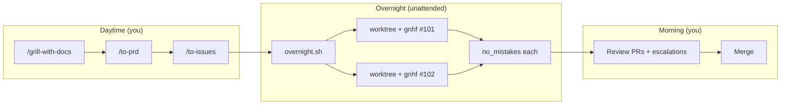

# Overnight feature building — runbook

How to leave feature work running overnight: **grill → issues by day**, **gnhf + multiple
agents by night**, **no-mistakes before you merge**.

## The overnight stack

| Layer | Tool | Role |
|-------|------|------|
| Planning (you, daytime) | `/grill-with-docs` → `/to-prd` → `/to-issues` | Sharp spec + vertical-slice issues |
| Build (unattended) | `gnhf.sh` or Cloud Agents | Fresh-context steps, rollback on fail, budget cap |
| Parallelism | `overnight.sh` + git worktrees | One gnhf per independent issue, no toe-stepping |
| Verify (unattended) | `no_mistakes.sh` + `agent_verify.py` | Fresh review + agent exercises capabilities |
| Trust (you, morning) | Glance PR + merge | Escalations wait; never auto-merge |



## Before you leave — prep checklist

Do this **before** starting overnight runs. Overnight automation only works on **well-scoped**
issues from `/to-issues`.

1. **Issue is agent-ready** — acceptance criteria are testable; blockers resolved; prefactor
   slice merged if needed.
2. **Plan file per issue** — export issue body + PRD context to `plans/overnight/issue-NNN.md`.
   gnhf seeds every step from this + `AGENTS.md`.
3. **Capability verify spec** — copy `.cursor/capability-verify.example.json` →
   `plans/overnight/issue-NNN.verify.json` (or one shared spec). The exercise agent needs hints
   for *how* to prove the slice works.
4. **Validation gate** — `make check` (or your repo's gate) must pass on `main` before you start.
5. **Clean tree** — gnhf refuses dirty trees (rollback uses `git reset --hard`).
6. **Budget** — set `--budget-usd` and `--max-steps` so you don't wake up bankrupt.
7. **`CURSOR_API_KEY`** — set for headless `agent -p` (gnhf + no-mistakes + agent_verify).

### Plan file template (`plans/overnight/issue-101.md`)

```markdown
# Issue #101 — <title>

## Parent PRD
<link or 2-sentence summary>

## What to build
<copy from issue "What to build">

## Acceptance criteria
- [ ] ...
- [ ] ...

## Implementation notes
<ADRs, seams, things gnhf must not violate>

## Done when
Print GNHF_DONE only when ALL acceptance criteria are met and `make check` passes.
```

---

## Pattern A — Single big slice (one gnhf)

Use when **one issue** is too large for a single agent context but still one feature.

```bash
export CURSOR_API_KEY=...

scripts/gnhf.sh -f plans/overnight/issue-101.md \
  --validate "make check" \
  --base-context AGENTS.md \
  --max-steps 30 \
  --budget-usd 25 \
  --branch-prefix "gnhf/issue-101-"

# After gnhf finishes (morning or chained):
scripts/no_mistakes.sh -y \
  --verify-spec plans/overnight/issue-101.verify.json \
  --base main
```

**What gnhf does overnight:** small step → validate → commit, or rollback + learn → repeat until
`GNHF_DONE` or budget/steps exhausted. You wake up to a branch of commits + `notes.md`.

---

## Pattern B — Multiple independent issues (parallel gnhf)

Use when `/to-issues` produced **slices with no blockers between them** (e.g. #101, #102, #103).

```bash
export CURSOR_API_KEY=...

scripts/overnight.sh \
  --parallel 3 \
  --budget-usd 20 \
  --max-steps 25 \
  --validate "make check" \
  --job plans/overnight/issue-101.md \
  --job plans/overnight/issue-102.md \
  --job plans/overnight/issue-103.md
```

`overnight.sh` creates a **git worktree per job**, runs **gnhf in parallel**, then **no_mistakes**
on each successful branch. Logs: `artifacts/overnight/<timestamp>/`.

**Rule:** only parallelize issues that don't touch the same files/modules. If unsure, run
`--parallel 1` or sequence jobs with `--job-after`.

---

## Pattern C — Cloud Agents (IDE-native parallelism)

Cursor's **Cloud Agents** are the IDE equivalent of "one tmux window per task" — no worktrees on
your machine.

**Evening:**
1. For each ready issue, open a **new Cloud Agent** (or `&` prefix in CLI).
2. Prompt: *"Implement issue #101 per `plans/overnight/issue-101.md`. Run make check. Do not merge."*
3. Let them run; each opens its own branch + PR.

**Morning:**
```bash
# Per PR branch, locally or in CI:
scripts/no_mistakes.sh -y --verify-spec plans/overnight/issue-101.verify.json
```

Use **gnhf locally** when you need rollback-on-fail + token budget (Cloud Agents don't give you
that control). Use **Cloud Agents** when you want zero local setup and happy to review PRs only.

**Hybrid (common):**
- Cloud Agent for quick/medium slices
- gnhf overnight for the one gnarly slice that needs 20+ steps

---

## Pattern D — gnhf then no-mistakes in one shot

`overnight.sh` chains both by default. Manual equivalent:

```bash
scripts/overnight.sh \
  --job plans/overnight/issue-101.md \
  --verify-spec plans/overnight/issue-101.verify.json \
  --budget-usd 15
```

Pipeline per job:
1. gnhf (build + `make check` each step)
2. `no_mistakes.sh -y` (fresh review → agent capability verify → PR body)
3. Exit 2 = **escalation** — product ambiguity; fix in the morning, don't merge

---

## What you'll find in the morning

| Artifact | Meaning |
|----------|---------|
| `notes.md` on gnhf branch | Step log, rollbacks, spend |
| `artifacts/capability-verify/manifest.json` | Agent exercise + judge verdicts |
| `artifacts/no-mistakes/pr-body.md` | PR draft with evidence |
| `artifacts/overnight/<run>/summary.json` | Multi-job status |
| Exit code 2 anywhere | **Needs you** — ambiguous product decision or blocked exercise |

### Morning routine (15 min)

1. Read `artifacts/overnight/*/summary.json` — which jobs passed / escalated / failed
2. For each PR: scan diffstat (10s), read Testing section + manifest
3. Resolve escalations (exit 2) — only human step that blocks merge
4. Merge what you trust; re-queue failed jobs with updated `notes.md` learnings

---

## Trust guardrails (don't disable overnight)

- **gnhf** rolls back failed steps — won't leave broken commits
- **no_mistakes** won't auto-fix ambiguous findings — stops with exit 2
- **agent_verify** won't pass without exercise artifacts — judge is fresh context
- **You** still merge — automation raises quality of what arrives at review

---

## Cost control

| Knob | Default | Overnight suggestion |
|------|---------|----------------------|
| `--budget-usd` | 10 | 15–30 per issue depending on size |
| `--max-steps` | 20 | 25–40 for large slices |
| `--parallel` | 1 | Match independent issue count (2–3 typical) |

Start conservative one night; tune from `notes.md` spend data.

---

## When NOT to run overnight

- Issue still has open product questions from grilling
- Slice depends on unmerged blocker issue
- No capability verify spec and you can't describe acceptance in agent-checkable terms
- High-risk area (auth, payments, data deletion) — use `/build` with human gates instead

---

## Related

- [knowledge.md](knowledge.md) — gnhf + no-mistakes design
- [capability-verification.md](capability-verification.md) — agent exercise + judge
- [rules.md](rules.md) — trust guardrails
- `scripts/overnight.sh` — parallel fan-out wrapper
- `.agents/skills/ask-matt/SKILL.md` — grill → PRD → issues flow
